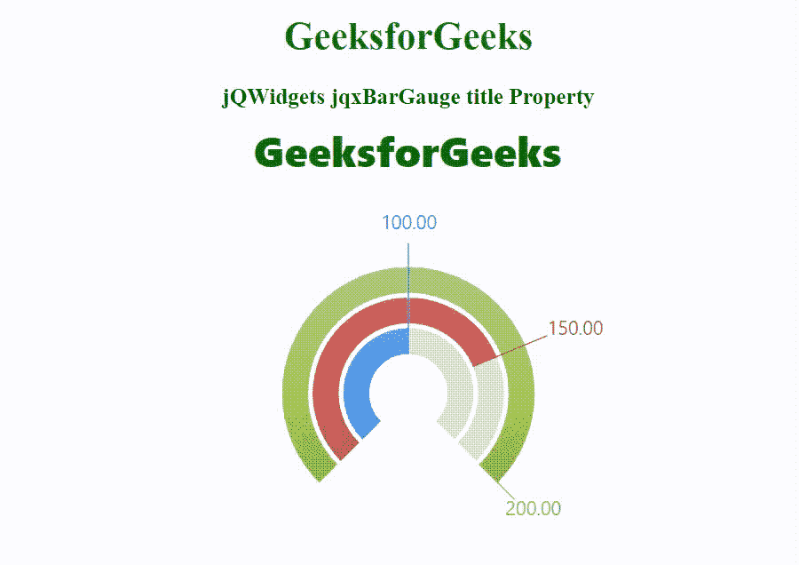

# jQWidgets jqxBarGauge 标题属性

> 原文:[https://www . geesforgeks . org/jqwidgets-jqxbargage-title-property/](https://www.geeksforgeeks.org/jqwidgets-jqxbargauge-title-property/)

jQWidgets 是一个 JavaScript 框架，用于为 PC 和移动设备制作基于 web 的应用程序。它是一个非常强大和优化的框架，独立于平台，并得到广泛支持。jqxBarGauge 表示一个 jQuery 条形图小部件，它为给定的值绘制一个条形图。

title 属性用于设置或返回 BarGauge 的标题。该属性可以是具有自定义标题设置的字符串或对象。它的默认值为 null。

**语法:**

```html
$('.selector').jqxBarGauge({
  values: [array],
  title: {
  }
});
```

**链接文件:**从[这个](https://www.jqwidgets.com/download/)链接下载 jQWidgets。在 HTML 文件中，找到下载文件夹中的脚本文件:

> <link rel="”stylesheet”" href="”jqwidgets/styles/jqx.base.css”" type="”text/css”">
> <脚本类型= " text/JavaScript " src = " scripts/jquery-1 . 11 . 1 . min . js "></脚本>
> <脚本类型= " text/JavaScript " src = " jqwidgets/jqxcore . js "></脚本>
> 
> <脚本类型

以下示例说明了 jQWidgets 中的 jqxBarGauge 标题属性:

**示例:**

## 超文本标记语言

```html
<!DOCTYPE html>
<html lang="en">
  <head>
    <link
      rel="stylesheet"
      href="jqwidgets/styles/jqx.base.css"
      type="text/css"/>

    <script type=
    "text/javascript" src="scripts/jquery-1.11.1.min.js">
    </script>
    <script type=
    "text/javascript" src="jqwidgets/jqxcore.js">
    </script>
    <script type=
    "text/javascript" src="jqwidgets/jqxdraw.js">
    </script>
    <script type=
    "text/javascript" src="jqwidgets/jqxbargauge.js">
    </script>
  </head>

  <body>
    <center>
      <h1 style="color: green">GeeksforGeeks</h1>

      <h3>jQWidgets jqxBarGauge title Property</h3>

      <div id="gfg"></div>
    </center>

    <script type="text/javascript">
      $(document).ready(function () {
        $("#gfg").jqxBarGauge({
          values: [100, 150, 200],
          max: 200,
          title: {
            text: "GeeksforGeeks",
            font: {
              color: "green",
              size: 35,
              weight: 1000,
            },
          },
        });
      });
    </script>
  </body>
</html>
```

**输出:**



**参考:**[https://www . jqwidgets . com/jquery-widgets-documentation/documentation/jqxbargage/jquery-bar-gauge-API . htm](https://www.jqwidgets.com/jquery-widgets-documentation/documentation/jqxbargauge/jquery-bar-gauge-api.htm)