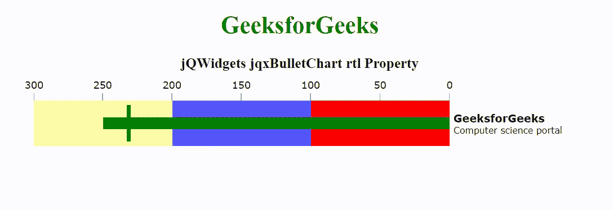

# jQWidgets jqxbullachert RTL 物业

> 原文:[https://www . geeksforgeeks . org/jqwidgets-jqxbullethart-RTL-property/](https://www.geeksforgeeks.org/jqwidgets-jqxbulletchart-rtl-property/)

jQWidgets 是一个 JavaScript 框架，用于为 PC 和移动设备制作基于 web 的应用程序。它是一个非常强大和优化的框架，独立于平台，并得到广泛支持。jqxBulletChart 代表一个 jQuery 项目符号图小部件，它有两个度量标准——一个主要的和一个比较的，并在许多不同样式的定性范围的上下文中显示它们。

rtl 属性用于设置或返回一个值，该值指示小部件的元素被对齐以支持使用从右向左字体的区域设置。

**语法:**

```html
$('.selector').jqxBulletChart({
    rtl: boolean
});
```

链接文件:从 https://www.jqwidgets.com/download/链接下载 jQWidgets。在 HTML 文件中，找到下载文件夹中的脚本文件:

> <link rel="”stylesheet”" href="”jqwidgets/styles/jqx.base.css”" type="”text/css”">
> <脚本类型=【text/JavaScript】src =【scripts/jquery-1 . 11 . 1 . min . js】></脚本>
> <脚本类型=【text/JavaScript】src =【jqwidgets/jqxcore . js】></脚本>
> 脚本类型=【text/JavaScript】src =【jqwidgets/jqxdraw。

下面的例子说明了 jQWidgets 中的 jqxbullethart RTL 属性:

**示例:**

## 超文本标记语言

```html
<!DOCTYPE html>
<html lang="en">

<head>
    <link rel="stylesheet" href=
        "jqwidgets/styles/jqx.base.css" type="text/css" />
    <script type="text/javascript" src="scripts/jquery-1.11.1.min.js">
    </script>
    <script type="text/javascript" src="jqwidgets/jqxcore.js">
    </script>
    <script type="text/javascript" src="jqwidgets/jqxdraw.js">
    </script>
    <script type="text/javascript" src="jqwidgets/jqxdata.js"></script>
    <script type="text/javascript" src="jqwidgets/jqxbulletchart.js"></script>
    <script type="text/javascript" src="/jqwidgets/jqxtooltip.js"></script>
</head>

<body>
    <center>
        <h1 style="color: green;">
            GeeksforGeeks
        </h1>

        <h3>
            jQWidgets jqxBulletChart rtl Property
        </h3>

        <div id="gfg"></div>
    </center>

    <script type="text/javascript">
        $(document).ready(function () {
            $('#gfg').jqxBulletChart({
                width: 700,
                height: 100,
                barSize: "60%",
                rtl: true,
                title: "GeeksforGeeks",
                description: "Computer science portal",
                ranges: [
                    { startValue: 0, endValue: 100, color: "red" },
                    { startValue: 100, endValue: 200, color: "blue" },
                    { startValue: 200, endValue: 300, color: "yellow" }
                ],
                pointer: { value: 250, color: "green" },
                target: { value: 230, color: "green" },
                ticks: { interval: 50 }
            });
        });
    </script>
</body>

</html>
```

**输出:**



**参考:**[https://www . jqwidgets . com/jquery-widgets-documentation/documentation/jqxbullethart/jquery-bullet-chart-API . htm](https://www.jqwidgets.com/jquery-widgets-documentation/documentation/jqxbulletchart/jquery-bullet-chart-api.htm)