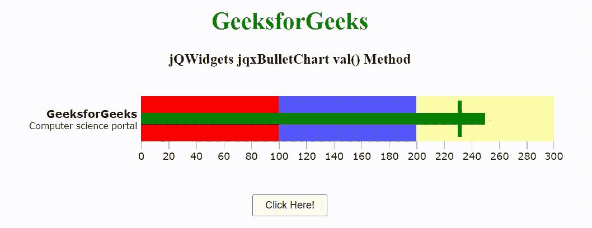

# jQWidgets jqxbullethart val()方法

> 原文:[https://www . geesforgeks . org/jqwidgets-jqxbullethart-val-method/](https://www.geeksforgeeks.org/jqwidgets-jqxbulletchart-val-method/)

**jQWidgets** 是一个 JavaScript 框架，用于为 PC 和移动设备制作基于 web 的应用程序。它是一个非常强大、优化、独立于平台并且得到广泛支持的框架。jqxBulletChart 代表一个 jQuery 项目符号图小部件，它有两个度量标准，一个主要的和一个比较的，并在许多不同样式的定性范围的上下文中显示它们。

**val()** 方法用于设置或返回 jqxBulletChart 选定值。它接受单个参数“值”并返回数值。

**语法:**

```
$('.selector').jqxBulletChart('val');
```

**链接文件:**从链接下载 [jQWidgets](https://www.jqwidgets.com/download/) 。在 HTML 文件中，找到下载文件夹中的脚本文件。

> <link rel="”stylesheet”<br/">href = " jqwidgets/style/jqx . base . CSS " type = " text/CSS "/>
> <script type = " text/JavaScript " src = " scripts/jquery-1 . 11 . 1 . min . js "></script>
> <script type = " text/JavaScript " src = " jqwidgets/jqxcore . js "></script【

**示例:**下面的示例说明了 jQWidgets 中的 jqxbullethart*val()*方法。

## 超文本标记语言

```
<!DOCTYPE html>
<html lang="en">

<head>
    <link rel="stylesheet" href="jqwidgets/styles/jqx.base.css" type="text/css" />
    <script type="text/javascript" src="scripts/jquery-1.11.1.min.js">
    </script>
    <script type="text/javascript" src="jqwidgets/jqxcore.js">
    </script>
    <script type="text/javascript" src="jqwidgets/jqxdraw.js">
    </script>
    <script type="text/javascript" src="jqwidgets/jqxdata.js"></script>
    <script type="text/javascript" src="jqwidgets/jqxbulletchart.js"></script>
    <script type="text/javascript" src="jqwidgets/jqxtooltip.js"></script>
</head>

<body>
    <center>
        <h1 style="color:green;">
            GeeksforGeeks
        </h1>

        <h3>
            jQWidgets jqxBulletChart val() Method
        </h3>

        <div id="gfg"></div>

        <input type="button" id="jqxbutton" value="Click Here!"
            style="margin-top: 50px; padding: 5px 15px" />
    </center>

    <script type="text/javascript">
        $(document).ready(function () {
            $('#gfg').jqxBulletChart({
                width: 700,
                height: 100,
                barSize: "60%",
                title: "GeeksforGeeks",
                description: "Computer science portal",
                ranges: [
                    { startValue: 0, endValue: 100, color: "red" },
                    { startValue: 100, endValue: 200, color: "blue" },
                    { startValue: 200, endValue: 300, color: "yellow" }
                ],
                pointer: { value: 250, color: "green" },
                target: { value: 230, color: "green" },
            });
        });

        $('#jqxbutton').click(function () {
            $("#gfg").jqxBulletChart('val', 150);
        });
    </script>
</body>

</html>
```

**输出:**



**参考:**[https://www . jqwidgets . com/jquery-widgets-documentation/documentation/jqxbullethart/jquery-bullet-chart-API . htm](https://www.jqwidgets.com/jquery-widgets-documentation/documentation/jqxbulletchart/jquery-bullet-chart-api.htm)