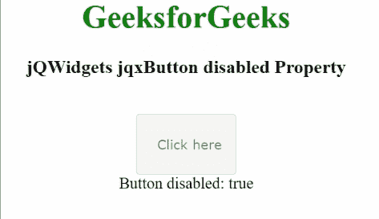

# jQWidgets jqxButton 禁用属性

> 原文:[https://www . geesforgeks . org/jqwidgets-jqxbutton-disabled-property/](https://www.geeksforgeeks.org/jqwidgets-jqxbutton-disabled-property/)

**jQWidgets** 是一个 JavaScript 框架，用于为 PC 和移动设备制作基于 web 的应用程序。它是一个非常强大、优化、独立于平台并且得到广泛支持的框架。 *jqxButton* 用于说明 jQuery 按钮小部件，它使我们能够在所需的网页上显示按钮。

***禁用*** 属性用于启用或禁用所需按钮。为布尔类型，默认值为*假*。

**语法:**

*   设置*禁用*属性。

```
$('#jqxButton').jqxButton({disabled: false });
```

*   使*禁用*属性。

```
var disabled = $('#jqxButton').jqxButton('disabled');
```

**链接文件:**从链接下载 [jQWidgets](https://www.jqwidgets.com/download/) 。在 HTML 文件中，找到下载文件夹中的脚本文件。

> <link rel="”stylesheet”" href="”jqwidgets/styles/jqx.base.css”" type="”text/css”">
> <脚本类型=【文本/JavaScript】src =【脚本/jquery-1 . 11 . 1 . min . js】></脚本>
> T8】脚本类型=【文本/JavaScript】src =【jqwidgets/jqxcore . js】></脚本>
> <脚本类型=【文本/JavaScript】src =【jqwidgets/jqxbuttons . js】。

**示例:**以下示例说明了 jQWidgets 中的 jqxButton *禁用了* 属性。

## 超文本标记语言

```
<!DOCTYPE html>
<html>

<head>
    <link rel="stylesheet" href=
        "jqwidgets/styles/jqx.base.css" type="text/css" />
    <script type="text/javascript" 
        src="scripts/jquery-1.11.1.min.js"></script>
    <script type="text/javascript" 
        src="jqwidgets/jqxcore.js"></script>
    <script type="text/javascript" 
        src="jqwidgets/jqxbuttons.js"></script>
</head>

<body>
    <center>
        <h1 style="color: green;">
            GeeksforGeeks
        </h1>
        <h3>
            jQWidgets jqxButton disabled Property
        </h3>
        <br />
        <input type="button" id="jqxBtn" 
            style="padding: 5px 20px;" 
            value="Click here" />
        <div id="log"></div>
    </center>

    <script type="text/javascript">
        $(document).ready(function () {
            $("#jqxBtn").jqxButton({
                width: "100px",
                height: "60px",
                disabled: true,
            });

            var d = $("#jqxBtn").jqxButton("disabled");
            $("#log").text("Button disabled: " + d);
        });
    </script>
</body>

</html>
```

**输出:**



禁用的属性

**参考:**[https://www . jqwidgets . com/jquery-widgets-documentation/documentation/jqxbutton/jquery-button-API . htm？搜索=](https://www.jqwidgets.com/jquery-widgets-documentation/documentation/jqxbutton/jquery-button-api.htm?search=)