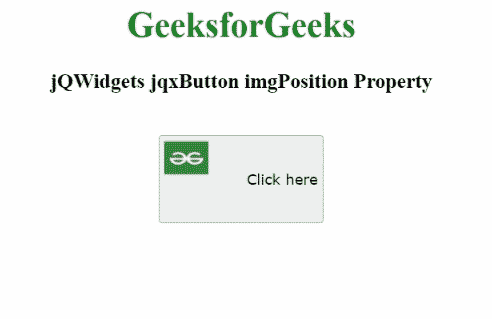

# jQWidgets jqxButton img position 属性

> 原文:[https://www . geesforgeks . org/jqwidgets-jqxbutton-img position-property/](https://www.geeksforgeeks.org/jqwidgets-jqxbutton-imgposition-property/)

**jQWidgets** 是一个 JavaScript 框架，用于为 PC 和移动设备制作基于 web 的应用程序。它是一个非常强大、优化、独立于平台并且得到广泛支持的框架。 **jqxButton** 用于说明 jQuery 按钮小部件，它使我们能够在所需的网页上显示按钮。

*imgPosition* 属性用于设置或获取显示按钮图像的位置。它属于字符串类型，默认值为中心。

其可能值如下:

*   左边的
*   顶端
*   中心
*   底部
*   正确
*   topLeft
*   底部左
*   topRight
*   右下角

**语法:**

设置*位置*属性。

```html
$('#jqxButton').jqxButton({
    imgPosition: "left", 
    imgSrc: 'images/andrew.png' 
}); 
```

返回*位置*属性。

```html
var imgPosition = $('#jqxButton').jqxButton('imgPosition');
```

**链接文件:**从给定链接下载 [jQWidgets](https://www.jqwidgets.com/download/) 。在 HTML 文件中，找到下载文件夹中的脚本文件。

> <link rel="”stylesheet”" href="”jqwidgets/styles/jqx.base.css”" type="”text/css”">
> <脚本类型=【文本/JavaScript】src =【脚本/jquery-1 . 11 . 1 . min . js】></脚本>
> T8】脚本类型=【文本/JavaScript】src =【jqwidgets/jqxcore . js】></脚本>
> <脚本类型=【文本/JavaScript】src =【jqwidgets/jqxbuttons . js】。

**示例:**以下示例说明了 jQWidgets 中的 jqxButton*imgpposition*属性。

## 超文本标记语言

```html
<!DOCTYPE html>
<html lang="en">

<head>
    <link rel="stylesheet"
          href="jqwidgets/styles/jqx.base.css" 
          type="text/css" />
    <script type="text/javascript" 
            src="scripts/jquery-1.11.1.min.js">
    </script>
    <script type="text/javascript" 
            src="jqwidgets/jqxcore.js">
    </script>
    <script type="text/javascript" 
            src="jqwidgets/jqxbuttons.js">
    </script>
</head>

<body>
    <center>
        <h1 style="color: green">
            GeeksforGeeks
        </h1>

        <h3>jQWidgets jqxButton imgPosition Property</h3>
        <br />

        <input type="button" id="jqxBtn" 
            style="padding: 5px 20px" value="Click here" />
        <br />

        <div id="log"></div>
    </center>

    <script type="text/javascript">
        $(document).ready(function () {
            $("#jqxBtn").jqxButton({
                width: "150px",
                height: "80px",
                imgSrc: 
 "https://media.geeksforgeeks.org/wp-content/uploads/20211012130808/imgsr-200x200.png",
                imgPosition: "left",
                textPosition: "right",
                imgWidth: "40px",
                imgHeight: "30px",
            });

            $("#jqxBtn").on("click", function () {
                var imgp = $("#jqxBtn").jqxButton("imgPosition");
                $("#log").html("Position of button's image: " + imgp);
            });
        });
    </script>
</body>

</html>
```

**输出:**



**参考:**[https://www . jqwidgets . com/jquery-widgets-documentation/documentation/jqxbutton/jquery-button-API . htm？搜索=](https://www.jqwidgets.com/jquery-widgets-documentation/documentation/jqxbutton/jquery-button-api.htm?search=)