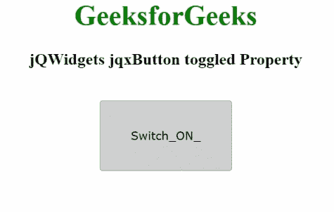

# jQWidgets jqxButton 切换属性

> 原文:[https://www . geesforgeks . org/jqwidgets-jqxbutton-togged-property/](https://www.geeksforgeeks.org/jqwidgets-jqxbutton-toggled-property/)

**jQWidgets** 是一个 JavaScript 框架，用于为 PC 和移动设备制作基于 web 的应用程序。它是一个非常强大、优化、独立于平台并且得到广泛支持的框架。jqxButton 用于说明 jQuery 按钮小部件，它使我们能够在所需的网页上显示按钮，jqxToggleButton 用于说明 jQuery 按钮小部件，它在被单击后改变其验证状态。

**切换属性**用于设置或获取显示按钮的切换状态。它属于布尔类型，默认值为假。

**语法:**

设置*切换*属性。

```
$('#jqxButton').jqxToggleButton({ toggled: true }); 
```

获取*切换的*属性。

```
var toggled = $('#jqxButton').jqxToggleButton('toggled');
```

**链接文件:**从链接下载 [jQWidgets](https://www.jqwidgets.com/download/) 。在 HTML 文件中，找到下载文件夹中的脚本文件。

> <link rel="”stylesheet”" href="”jqwidgets/styles/jqx.base.css”" type="”text/css”">
> <脚本类型=【文本/JavaScript】src =【脚本/jquery-1 . 11 . 1 . min . js】></脚本>
> T8】脚本类型=【文本/JavaScript】src =【jqwidgets/jqxcore . js】></脚本>
> <脚本类型=【文本/JavaScript】src =【jqwidgets/jqxbuttons . js】。

下面的例子说明了 jQWidgets 中的 jqxButton **切换**属性。

**示例:**

## 超文本标记语言

```
<!DOCTYPE html>
<html lang="en">

<head>
    <link rel="stylesheet" href=
"jqwidgets/styles/jqx.base.css" type="text/css" />
    <script type="text/javascript" 
            src="scripts/jquery-1.11.1.min.js">
    </script>
    <script type="text/javascript" 
            src="jqwidgets/jqxcore.js">
    </script>
    <script type="text/javascript" 
            src="jqwidgets/jqxbuttons.js">
    </script>
</head>

<body>
    <center>
        <h1 style="color: green">GeeksforGeeks</h1>
        <h3>jQWidgets jqxButton toggled Property</h3>
        <br />
        <input type="button" id="jqxBtn" 
               style="padding: 5px 20px"
               value="Switch_ON_" />
        <div id="log"></div>
    </center>

    <script type="text/javascript">
        $(document).ready(function () {
            $("#jqxBtn").jqxToggleButton({
                width: "150px",
                height: "80px",
                toggled: true,
            });

            $("#jqxBtn").on("click", function () {
                var t = $("#jqxBtn").jqxToggleButton("toggled");
                if (t) {
                    $("#jqxBtn")[0].value = "ON";
                } else $("#jqxBtn")[0].value = "OFF";
                $("#log").html("toggled state: " + t);
            });
        });
    </script>
</body>

</html>
```

**输出:**



**参考:**[https://www . jqwidgets . com/jquery-widgets-documentation/documentation/jqxbutton/jquery-button-API . htm](https://www.jqwidgets.com/jquery-widgets-documentation/documentation/jqxbutton/jquery-button-api.htm)