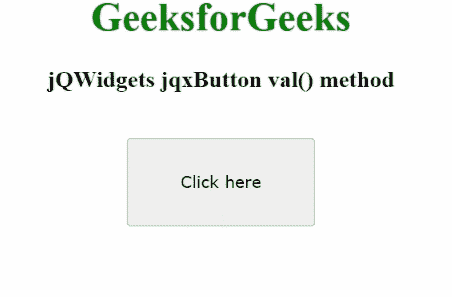

# jQWidgets jqxButton val()方法

> 原文:[https://www . geesforgeks . org/jqwidgets-jqxbutton-val-method/](https://www.geeksforgeeks.org/jqwidgets-jqxbutton-val-method/)

**jQWidgets** 是一个 JavaScript 框架，用于为 PC 和移动设备制作基于 web 的应用程序。它是一个非常强大、优化、独立于平台并且得到广泛支持的框架。 **jqxButton** 用于说明 jQuery 按钮小部件，它使我们能够在所需的网页上显示按钮。

*val()* 方法用于设置或获取值。它有一个可选参数，即字符串类型的值。它返回一个字符串。

**语法:**

设置值。

```
$("#jqxButton").jqxButton('val', "New Value");
```

返回值。

```
var value = $("#jqxButton").jqxButton('val');
```

使用 jQuery 的 val()设置值。

```
$("#jqxButton").val("New Value");
```

使用 jQuery 的 val()返回值。

```
var value = $("#jqxButton").val();
```

**链接文件:**从给定链接下载 [jQWidgets](https://www.jqwidgets.com/download/) 。在 HTML 文件中，找到下载文件夹中的脚本文件。

> <link rel="”stylesheet”" href="”jqwidgets/styles/jqx.base.css”" type="”text/css”">
> <脚本类型=【文本/JavaScript】src =【脚本/jquery-1 . 11 . 1 . min . js】></脚本>
> T8】脚本类型=【文本/JavaScript】src =【jqwidgets/jqxcore . js】></脚本>
> <脚本类型=【文本/JavaScript】src =【jqwidgets/jqxbuttons . js】。

**示例:**下面的示例说明了 jQWidgets 中的 jqxButton *val()* 方法。

## 超文本标记语言

```
<!DOCTYPE html>
<html lang="en">
  <head>
    <link
      rel="stylesheet"
      href="jqwidgets/styles/jqx.base.css"
      type="text/css"
    />
    <script type="text/javascript" 
        src="scripts/jquery-1.11.1.min.js"></script>
    <script type="text/javascript" 
        src="jqwidgets/jqxcore.js"></script>
    <script type="text/javascript" 
        src="jqwidgets/jqxbuttons.js"></script>
  </head>
  <body>
    <center>
      <h1 style="color: green">GeeksforGeeks</h1>
      <h3>jQWidgets jqxButton val() method</h3>
      <br />
      <input
        type="button"
        id="jqxBtn"
        style="padding: 5px 20px"
        value="Click here"
      />
      <div id="log"></div>
    </center>

    <script type="text/javascript">
      $(document).ready(function () {
        $("#jqxBtn").jqxButton({
          width: "150px",
          height: "70px",
        });

        $("#jqxBtn").on("click", function () {
          $("#jqxBtn").jqxButton("val", "Button");
        });
      });
    </script>
  </body>
</html>
```

**输出:**



**参考:**[https://www . jqwidgets . com/jquery-widgets-documentation/documentation/jqxbutton/jquery-button-API . htm？搜索=](https://www.jqwidgets.com/jquery-widgets-documentation/documentation/jqxbutton/jquery-button-api.htm?search=)