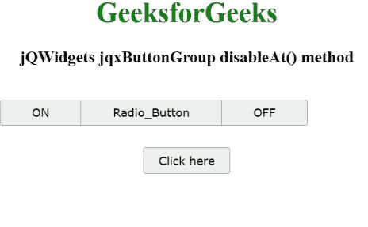

# jQWidgets jqxButtonGroup disablet()方法

> 原文:[https://www . geesforgeks . org/jqwidgets-jqxbuttongroup-disablet-method/](https://www.geeksforgeeks.org/jqwidgets-jqxbuttongroup-disableat-method/)

**jQWidgets** 是一个 JavaScript 框架，用于为 PC 和移动设备制作基于 web 的应用程序。它是一个非常强大、优化、独立于平台并且得到广泛支持的框架。jqxButtonGroup 用于说明 jQuery 小部件，该部件生成一组按钮，其功能类似于普通按钮、单选按钮或复选框。

**disablet()**方法用于在特定索引处禁用显示的 jqxButtonGroup。它有一个参数，一个数字类型的索引。它不返回任何东西。

**语法:**

```html
$('Selector').jqxButtonGroup('disableAt', Index);
```

**链接文件:**从链接下载 [jQWidgets](https://www.jqwidgets.com/download/) 。在 HTML 文件中，找到下载文件夹中的脚本文件。

> <link rel="”stylesheet”" href="”jqwidgets/styles/jqx.base.css”" type="”text/css”">
> <脚本类型= " text/JavaScript " src = " scripts/jquery-1 . 11 . 1 . min . js "></脚本类型>
> <脚本类型= " text/JavaScript " src = " jqwidgets/jqxcore . js "></脚本类型>
> <脚本类型= " text/JavaScript " src = " jqwidgets/jqx-all . js

**示例:**下面的示例说明了 jQWidgets 中的 jqxButtonGroup**disablet()**方法。

## 超文本标记语言

```html
<!DOCTYPE html>
<html lang="en">
  <head>
    <link
      rel="stylesheet"
      href="jqwidgets/styles/jqx.base.css"
      type="text/css"
    />
    <script type="text/javascript" 
        src="scripts/jquery-1.11.1.min.js"></script>
    <script type="text/javascript" 
        src="jqwidgets/jqxcore.js"></script>
     <script type="text/javascript" 
        src="jqwidgets/jqx-all.js"></script>
    <script type="text/javascript" 
        src="jqwidgets/jqxbuttons.js"></script>
  </head>
  <body>
    <center>
      <h1 style="color: green">GeeksforGeeks</h1>
      <h3>jQWidgets jqxButtonGroup disableAt() method</h3>
      <br />

      <div id="jqxBG">
        <button style="padding: 6px 36px" 
                id="l">ON</button>
        <button style="padding: 6px 36px" 
                id="c">Radio_Button</button>
        <button style="padding: 6px 36px" 
                id="r">OFF</button>
      </div>
      <div>
        <input
          type="button"
          id="jqxBtn"
          style="margin-top: 25px"
          value="Click here"
        />
      </div>
      <div id="log"></div>
    </center>

    <script type="text/javascript">
      $(document).ready(function () {
        $("#jqxBtn").jqxButton({
          width: "100px",
          height: "30px",
        });
        $("#jqxBG").jqxButtonGroup({});

        $("#jqxBtn").on("click", function () {
          $("#jqxBG").jqxButtonGroup("disableAt", 1);
          $("#log").text("Radio_Button disabled");
        });
      });
    </script>
  </body>
</html>
```

**输出:**



**参考:**[https://www . jqwidgets . com/jquery-widgets-documentation/documentation/jqxbutton/jquery-button-API . htm？搜索=](https://www.jqwidgets.com/jquery-widgets-documentation/documentation/jqxbutton/jquery-button-api.htm?search=)