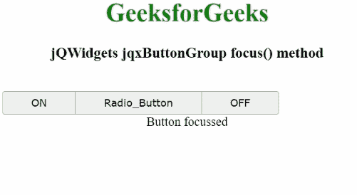

# jQWidgets jqxButtonGroup focus()方法

> 原文:[https://www . geesforgeks . org/jqwidgets-jqxbuttongroup-focus-method/](https://www.geeksforgeeks.org/jqwidgets-jqxbuttongroup-focus-method/)

**jQWidgets** 是一个 JavaScript 框架，用于为 PC 和移动设备制作基于 web 的应用程序。它是一个非常强大、优化、独立于平台并且得到广泛支持的框架。 **jqxButtonGroup** 用于说明 jQuery 小部件，它生成一组功能类似于普通按钮、单选按钮或复选框的按钮。

**聚焦()方法**用于聚焦显示的 jqxButtonGroup。它没有参数，也不返回任何内容。

**语法:**

```html
$('#Selector').jqxButtonGroup('focus');
```

**链接文件:**从给定链接下载 [jQWidgets](https://www.jqwidgets.com/download/) 。在 HTML 文件中，找到下载文件夹中的脚本文件。

> <link rel="”stylesheet”" href="”jqwidgets/styles/jqx.base.css”" type="”text/css”">
> <脚本类型=【文本/JavaScript】src =【脚本/jquery-1 . 11 . 1 . min . js】></脚本>
> T8】脚本类型=【文本/JavaScript】src =【jqwidgets/jqxcore . js】></脚本>
> <脚本类型=【文本/JavaScript】src =【jqwidgets/jqxbuttons . js】。

下面的例子说明了 jQWidgets 中的 jqxButtonGroup **focus()** 方法。

**示例:**

## 超文本标记语言

```html
<!DOCTYPE html>
<html lang="en">

<head>
    <link rel="stylesheet"
          href="jqwidgets/styles/jqx.base.css"
          type="text/css" />
    <script type="text/javascript" 
        src="scripts/jquery-1.11.1.min.js">
    </script>
    <script type="text/javascript" 
        src="jqwidgets/jqxcore.js">
    </script>
    <script type="text/javascript" 
        src="jqwidgets/jqxbuttons.js">
    </script>
</head>

<body>
    <center>
        <h1 style="color: green">
            GeeksforGeeks
        </h1>

        <h3>jQWidgets jqxButtonGroup focus() method</h3>
        <br />

        <div id="jqxBG">
            <button style="padding: 6px 36px" id="l">
                ON
            </button>

            <button style="padding: 6px 36px" id="c">
                Radio_Button
            </button>

            <button style="padding: 6px 36px" id="r">
                OFF
            </button>
        </div>

        <div id="log"></div>
    </center>

    <script type="text/javascript">
        $(document).ready(function () {
            $("#jqxBG").jqxButtonGroup({
                mode: "radio",
            });
        });

        $("#jqxBG").jqxButtonGroup("focus");
        $("#log").text("Button focussed");
    </script>
</body>

</html>
```

**输出:**



**参考:**[https://www . jqwidgets . com/jquery-widgets-documentation/documentation/jqxbutton/jquery-button-API . htm](https://www.jqwidgets.com/jquery-widgets-documentation/documentation/jqxbutton/jquery-button-api.htm)