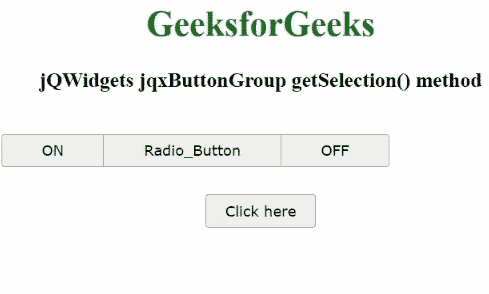

# jQWidgets jqxButtonGroup getSelection()方法

> 原文:[https://www . geesforgeks . org/jqwidgets-jqxbuttongroup-get selection-method/](https://www.geeksforgeeks.org/jqwidgets-jqxbuttongroup-getselection-method/)

jQWidgets 是一个 JavaScript 框架，用于为 PC 和移动设备制作基于 web 的应用程序。它是一个非常强大、优化、独立于平台并且得到广泛支持的框架。jqxButtonGroup 用于说明 jQuery 小部件，该部件生成一组功能类似于普通按钮、单选按钮或复选框的按钮。

**getSelection()方法**用于从显示的 jqxButtonGroup 返回所选按钮的索引。它没有参数。它返回一个数字或数字数组。

**注:**

*   如果选择模式为*默认*，则返回未定义。
*   如果选择模式为*单选*，则从显示的 jqxButtonGroup 返回所选按钮的索引。
*   如果选择模式是*复选框*，则它从显示的 jqxButtonGroup 中返回所选按钮的数组。

**语法:**

```html
var jqxButtonGroup = $('#Selector').jqxButtonGroup('getSelection'); 
```

**链接文件:**从给定链接下载 https://www.jqwidgets.com/download/。在 HTML 文件中，找到下载文件夹中的脚本文件。

> <link rel="”stylesheet”" href="”jqwidgets/styles/jqx.base.css”" type="”text/css”">
> <脚本类型=【文本/JavaScript】src =【脚本/jquery-1 . 11 . 1 . min . js】></脚本>
> T8】脚本类型=【文本/JavaScript】src =【jqwidgets/jqxcore . js】></脚本>
> <脚本类型=【文本/JavaScript】src =【jqwidgets/jqxbuttons . js】。

下面的例子说明了 jQWidgets 中的 jqxButtonGroup getSelection()方法。

**示例:**

## 超文本标记语言

```html
<!DOCTYPE html>
<html lang="en">
   <head>
      <link rel="stylesheet" href=
         "jqwidgets/styles/jqx.base.css" type="text/css" />
      <script type="text/javascript" 
         src="scripts/jquery-1.11.1.min.js"></script>
      <script type="text/javascript" 
         src="jqwidgets/jqxcore.js"></script>
      <script type="text/javascript" 
         src="jqwidgets/jqxbuttons.js"></script>
   </head>
   <body>
      <center>
         <h1 style="color: green">
            GeeksforGeeks
         </h1>
         <h3>jQWidgets jqxButtonGroup getSelection() method</h3>
         <br />
         <div id="jqxBG">
            <button style="padding: 6px 36px" id="l">
            ON
            </button>
            <button style="padding: 6px 36px" id="c">
            Radio_Button
            </button>
            <button style="padding: 6px 36px" id="r">
            OFF
            </button>
         </div>
         <div>
            <input type="button" id="jqxBtn" 
               style="margin-top: 25px" value="Click here" />
         </div>
         <div id="log"></div>
      </center>
      <script type="text/javascript">
         $(document).ready(function () {
             $("#jqxBtn").jqxButton({
                 width: "100px",
                 height: "30px",
             });
             $("#jqxBG").jqxButtonGroup({
                 mode: "radio",
             });

             $("#jqxBtn").on("click", function () {
                 var gs = $("#jqxBG").jqxButtonGroup("getSelection");
                 $("#log").text(
                     "Button with index " + gs + " is selected!"
                  );
             });
         });
      </script>
   </body>
</html>
```

**输出:**



**参考:**[https://www . jqwidgets . com/jquery-widgets-documentation/documentation/jqxbutton/jquery-button-API . htm？搜索=](https://www.jqwidgets.com/jquery-widgets-documentation/documentation/jqxbutton/jquery-button-api.htm?search=)