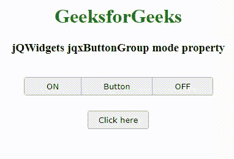

# jQWidgets jqxButtonGroup 模式属性

> 原文:[https://www . geesforgeks . org/jqwidgets-jqxbuttongroup-mode-property/](https://www.geeksforgeeks.org/jqwidgets-jqxbuttongroup-mode-property/)

**jQWidgets** 是一个 JavaScript 框架，用于为 PC 和移动设备制作基于 web 的应用程序。它是一个非常强大、优化、独立于平台并且得到广泛支持的框架。 **jqxButtonGroup** 用于说明 jQuery 小部件，该部件生成一组功能类似于普通按钮、单选按钮或复选框的按钮。

**模式属性**用于设置或获取显示的 jqxButtonGroup 的模式。它是字符串类型，默认值为*默认值*。

可用于*模式*属性的可能值如下:

*   检验盒
*   收音机
*   系统默认值

**语法:**

*   它用于设置模式属性。

```html
$('Selector').jqxButtonGroup({mode: 'radio' });
```

*   它用于获取 mode 属性。

```html
var mode = $('Selector').jqxButtonGroup('mode');
```

**链接文件:**从链接下载 [jQWidgets](https://www.jqwidgets.com/download/) 。在 HTML 文件中，找到下载文件夹中的脚本文件。

> <link rel="”stylesheet”" href="”jqwidgets/styles/jqx.base.css”" type="”text/css”">
> <脚本类型= " text/JavaScript " src = " scripts/jquery-1 . 11 . 1 . min . js "></脚本类型>
> <脚本类型= " text/JavaScript " src = " jqwidgets/jqxcore . js "></脚本类型>
> <脚本类型= " text/JavaScript " src = " jqwidgets/jqx-all . js

**示例:**以下示例说明了 jQWidgets 中的 jqxButtonGroup **模式**属性。

## 超文本标记语言

```html
<!DOCTYPE html>
<html lang="en">
  <head>
    <link
      rel="stylesheet"
      href=
"jqwidgets/styles/jqx.base.css"
      type="text/css"/>
    <script type="text/javascript" 
            src="scripts/jquery-1.11.1.min.js">
    </script>
    <script type="text/javascript" 
            src="jqwidgets/jqxcore.js">
    </script>
    <script type="text/javascript" 
            src="jqwidgets/jqxbuttons.js">
    </script>
  </head>
  <body>
    <center>
      <h1 style="color: green">GeeksforGeeks</h1>
      <h3>jQWidgets jqxButtonGroup mode property</h3>
      <br />
      <div id="jqxBG">
        <button style="padding: 6px 36px" 
                id="l">ON
        </button>
        <button style="padding: 6px 36px" 
                id="c">Button
        </button>
        <button style="padding: 6px 36px" 
                id="r">OFF
        </button>
      </div>
      <div>
        <input
          type="button"
          id="jqxBtn"
          style="margin-top: 25px"
          value="Click here"/>
      </div>
      <div id="log"></div>
    </center>

    <script type="text/javascript">
      $(document).ready(function () {
        $("#jqxBtn").jqxButton({
          width: "100px",
          height: "30px",
        });
        $("#jqxBG").jqxButtonGroup({
          mode: "checkbox",
        });

        $("#jqxBtn").on("click", function () {
          var m = $("#jqxBG").jqxButtonGroup("mode");
          $("#log").text("Mode: " + m);
        });
      });
    </script>
  </body>
</html>
```

**输出:**



**参考:**[https://www . jqwidgets . com/jquery-widgets-documentation/documentation/jqxbutton/jquery-button-API . htm？搜索=](https://www.jqwidgets.com/jquery-widgets-documentation/documentation/jqxbutton/jquery-button-api.htm?search=)