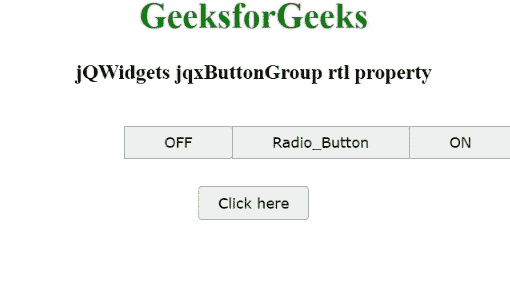

# jQWidgets jqxButtonGroup rtl 物业

> 原文:[https://www . geeksforgeeks . org/jqwidgets-jqxbuttongroup-RTL-property/](https://www.geeksforgeeks.org/jqwidgets-jqxbuttongroup-rtl-property/)

**jQWidgets** 是一个 JavaScript 框架，用于为 PC 和移动设备制作基于 web 的应用程序。它是一个非常强大、优化、独立于平台并且得到广泛支持的框架。 **jqxButtonGroup** 用于说明 jQuery 小部件，该部件生成一组按钮，其功能类似于普通按钮、单选按钮或复选框。

**rtl 属性**用于设置或获取一个值，该值说明小部件的元素是否在从右到左字体的帮助下被安排为支持区域设置。它属于布尔类型，默认值为假。

**语法:**

*   设置 *rtl* 属性。

    ```
    $('#jqxButtonGroup').jqxButtonGroup({rtl : true});  
    ```

*   获得 *rtl* 房产。

    ```
    var rtl = $('#jqxButtonGroup').jqxButtonGroup('rtl');
    ```

**链接文件:**从链接下载 [jQWidgets](https://www.jqwidgets.com/download/) 。在 HTML 文件中，找到下载文件夹中的脚本文件。

> <link rel="”stylesheet”" href="”jqwidgets/styles/jqx.base.css”" type="”text/css”">
> <脚本类型=【文本/JavaScript】src =【脚本/jquery-1 . 11 . 1 . min . js】></脚本>
> T8】脚本类型=【文本/JavaScript】src =【jqwidgets/jqxcore . js】></脚本>
> <脚本类型=【文本/JavaScript】src =【jqwidgets/jqxbuttons . js】。

下面的例子说明了 jQWidgets 中的 jqxButtonGroup **rtl 属性**。

**示例:**

## 超文本标记语言

```
<!DOCTYPE html>
<html lang="en">

<head>
    <link rel="stylesheet" 
          href="jqwidgets/styles/jqx.base.css" 
          type="text/css" />
    <link rel="stylesheet" 
          href="jqwidgets/styles/jqx.energyblue.css" 
          type="text/css" />
    <script type="text/javascript"
            src="scripts/jquery-1.11.1.min.js">
    </script>
    <script type="text/javascript"
            src="jqwidgets/jqxcore.js">
    </script>
    <script type="text/javascript"
            src="jqwidgets/jqx-all.js">
    </script>
    <script type="text/javascript"
            src="jqwidgets/jqxbuttons.js">
    </script>
</head>

<body>
    <center>
        <h1 style="color: green">GeeksforGeeks</h1>
        <h3>jQWidgets jqxButtonGroup rtl property</h3>
        <br />
        <div id="jqxBG">
            <button style="padding: 6px 36px" 
                    id="l">
                ON
            </button>
            <button style="padding: 6px 36px" 
                    id="c">
                Radio_Button
            </button>
            <button style="padding: 6px 36px" 
                    id="r">
                OFF
            </button>
        </div>
        <div>
            <input type="button" id="jqxBtn" 
                   style="margin-top: 25px" 
                   value="Click here" /> 
            </div>
        <div id="log"></div>
    </center>
    <script type="text/javascript">
    $(document).ready(function() {
        $("#jqxBtn").jqxButton({
            width: "100px",
            height: "30px",
        });
        $("#jqxBG").jqxButtonGroup({
            rtl: true,
        });
        $("#jqxBtn").on("click", function() {
            var rl = $("#jqxBG").jqxButtonGroup("rtl");
            $("#log").text("Aligned right to left: " + rl);
        });
    });
    </script>
</body>

</html>
```

**输出:**



**参考:**[https://www . jqwidgets . com/jquery-widgets-documentation/documentation/jqxbutton/jquery-button-API . htm](https://www.jqwidgets.com/jquery-widgets-documentation/documentation/jqxbutton/jquery-button-api.htm)