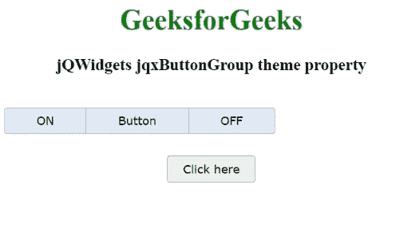

# jQWidgets jqxButtonGroup 主题属性

> 原文:[https://www . geesforgeks . org/jqwidgets-jqxbuttongroup-theme-property/](https://www.geeksforgeeks.org/jqwidgets-jqxbuttongroup-theme-property/)

**jQWidgets** 是一个 JavaScript 框架，用于为 PC 和移动设备制作基于 web 的应用程序。它是一个非常强大、优化、独立于平台并且得到广泛支持的框架。jqxButtonGroup 用于说明 jQuery 小部件，该部件生成一组按钮，其功能类似于普通按钮、单选按钮或复选框。

*主题*属性用于设置或返回 jqxButtonGroup 小部件的主题。它接受字符串类型值，默认值为空(')。为了使用这个属性，我们需要将*主题*样式表(即 jqx.energyblue.css)合并到标题部分。主题文件包含在 *jqx.base.css* 文件之后。

**语法:**

*   设置*主题*属性。

    ```html
    $('selector').jqxButtonGroup({ theme: String });
    ```

*   获得*主题*房产。

    ```html
    var theme = $('selector').jqxButtonGroup('theme');
    ```

**链接文件:**从链接下载 [jQWidgets](https://www.jqwidgets.com/download/) 。在 HTML 文件中，找到下载文件夹中的脚本文件。

> <link rel="”stylesheet”" href="”jqwidgets/styles/jqx.base.css”" type="”text/css”">
> < link rel= "样式表" href = " jqwidgets/style/jqx . energy blue . CSS " type = " text/CSS "/>
> <script type = " text/JavaScript " src = " scripts/jquery-1 . 11 . 1 . min . js "></script>
> <script type = " text/JavaScript " src = " jqwidgets/jqxcore。

**示例:**以下示例说明了 jQWidgets 中的 jqxButtonGroup *主题*属性。

## 超文本标记语言

```html
<!DOCTYPE html>
<html lang="en">

<head>
    <link rel="stylesheet" href=
    "jqwidgets/styles/jqx.base.css" type="text/css" />
    <link rel="stylesheet" href=
    "jqwidgets/styles/jqx.energyblue.css" type="text/css" />
    <script type="text/javascript" 
        src="scripts/jquery-1.11.1.min.js"></script>
    <script type="text/javascript" 
        src="jqwidgets/jqxcore.js"></script>
    <script type="text/javascript" 
        src="jqwidgets/jqx-all.js"></script>
    <script type="text/javascript" 
        src="jqwidgets/jqxbuttons.js"></script>
</head>

<body>
    <center>
        <h1 style="color: green">
            GeeksforGeeks
        </h1>

        <h3>jQWidgets jqxButtonGroup theme property</h3>
        <br />

        <div id="jqxBG">
            <button style="padding: 6px 36px" id="l">
                ON
            </button>
            <button style="padding: 6px 36px" id="c">
                Button
            </button>
            <button style="padding: 6px 36px" id="r">
                OFF
            </button>
        </div>

        <div>
            <input type="button" id="jqxBtn"
                style="margin-top: 25px" 
                value="Click here" />
        </div>

        <div id="log"></div>
    </center>

    <script type="text/javascript">
        $(document).ready(function () {
            $("#jqxBtn").jqxButton({
                width: "100px",
                height: "30px",
            });
            $("#jqxBG").jqxButtonGroup({
                theme: "energyblue",
            });
            $("#jqxBtn").on("click", function () {
                var th = $("#jqxBG").jqxButtonGroup("theme");
                $("#log").text("Theme_Name: " + th);
            });
        });
    </script>
</body>

</html>
```

**输出:**



**参考:**[https://www . jqwidgets . com/jquery-widgets-documentation/documentation/jqxbutton/jquery-button-API . htm？搜索=](https://www.jqwidgets.com/jquery-widgets-documentation/documentation/jqxbutton/jquery-button-api.htm?search=)