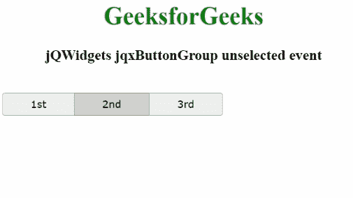

# jQWidgets jqxButtonGroup 未选中事件

> 原文:[https://www . geesforgeks . org/jqwidgets-jqxbuttongroup-unselect-event/](https://www.geeksforgeeks.org/jqwidgets-jqxbuttongroup-unselected-event/)

jQWidgets 是一个 JavaScript 框架，用于为 PC 和移动设备制作基于 web 的应用程序。它是一个非常强大、优化、独立于平台并且得到广泛支持的框架。jqxButtonGroup 用于说明 jQuery 小部件，它生成一组按钮，这些按钮的功能类似于普通按钮、单选按钮或复选框。

只要显示的 jqxButtonGroup 未被选择，并且模式必须是复选框或单选，则**未被选择事件**被激活。

**语法:**

```
$('#jqxButtonGroup').on('unselected', function () {});  
```

**链接文件:**从链接下载 [jQWidgets](https://www.jqwidgets.com/download/) 。在 HTML 文件中，找到下载文件夹中的脚本文件。

> <link rel="”stylesheet”" href="”jqwidgets/styles/jqx.base.css”" type="”text/css”">
> <脚本类型=【文本/JavaScript】src =【脚本/jquery-1 . 11 . 1 . min . js】></脚本>
> T8】脚本类型=【文本/JavaScript】src =【jqwidgets/jqxcore . js】></脚本>
> <脚本类型=【文本/JavaScript】src =【jqwidgets/jqxbuttons . js】。

以下示例说明了 jQWidgets 中的 jqxButtonGroup 未选中事件。

**示例:**

## 超文本标记语言

```
<!DOCTYPE html>
<html lang="en">
  <head>
    <link
      rel="stylesheet"
      href="jqwidgets/styles/jqx.base.css"
      type="text/css"
    />
    <script type="text/javascript" 
        src="scripts/jquery-1.11.1.min.js"></script>
    <script type="text/javascript" 
        src="jqwidgets/jqxcore.js"></script>
    <script type="text/javascript" 
        src="jqwidgets/jqxbuttons.js"></script>
  </head>
  <body>
    <center>
      <h1 style="color: green">GeeksforGeeks</h1>
      <h3>jQWidgets jqxButtonGroup unselected event</h3>
      <br />

      <div id="jqxBG">
        <button style="padding: 6px 36px" 
                id="l">1st</button>
        <button style="padding: 6px 36px" 
                id="c">2nd</button>
        <button style="padding: 6px 36px" 
                id="r">3rd</button>
      </div>
    </center>

    <div id="log"></div>

    <script type="text/javascript">
      $(document).ready(function () {
        $("#jqxBG").jqxButtonGroup({
          mode: "checkbox",
        });
        $("#jqxBG").jqxButtonGroup("setSelection", 1);

        $("#jqxBG").on("unselected", function (event) {
          $("#log").html(
            "Button with index " + event.args.index
            + " is unselected!"
          );
        });
      });
    </script>
  </body>
</html>
```

**输出:**



**参考:**[https://www . jqwidgets . com/jquery-widgets-documentation/documentation/jqxbutton/jquery-button-API . htm？搜索=](https://www.jqwidgets.com/jquery-widgets-documentation/documentation/jqxbutton/jquery-button-api.htm?search=)