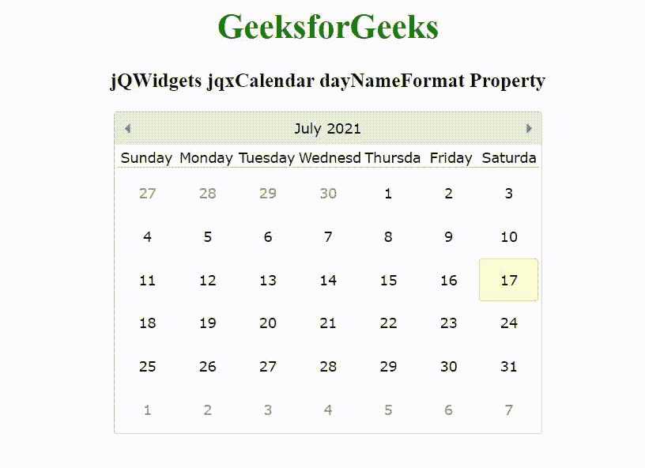

# jQWidgets jqxCalendar dayname format 属性

> 原文:[https://www . geesforgeks . org/jqwidgets-jqxcalendar-daynameform-property/](https://www.geeksforgeeks.org/jqwidgets-jqxcalendar-daynameformat-property/)

jQWidgets 是一个 JavaScript 框架，用于为 PC 和移动设备制作基于 web 的应用程序。它是一个非常强大和优化的框架，独立于平台，并得到广泛支持。jqxCalendar 代表一个 jQuery 日历小部件，使用户能够使用可视的月历显示来选择日期。

dayNameFormat 属性用于设置或返回一周中各天的名称格式。它接受字符串类型值，默认值为“第一个两个字母”。

它的可能值是–

*   “默认”
*   最短的
*   '前两个字母'
*   第一个字母
*   “满了”

**语法:**

```
$('.selector').jqxCalendar({
    dayNameFormat: String
});
```

**链接文件:**从 https://www.jqwidgets.com/download/链接下载 jQWidgets。在 HTML 文件中，找到下载文件夹中的脚本文件:

> <link rel="”stylesheet”" href="”jqwidgets/styles/jqx.base.css”" type="”text/css”">
> <脚本类型=“text/JavaScript”src =“scripts/jquery-1 . 11 . 1 . min . js”></脚本>
> <脚本类型=“text/JavaScript”src =“jqwidgets/jqxcore . js”></脚本>
> 脚本类型=“text/JavaScript”src =“jqwidgets/jqxdatetimetime”

以下示例说明了 jQWidgets 中的 jqxCalendar dayNameFormat 属性:

**示例:**

## 超文本标记语言

```
<!DOCTYPE html>
<html lang="en">

<head>
    <link rel="stylesheet" href=
"jqwidgets/styles/jqx.base.css" type="text/css" />
    <script type="text/javascript" 
            src="scripts/jquery-1.11.1.min.js">
   </script>
    <script type="text/javascript" 
            src="jqwidgets/jqxcore.js">
    </script>
    <script type="text/javascript" 
            src="jqwidgets/jqxdatetimeinput.js">
    </script>
    <script type="text/javascript" 
            src="jqwidgets/jqxcalendar.js">
    </script>
    <script type="text/javascript" 
            src="jqwidgets/globalization/globalize.js">
    </script>
    <script tyle="text/javascript" 
            src="jqwidgets/jqx-all.js">
    </script>
</head>
<body>
    <center>
        <h1 style="color: green;">
            GeeksforGeeks
        </h1>

        <h3>
            jQWidgets jqxCalendar dayNameFormat Property
        </h3>

        <div id='jqxcal'></div>
    </center>

    <script type="text/javascript">
        $(document).ready(function () {
            $("#jqxcal").jqxCalendar({
                width: '400px',
                height: '300px',
                dayNameFormat: 'full'
            });
        });
    </script>
</body>

</html>
```

**输出:**



**输出:**[https://www . jqwidgets . com/jquery-widgets-documentation/documentation/jqxcalendar/jquery-calendar-API . htm](https://www.jqwidgets.com/jquery-widgets-documentation/documentation/jqxcalendar/jquery-calendar-api.htm)