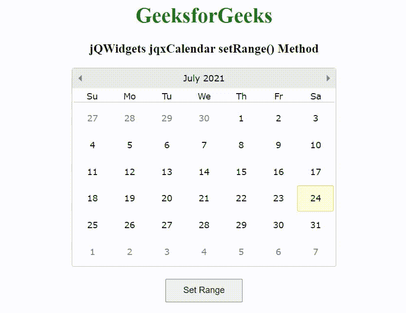

# jQWidgets jqxCalendar setRange()方法

> 原文:[https://www . geesforgeks . org/jqwidgets-jqxcalendar-set range-method/](https://www.geeksforgeeks.org/jqwidgets-jqxcalendar-setrange-method/)

jQWidgets 是一个 JavaScript 框架，用于为 PC 和移动设备制作基于 web 的应用程序。它是一个非常强大和优化的框架，独立于平台，并得到广泛支持。jqxCalendar 代表一个 jQuery 日历小部件，使用户能够使用可视的月历显示来选择日期。

当 selectionMode 属性设置为“范围”时，setRange()方法用于设置选择范围。此方法接受日期作为参数，并且不返回值。

**语法:**

```html
$("selector").jqxCalendar('setRange', date1, date2);
```

**链接文件:**从 https://www.jqwidgets.com/download/链接下载 jQWidgets。在 HTML 文件中，找到下载文件夹中的脚本文件:

> <link rel="”stylesheet”" href="”jqwidgets/styles/jqx.base.css”" type="”text/css”">

以下示例说明了 jQWidgets 中的 jqxCalendar setRange()方法:

**示例:**

## 超文本标记语言

```html
<!DOCTYPE html>
<html lang="en">

<head>
    <link rel="stylesheet" href=
        "jqwidgets/styles/jqx.base.css" type="text/css" />
    <script type="text/javascript" 
        src="scripts/jquery-1.11.1.min.js"></script>
    <script type="text/javascript" 
        src="jqwidgets/jqxcore.js"></script>
    <script type="text/javascript" 
        src="jqwidgets/jqxdatetimeinput.js"></script>
    <script type="text/javascript" 
        src="jqwidgets/jqxcalendar.js"></script>
    <script type="text/javascript" 
        src="jqwidgets/globalization/globalize.js">
    </script>
    <script tyle="text/javascript" 
        src="jqwidgets/jqx-all.js"></script>
</head>

<body>
    <center>
        <h1 style="color: green;">
            GeeksforGeeks
        </h1>

        <h3>
            jQWidgets jqxCalendar setRange() Method
        </h3>

        <div id='jqxcal'></div>
        <br>
        <input type="button" id='jqxBtn' 
            value="Set Range" style="padding: 8px 25px;" />
    </center>

    <script type="text/javascript">
        $(document).ready(function () {
            $("#jqxcal").jqxCalendar({
                width: '400px',
                height: '300px',
                selectionMode: 'range'
            });

            var d1 = new Date(2022, 0, 1)
            var d2 = new Date(2022, 0, 5);

            $('#jqxBtn').on('click', function () {
                $('#jqxcal').jqxCalendar(
                    'setRange', d1, d2
                );
            });
        });
    </script>
</body>

</html>
```

**输出:**



**参考:**[https://www . jqwidgets . com/jquery-widgets-documentation/documentation/jqxcalendar/jquery-calendar-API . htm](https://www.jqwidgets.com/jquery-widgets-documentation/documentation/jqxcalendar/jquery-calendar-api.htm)