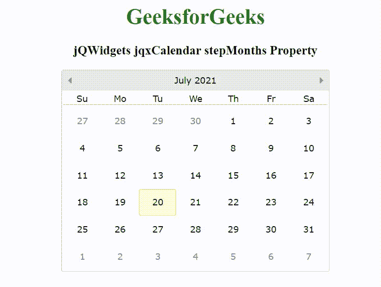

# jQWidgets jqxCalendar 继月属性

> 原文:[https://www . geesforgeks . org/jqwidgets-jqxcalendar-step months-property/](https://www.geeksforgeeks.org/jqwidgets-jqxcalendar-stepmonths-property/)

jQWidgets 是一个 JavaScript 框架，用于为 PC 和移动设备制作基于 web 的应用程序。它是一个非常强大和优化的框架，独立于平台，并得到广泛支持。jqxCalendar 代表一个 jQuery 日历小部件，使用户能够使用可视的月历显示来选择日期。

当点击左侧或右侧导航按钮时，*步骤月份*属性用于设置或返回日历的导航步骤。它接受数字类型值，默认值为 1。

**语法:**

```html
$('.selector').jqxCalendar({
  stepMonths: Number
});
```

**链接文件:**从 https://www.jqwidgets.com/download/链接下载 jQWidgets。在 HTML 文件中，找到下载文件夹中的脚本文件:

> <link rel="”stylesheet”" href="”jqwidgets/styles/jqx.base.css”" type="”text/css”">

下面的示例说明了 jQWidgets 中的 jqxCalendar stepMonths 属性:

**示例:**

## 超文本标记语言

```html
<!DOCTYPE html>
<html lang="en">
  <head>
    <link
      rel="stylesheet"
      href="jqwidgets/styles/jqx.base.css"
      type="text/css"/>
    <script type="text/javascript" 
    src="scripts/jquery-1.11.1.min.js">
    </script>
    <script type="text/javascript" 
    src="jqwidgets/jqxcore.js">
    </script>
    <script type="text/javascript" 
    src="jqwidgets/jqxdatetimeinput.js">
    </script>
    <script type="text/javascript" 
       src="jqwidgets/jqxcalendar.js">
    </script>
    <script
      type="text/javascript"
      src="jqwidgets/globalization/globalize.js"
    ></script>
    <script tyle="text/javascript" src="jqwidgets/jqx-all.js"></script>
  </head>

  <body>
    <center>
      <h1 style="color: green">GeeksforGeeks</h1>

      <h3>jQWidgets jqxCalendar stepMonths Property</h3>

      <div id="jqxcal"></div>
    </center>

    <script type="text/javascript">
      $(document).ready(function () {
        $("#jqxcal").jqxCalendar({
          width: "400px",
          height: "300px",
          stepMonths: 3,
        });
      });
    </script>
  </body>
</html>
```

**输出:**



**参考:**[https://www . jqwidgets . com/jquery-widgets-documentation/documentation/jqxcalendar/jquery-calendar-API . htm](https://www.jqwidgets.com/jquery-widgets-documentation/documentation/jqxcalendar/jquery-calendar-api.htm)