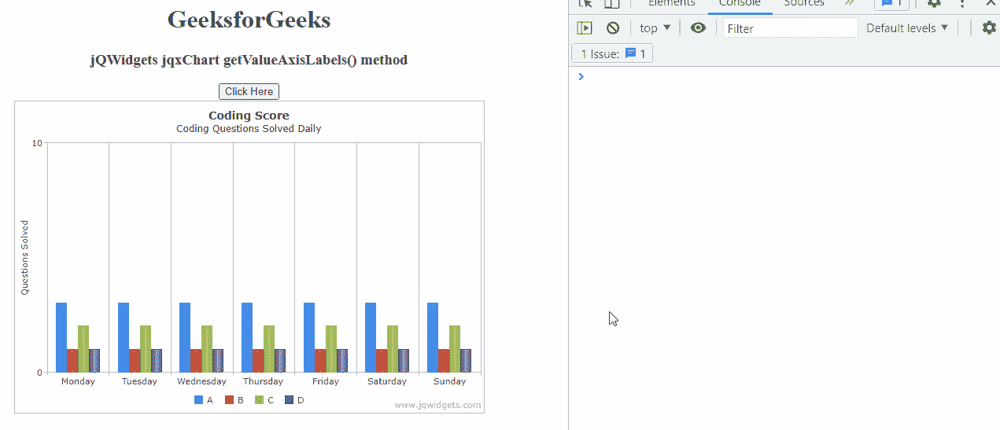

# jQWidgets jqxChart getValueAxisLabels()方法

> 原文:[https://www . geesforgeks . org/jqwidgets-jqxchart-getvalueaxislabels-method/](https://www.geeksforgeeks.org/jqwidgets-jqxchart-getvalueaxislabels-method/)

**jQWidgets** 是一个 JavaScript 框架，用于为 PC 和移动设备制作基于 web 的应用程序。它是一个非常强大和优化的框架，独立于平台，并得到广泛支持。jqxChart 是一个轻量级且功能强大的图表小部件，100%用 javascript 编写。它提供了许多高级功能，并支持三种不同的渲染技术——SVG、HTML5 画布& VML。

**getValueAxisLabels()方法**用于获取值轴的标签坐标。它以 groupIndex 类型值为参数，取数字类型值，返回数组类型值。

**语法:**

```html
var getValueAxisLabels= chartInstance.getValueAxisLabels(0);
```

**链接文件:**从链接下载 https://www.jqwidgets.com/download/。在 HTML 文件中，找到下载文件夹中的脚本文件:

> <link rel="”stylesheet”" href="”jqwidgets/styles/jqx.base.css”" type="”text/css”">
> <脚本类型=【text/JavaScript】src =【scripts/jquery-1 . 11 . 1 . min . js】></脚本>
> <脚本类型=【text/JavaScript】src =【jqwidgets/jqxcore . js】></脚本>
> 脚本类型=【text/JavaScript】src =【jqwidgets/jqxchart . core

**示例:**以下示例说明了 jQWidgets 中的 jqxHeatMap getValueAxisLabels()方法:

## 超文本标记语言

```html
<!DOCTYPE html>
<html lang="en">

<head>
    <link rel="stylesheet" 
          href="jqwidgets/styles/jqx.base.css" 
          type="text/css" />
    <script type="text/javascript" 
             src="scripts/jquery-1.11.1.min.js">
    </script>
    <script type="text/javascript"
             src="jqwidgets/jqxcore.js">
    </script>
    <script type="text/javascript" 
             src="jqwidgets/jqxchart.core.js">
    </script>
    <script type="text/javascript" 
             src="jqwidgets/jqxchart.api.js">
    </script>
    <script type="text/javascript" 
             src="jqwidgets/jqxdraw.js">
    </script>
    <script type="text/javascript" 
             src="jqwidgets/jqxdata.js">
    </script>
</head>

<body>
    <center>
        <h1 style="color: green">
          GeeksforGeeks
        </h1>
        <h3>jQWidgets jqxChart getValueAxisLabels() method</h3>

        <button id='gfg'>Click Here</button>

        <div id='gfg1' style="width:600px; height: 400px"/>
    </center>

    <script type="text/javascript">
        $(document).ready(function () {
            var json = [
                { Day:'Monday', A:3, B:1, C: 2, D:1},
                { Day:'Tuesday', A:3, B:1, C: 2, D:1},
                { Day:'Wednesday', A:3, B:1, C: 2, D:1},
                { Day:'Thursday', A:3, B:1, C: 2, D:1},
                { Day:'Friday', A:3, B:1, C: 2, D:1},
                { Day:'Saturday', A:3, B:1, C: 2, D:1},
                { Day:'Sunday', A:3, B:1, C: 2, D:1}
            ];

            var obj = {
                title: "Coding Score",
                description: "Coding Questions Solved Daily",
                source: json,
                toolTipMoveDuration: 1000,
                categoryAxis: {
                    dataField: 'Day',
                    showGridLines: true
                },
                seriesGroups: [{
                    type: 'column',
                    columnsGapPercent: 30,
                    seriesGapPercent: 0,
                    valueAxis: {
                        minValue: 0,
                        maxValue: 10,
                        unitInterval: 10,
                        description: 'Questions Solved'
                    },
                    series: [
                        { dataField: 'A', displayText: 'A'},
                        { dataField: 'B', displayText: 'B'},
                        { dataField: 'C', displayText: 'C'},
                        { dataField: 'D', displayText:'D' }
                    ]
                }]
            };
            $('#gfg1').jqxChart(obj);

             $('#gfg').click(function () {
                var chartInstance = $('#gfg1').jqxChart('getInstance');
                var xval = chartInstance.getValueAxisLabels(0); 
                console.log(xval);
            });
        });
    </script>
</body>

</html>
```

**输出:**



**参考:**[**https://www . jqwidgets . com/jquery-widgets-documentation/documentation/jqxchart/jquery-chart-API . htm？搜索=**](https://www.jqwidgets.com/jquery-widgets-documentation/documentation/jqxchart/jquery-chart-api.htm?search=)