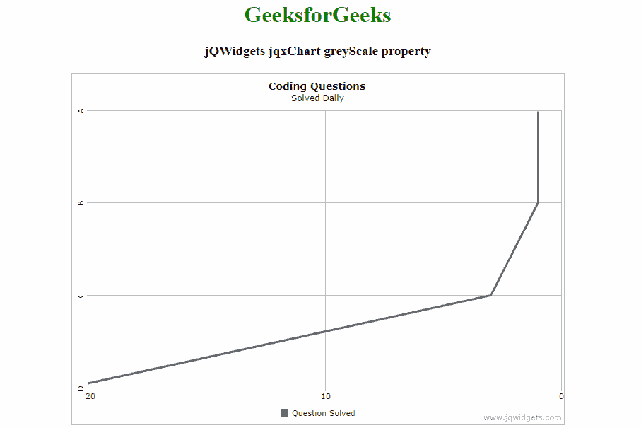

# jQWidgets jqxChart 灰度属性

> 原文:[https://www . geeksforgeeks . org/jqwidgets-jqxchart-灰度-property/](https://www.geeksforgeeks.org/jqwidgets-jqxchart-greyscale-property/)

**jQWidgets** 是一个 JavaScript 框架，用于为 PC 和移动设备制作基于 web 的应用程序。它是一个非常强大和优化的框架，独立于平台，并得到广泛支持。 **jqxChart** 是一个轻量级且功能强大的图表小部件，100%用 javascript 编写。它提供了许多高级功能，并支持三种不同的渲染技术——SVG、HTML5 画布& VML。

**灰度属性**用于设置或返回灰度属性。即该属性用于以灰色显示刻度。它接受布尔类型值，默认值为 false。

**语法:**

设置**灰度**属性。

```
$('Selector').jqxChart({ grayScale : boolean});
```

返回**灰度**属性。

```
var grayScale = $('Selector').jqxChart('grayScale');
```

**链接文件:**从链接下载 https://www.jqwidgets.com/download/。在 HTML 文件中，找到下载文件夹中的脚本文件:

> <link rel="”stylesheet”" href="”jqwidgets/styles/jqx.base.css”" type="”text/css”">
> <脚本类型=【text/JavaScript】src =【scripts/jquery-1 . 11 . 1 . min . js】></脚本>
> <脚本类型=【text/JavaScript】src =【jqwidgets/jqxcore . js】></脚本>
> 脚本类型=【text/JavaScript】src =【jqwidgets/jqxchart . core

**示例:**以下示例说明了 jQWidgets 中的 jqxChart 灰度属性:

## 超文本标记语言

```
<!DOCTYPE html>
<html lang="en">

<head>
    <link rel="stylesheet" href=
    "jqwidgets/styles/jqx.base.css" type="text/css" />
    <script type="text/javascript"
        src="scripts/jquery-1.11.1.min.js"></script>
    <script type="text/javascript"
        src="jqwidgets/jqxcore.js"></script>
    <script type="text/javascript"
        src="jqwidgets/jqxchart.core.js"></script>
    <script type="text/javascript"
        src="jqwidgets/jqxdraw.js"></script>
    <script type="text/javascript"
        src="jqwidgets/jqxdata.js"></script>
</head>

<body>
    <center>
        <h1 style="color: green">
            GeeksforGeeks
        </h1>

        <h3>jQWidgets jqxChart grayScale property</h3>

        <div id='chartContainer'
            style="width:700px; height: 500px">
        </div>
    </center>

    <script type="text/javascript">
        $(document).ready(function () {
            var Data = [{
                name: 'A',
                ques: 1,
            }, {
                name: 'B',
                ques: 1,
            }, {
                name: 'C',
                ques: 3,
            }, {
                name: 'D',
                ques: 21,
            }];

            // Prepare jqxChart settings
            var settings = {
                showLegend: true,
                enableCrosshairs: true,
                grayScale: true,
                title: "Coding Questions",
                description: "Solved Daily",
                source: Data,
                categoryAxis: {
                    dataField: 'name'
                },
                seriesGroups: [{
                    type: 'line',
                    orientation: 'horizontal',
                    columnsGapPercent: 10,
                    valueAxis: {
                        unitInterval: 10,
                        maxValue: 15,
                        displayValueAxis: true,
                        description: '',
                    },
                    series: [{
                        dataField: 'ques',
                        displayText: 'Question Solved'
                    }]
                }]
            };
            $('#chartContainer').jqxChart(settings);
        });
    </script>
</body>

</html>
```

**输出:**



**参考:**[**https://www . jqwidgets . com/jquery-widgets-documentation/documentation/jqxchart/jquery-chart-API . htm？搜索=**](https://www.jqwidgets.com/jquery-widgets-documentation/documentation/jqxchart/jquery-chart-api.htm?search=)