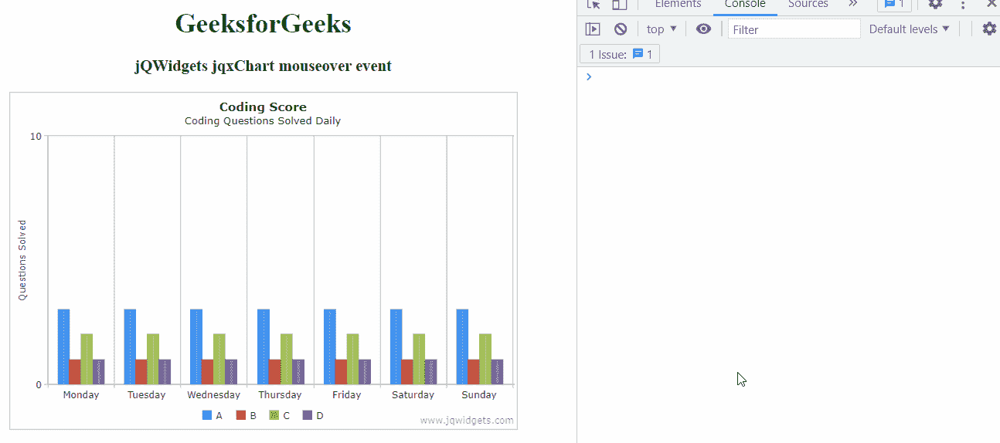

# jQWidgets jqxChart 鼠标悬停事件

> 原文:[https://www . geesforgeks . org/jqwidgets-jqxchart-mouse over-event/](https://www.geeksforgeeks.org/jqwidgets-jqxchart-mouseover-event/)

**jQWidgets** 是一个 JavaScript 框架，用于为 PC 和移动设备制作基于 web 的应用程序。它是一个非常强大、优化、独立于平台并且得到广泛支持的框架。 **jqxChart** 是一个轻量级且功能强大的图表小部件，100%用 JavaScript 编写。它提供了许多高级功能，并支持三种不同的渲染技术——SVG、HTML5 画布& VML。

当用户将光标移动到元素上时，触发**鼠标悬停**事件。

**语法:**

```html
$('.jqxChart').on('mouseover', function (){
 // Code
});
```

**链接文件:**从给定的链接下载 jQWidgets。在 HTML 文件中，找到下载文件夹中的脚本文件:

> <link type="”text/css”" rel="”Stylesheet”" href="”jqwidgets/styles/jqx.base.css”">
> <脚本类型= " text/JavaScript " src = " scripts/jquery-1 . 11 . 1 . min . js "></脚本类型>
> <脚本类型= " text/JavaScript " src = " jqwidgets/jqxcore . js "></脚本类型>
> <脚本类型= " text/JavaScript " src = " jqwidgets/globalize . js

**示例:**以下示例说明了 jQWidgets 中的 **jqxChart** 鼠标悬停事件:

## 超文本标记语言

```html
<!DOCTYPE html>
<html lang="en">

<head>
    <link rel="stylesheet" href=
    "jqwidgets/styles/jqx.base.css" type="text/css" />
    <script type="text/javascript" 
        src="scripts/jquery-1.11.1.min.js"></script>
    <script type="text/javascript" 
        src="jqwidgets/jqxcore.js"></script>
    <script type="text/javascript" 
        src="jqwidgets/jqxchart.core.js"></script>
    <script type="text/javascript" 
        src="jqwidgets/jqxdraw.js"></script>
    <script type="text/javascript" 
        src="jqwidgets/jqxdata.js"></script>
</head>

<body>
    <center>
        <h1 style="color: green">
            GeeksforGeeks
        </h1>
        <h3>jQWidgets jqxChart mouseover event</h3>
        <div class='default'></div>
        <div id='chartContainer' 
            style="width:600px; height: 400px"></div>
    </center>

    <script type="text/javascript">
        $(document).ready(function () {
            var json = [
                { Day: 'Monday', A: 3, B: 1, C: 2, D: 1 },
                { Day: 'Tuesday', A: 3, B: 1, C: 2, D: 1 },
                { Day: 'Wednesday', A: 3, B: 1, C: 2, D: 1 },
                { Day: 'Thursday', A: 3, B: 1, C: 2, D: 1 },
                { Day: 'Friday', A: 3, B: 1, C: 2, D: 1 },
                { Day: 'Saturday', A: 3, B: 1, C: 2, D: 1 },
                { Day: 'Sunday', A: 3, B: 1, C: 2, D: 1 }
            ];

            var obj = {
                title: "Coding Score",
                description: "Coding Questions Solved Daily",
                source: json,
                categoryAxis: {
                    dataField: 'Day',
                    showGridLines: true
                },
                seriesGroups: [{
                    type: 'column',
                    columnsGapPercent: 30,
                    seriesGapPercent: 0,
                    valueAxis: {
                        minValue: 0,
                        maxValue: 10,
                        unitInterval: 10,
                        description: 'Questions Solved'
                    },
                    series: [
                        { dataField: 'A', displayText: 'A' },
                        { dataField: 'B', displayText: 'B' },
                        { dataField: 'C', displayText: 'C' },
                        { dataField: 'D', displayText: 'D' }
                    ]
                }
                ]
            };
            $('#chartContainer').jqxChart(obj);

            $('#chartContainer').on('mouseover', function (e) {
                console.log('mouseover event is triggered');
            });
        });
    </script>
</body>

</html>
```

**输出:**



**参考:**[https://www . jqwidgets . com/jquery-widgets-documentation/documentation/jqxchart/jquery-chart-API . htm？搜索=](https://www.jqwidgets.com/jquery-widgets-documentation/documentation/jqxchart/jquery-chart-api.htm?search=)