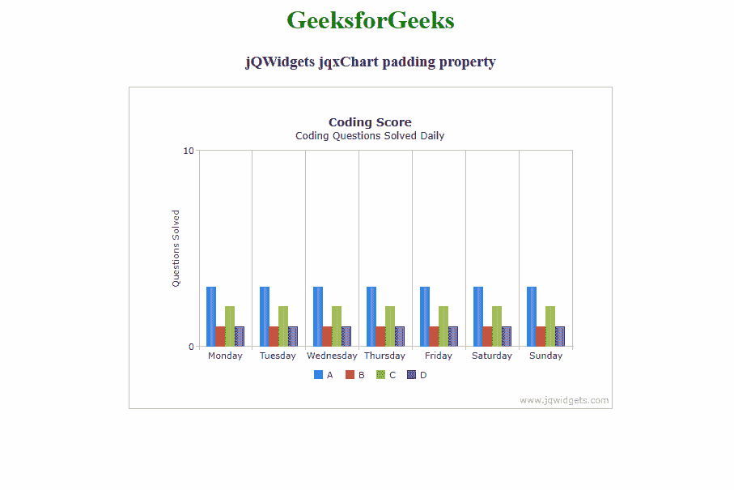

# jQWidgets jqxChart 填充属性

> 原文:[https://www . geesforgeks . org/jqwidgets-jqxchart-padding-property/](https://www.geeksforgeeks.org/jqwidgets-jqxchart-padding-property/)

**jQWidgets** 是一个 JavaScript 框架，用于为 PC 和移动设备制作基于 web 的应用程序。它是一个非常强大和优化的框架，独立于平台，并得到广泛支持。 **jqxChart** 是一个轻量级且功能强大的图表小部件，100%用 javascript 编写。它提供了许多高级功能，并支持三种不同的渲染技术——SVG、HTML5 画布& VML。

**填充**属性用于设置或返回填充属性。即该属性用于设置图表的左、上、右&底部填充。它接受填充类型值，默认值为{左:5，上:5，右:5，下:5 }。

**语法:**

*   它用于设置填充属性。

    ```html
    $('Selector').jqxChart({ padding : values});
    ```

*   它用于返回填充属性。

    ```html
    var padding = $('Selector').jqxChart('padding');
    ```

**链接文件:**从链接下载 [jQWidgets](https://www.jqwidgets.com/download/) 。在 HTML 文件中，找到下载文件夹中的脚本文件。

> <link rel="”stylesheet”" href="”jqwidgets/styles/jqx.base.css”" type="”text/css”">
> <脚本类型=【text/JavaScript】src =【scripts/jquery-1 . 11 . 1 . min . js】></脚本>
> <脚本类型=【text/JavaScript】src =【jqwidgets/jqxcore . js】></脚本>
> 脚本类型=【text/JavaScript】src =【jqwidgets/jqxchart . core

**示例:**以下示例说明了 jqxChart **在 jQWidgets 中填充**属性。

## 超文本标记语言

```html
<!DOCTYPE html>
<html lang="en">

<head>
    <link rel="stylesheet" 
          href="jqwidgets/styles/jqx.base.css" 
          type="text/css" />
    <script type="text/javascript" 
            src="scripts/jquery-1.11.1.min.js">
    </script>
    <script type="text/javascript" 
            src="jqwidgets/jqxcore.js">
    </script>
    <script type="text/javascript" 
            src="jqwidgets/jqxchart.core.js">
    </script>
    <script type="text/javascript" 
            src="jqwidgets/jqxdraw.js">
    </script>
    <script type="text/javascript" 
            src="jqwidgets/jqxdata.js">
    </script>
</head>

<body>
    <center>
        <h1 style="color: green">
          GeeksforGeeks
        </h1>
        <h3>jQWidgets jqxChart padding property</h3>
        <div class='default'></div>
      <div id='chartContainer' 
           style="width:600px; 
           height: 400px">
      </div>
    </center>

    <script type="text/javascript">
        $(document).ready(function () {
            var json = [
                { Day:'Monday', A:3, B:1, C: 2, D:1},
                { Day:'Tuesday', A:3, B:1, C: 2, D:1},
                { Day:'Wednesday', A:3, B:1, C: 2, D:1},
                { Day:'Thursday', A:3, B:1, C: 2, D:1},
                { Day:'Friday', A:3, B:1, C: 2, D:1},
                { Day:'Saturday', A:3, B:1, C: 2, D:1},
                { Day:'Sunday', A:3, B:1, C: 2, D:1}
            ];

            var obj = {
                title: "Coding Score",
                description: "Coding Questions Solved Daily",
                source: json,
                padding: { left: 50, top: 30, 
                     right: 50, bottom: 30 },
                categoryAxis: {
                    dataField: 'Day',
                    showGridLines: true
                },
                seriesGroups: [{
                    type: 'column',
                    columnsGapPercent: 30,
                    seriesGapPercent: 0,
                    valueAxis: {
                        minValue: 0,
                        maxValue: 10,
                        unitInterval: 10,
                        description: 'Questions Solved'
                    },
                    series: [
                        { dataField: 'A', displayText: 'A'},
                        { dataField: 'B', displayText: 'B'},
                        { dataField: 'C', displayText: 'C'},
                        { dataField: 'D', displayText:'D' }
                    ]
                }]
            };
            $('#chartContainer').jqxChart(obj);
        });
    </script>
</body>

</html>
```

**输出:**



**参考:**[https://www . jqwidgets . com/jquery-widgets-documentation/documentation/jqxchart/jquery-chart-API . htm？搜索=](https://www.jqwidgets.com/jquery-widgets-documentation/documentation/jqxchart/jquery-chart-api.htm?search=)