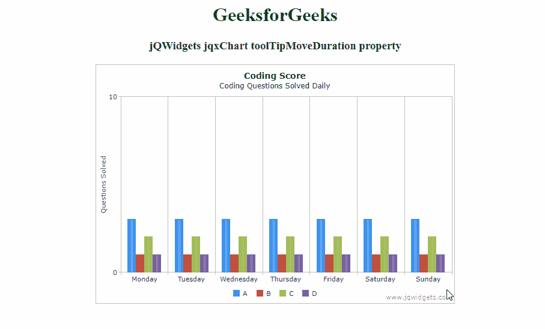

# jQWidgets jqxChart toolTipMoveDuration 属性

> 原文:[https://www . geesforgeks . org/jqwidgets-jqxchart-tooltipmoveduration-property/](https://www.geeksforgeeks.org/jqwidgets-jqxchart-tooltipmoveduration-property/)

**jQWidgets** 是一个 JavaScript 框架，用于为 PC 和移动设备制作基于 web 的应用程序。它是一个非常强大、优化、独立于平台并且得到广泛支持的框架。 **jqxChart** 是一个轻量级且功能强大的图表小部件，100%用 JavaScript 编写。它提供了许多高级功能，并支持三种不同的渲染技术——SVG、HTML5 画布& VML。

***toolTipMoveDuration*****属性用于设置或返回 *toolTipMoveDuration* 属性。即，该属性用于设置或返回在项目之间移动工具提示的时间(以毫秒为单位)。它接受数字类型值，默认值为 300。**

****语法:****

*   **设置*工具提示移动持续时间*属性。

    ```html
    $('Selector').jqxChart({ toolTipMoveDuration : number});
    ```** 
*   **返回*工具提示移动持续时间*属性。

    ```html
    var toolTipMoveDuration = 
        $('Selector').jqxChart('toolTipMoveDuration');
    ```** 

****链接文件:**从链接下载 [jQWidgets](https://www.jqwidgets.com/download/) 。在 HTML 文件中，找到下载文件夹中的脚本文件。**

> <link rel="”stylesheet”" href="”jqwidgets/styles/jqx.base.css”" type="”text/css”"> **<脚本类型=【text/JavaScript】src =【scripts/jquery-1 . 11 . 1 . min . js】></脚本>
> <脚本类型=【text/JavaScript】src =【jqwidgets/jqxcore . js】></脚本>
> 脚本类型=【text/JavaScript】src =【jqwidgets/jqxchart . core**

****示例:**以下示例说明了 jQWidgets 中的 jqxChart*toolTipMoveDuration*属性。**

## **超文本标记语言**

```html
<!DOCTYPE html>
<html lang="en">

<head>
    <link rel="stylesheet" href=
    "jqwidgets/styles/jqx.base.css" type="text/css" />
    <script type="text/javascript" 
        src="scripts/jquery-1.11.1.min.js"></script>
    <script type="text/javascript" 
        src="jqwidgets/jqxcore.js"></script>
    <script type="text/javascript" 
        src="jqwidgets/jqxchart.core.js"></script>
    <script type="text/javascript" 
        src="jqwidgets/jqxdraw.js"></script>
    <script type="text/javascript" 
        src="jqwidgets/jqxdata.js"></script>
</head>

<body>
    <center>
        <h1 style="color:green">
            GeeksforGeeks
        </h1>

        <h3>
            jQWidgets jqxChart toolTipMoveDuration property
        </h3>

        <div id='chartContainer' 
            style="width:600px; height:400px" />
    </center>

    <script type="text/javascript">

        $(document).ready(function () {
            var json = [
                { Day: 'Monday', A: 3, B: 1, C: 2, D: 1 },
                { Day: 'Tuesday', A: 3, B: 1, C: 2, D: 1 },
                { Day: 'Wednesday', A: 3, B: 1, C: 2, D: 1 },
                { Day: 'Thursday', A: 3, B: 1, C: 2, D: 1 },
                { Day: 'Friday', A: 3, B: 1, C: 2, D: 1 },
                { Day: 'Saturday', A: 3, B: 1, C: 2, D: 1 },
                { Day: 'Sunday', A: 3, B: 1, C: 2, D: 1 }
            ];

            var obj = {
                title: "Coding Score",
                description: "Coding Questions Solved Daily",
                source: json,
                toolTipMoveDuration: 1000,
                categoryAxis:
                {
                    dataField: 'Day',
                    showGridLines: true
                },
                seriesGroups: [{
                    type: 'column',
                    columnsGapPercent: 30,
                    seriesGapPercent: 0,
                    valueAxis: {
                        minValue: 0,
                        maxValue: 10,
                        unitInterval: 10,
                        description: 'Questions Solved'
                    },
                    series: [
                        { dataField: 'A', displayText: 'A' },
                        { dataField: 'B', displayText: 'B' },
                        { dataField: 'C', displayText: 'C' },
                        { dataField: 'D', displayText: 'D' }
                    ]
                }
                ]
            };
            $('#chartContainer').jqxChart(obj);
        });
    </script>
</body>

</html>
```

****输出:****

****

****参考:**[https://www . jqwidgets . com/jquery-widgets-documentation/documentation/jqxchart/jquery-chart-API . htm？搜索=](https://www.jqwidgets.com/jquery-widgets-documentation/documentation/jqxchart/jquery-chart-api.htm?search=)**