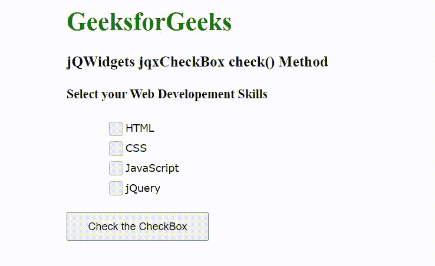

# jQWidgets jqxCheckBox check()方法

> 原文:[https://www . geesforgeks . org/jqwidgets-jqxcheckbox-check-method/](https://www.geeksforgeeks.org/jqwidgets-jqxcheckbox-check-method/)

jQWidgets 是一个 JavaScript 框架，用于为 PC 和移动设备制作基于 web 的应用程序。它是一个非常强大、优化、独立于平台并且得到广泛支持的框架。jqxCheckBox 小部件用于显示允许用户选择或取消选择复选框的复选框。

**check()** 方法用于选中复选框。它不接受任何参数，也不返回值。

**语法:**

```
$('selector').jqxCheckBox('check');
```

**链接文件:**从链接下载 [jQWidgets](https://www.jqwidgets.com/download/) 。在 HTML 文件中，找到下载文件夹中的脚本文件。

> <link rel="”stylesheet”" href="”jqwidgets/styles/jqx.base.css”" type="”text/css”">
> <脚本类型=【文本/JavaScript】src =【脚本/jquery-1 . 11 . 1 . min . js】></脚本>
> T8】脚本类型=【文本/JavaScript】src =【jqwidgets/jqxcore . js】></脚本>
> T12】脚本类型=【文本/JavaScript】src =【jqwidgets/jqxcheckbox . js。

**示例:**下面的示例说明了 jQWidgets 中的 jqxCheckBox **check()** 方法。

## 超文本标记语言

```
<!DOCTYPE html>
<html lang="en">

<head>
    <link rel="stylesheet" href=
"jqwidgets/styles/jqx.base.css" type="text/css" />
    <script type="text/javascript" 
            src="scripts/jquery-1.11.1.min.js">
    </script>
    <script type="text/javascript" 
            src="jqwidgets/jqxcore.js">
    </script>
    <script type="text/javascript" 
            src="jqwidgets/jqxcheckbox.js">
    </script>

    <style>
        body {
            margin-left: 100px;
        }

        .jqxcheckbox {
            margin-left: 50px;
        }
    </style>
</head>

<body>
    <h1 style="color: green;">
        GeeksforGeeks
    </h1>

    <h3>
        jQWidgets jqxCheckBox check() Method
    </h3>

    <h4>Select your Web Developement Skills</h4>

    <div class='jqxcheckbox'>HTML</div>
    <div class='jqxcheckbox'>CSS</div>
    <div class='jqxcheckbox'>JavaScript</div>
    <div class='jqxcheckbox'>jQuery</div>

    <br>
    <input type="button" id='jqxBtn' 
        value="Check the CheckBox" style="padding: 8px 25px;" />

    <script type="text/javascript">
        $(document).ready(function () {

            // Create jqxCheckBox
            $(".jqxcheckbox").jqxCheckBox({
                width: 120,
                height: 25
            });

            $('#jqxBtn').on('click', function () {
                $('.jqxcheckbox').jqxCheckBox('check');
            });
        });
    </script>
</body>

</html>
```

**输出:**



**参考:**[https://www . jqwidgets . com/jquery-widgets-documentation/documentation/jqxcheckandradio/jquery-checkandradio-API . htm](https://www.jqwidgets.com/jquery-widgets-documentation/documentation/jqxcheckandradio/jquery-checkandradio-api.htm)