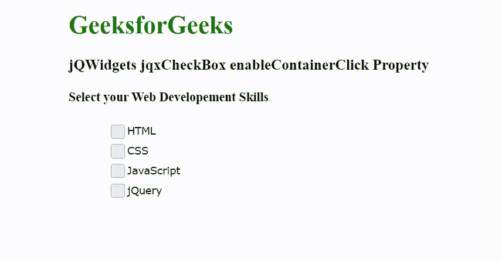

# jQWidgets jqxCheckBox enableContainerClick 属性

> 原文:[https://www . geesforgeks . org/jqwidgets-jqxcheckbox-enablecontainerclick-property/](https://www.geeksforgeeks.org/jqwidgets-jqxcheckbox-enablecontainerclick-property/)

jQWidgets 是一个 JavaScript 框架，用于为 PC 和移动设备制作基于 web 的应用程序。它是一个非常强大、优化、独立于平台并且得到广泛支持的框架。jqxCheckBox 小部件用于显示允许用户选择或取消选择复选框的复选框。

*enableContainerClick* 属性用于设置或返回容器上的点击，这些点击作为复选框上的点击来处理。它接受布尔类型值，默认值为*真*。

**语法:**

设置*启用容器点击*属性。

```html
$('selector').jqxCheckBox({ enableContainerClick: Boolean });
```

返回 *enableContainerClick* 属性。

```html
var enableCC = $('selector').jqxCheckBox('enableContainerClick');
```

**链接文件:**从链接下载 [jQWidgets](https://www.jqwidgets.com/download/) 。在 HTML 文件中，找到下载文件夹中的脚本文件。

> <link rel="”stylesheet”" href="”jqwidgets/styles/jqx.base.css”" type="”text/css”">

**示例:**以下示例说明了 jQWidgets 中的 jqxCheckBox*enableContainerClick*属性。

## 超文本标记语言

```html
<!DOCTYPE html>
<html lang="en">

<head>
    <link rel="stylesheet" href=
        "jqwidgets/styles/jqx.base.css" type="text/css" />
    <script type="text/javascript" 
        src="scripts/jquery-1.11.1.min.js"></script>
    <script type="text/javascript" 
        src="jqwidgets/jqxcore.js"></script>
    <script type="text/javascript" 
        src="jqwidgets/jqxcheckbox.js"></script>

    <style>
        body {
            margin-left: 100px;
        }

        .jqxcheckbox1, .jqxcheckbox2 {
            margin-left: 50px;
        }
    </style>
</head>

<body>
    <h1 style="color: green;">
        GeeksforGeeks
    </h1>

    <h3>
        jQWidgets jqxCheckBox enableContainerClick Property
    </h3>

    <h4>Select your Web Developement Skills</h4>

    <div class='jqxcheckbox1'>HTML</div>
    <div class='jqxcheckbox1'>CSS</div>
    <div class='jqxcheckbox2'>JavaScript</div>
    <div class='jqxcheckbox2'>jQuery</div>

    <script type="text/javascript">
        $(document).ready(function () {

            // Create jqxCheckBox
            $(".jqxcheckbox1").jqxCheckBox({
                width: 120,
                height: 25,
                enableContainerClick: true
            });

            // Create jqxCheckBox
            $(".jqxcheckbox2").jqxCheckBox({
                width: 120,
                height: 25,
                enableContainerClick: false
            });
        });
    </script>
</body>

</html>
```

**输出:**



**参考:**[https://www . jqwidgets . com/jquery-widgets-documentation/documentation/jqxcheckandradio/jquery-checkandradio-API . htm](https://www.jqwidgets.com/jquery-widgets-documentation/documentation/jqxcheckandradio/jquery-checkandradio-api.htm)