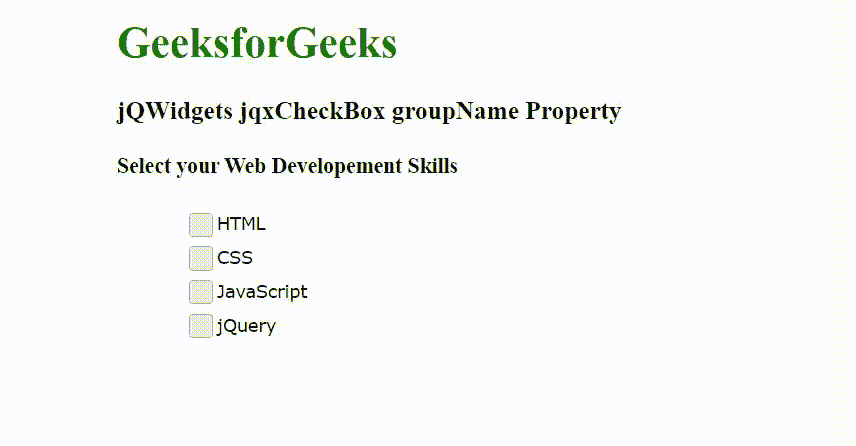

# jQWidgets jqxCheckBox 组名属性

> 原文:[https://www . geesforgeks . org/jqwidgets-jqxcheckbox-group name-property/](https://www.geeksforgeeks.org/jqwidgets-jqxcheckbox-groupname-property/)

jQWidgets 是一个 JavaScript 框架，用于为 PC 和移动设备制作基于 web 的应用程序。它是一个非常强大和优化的框架，独立于平台，并得到广泛支持。jqxCheckBox 小部件用于显示允许用户选择或取消选择复选框的复选框。

groupName 属性用于设置或返回组的名称。如果我们设置了这个属性，那么同一个组中的复选框就像单选按钮一样。它接受字符串类型值，默认值为空" "。

**语法:**

设置 groupName 属性。

```
$('selector').jqxCheckBox({ groupName: "Panel" });
```

返回 groupName 属性。

```
var groupName = $('selector').jqxCheckBox('groupName');
```

**链接文件:**从 https://www.jqwidgets.com/download/链接下载 jQWidgets。在 HTML 文件中，找到下载文件夹中的脚本文件:

> <link rel="”stylesheet”" href="”jqwidgets/styles/jqx.base.css”" type="”text/css”">

以下示例说明了 jQWidgets 中的 jqxCheckBox groupName 属性:

**示例:**

## 超文本标记语言

```
<!DOCTYPE html>
<html lang="en">

<head>
    <link rel="stylesheet" href=
        "jqwidgets/styles/jqx.base.css" type="text/css" />
    <script type="text/javascript" 
        src="scripts/jquery-1.11.1.min.js"></script>
    <script type="text/javascript" 
        src="jqwidgets/jqxcore.js"></script>
    <script type="text/javascript" 
        src="jqwidgets/jqxcheckbox.js"></script>

    <style>
        body {
            margin-left: 100px;
        }

        .jqxcheckbox1, .jqxcheckbox2,
        .jqxcheckbox3, .jqxcheckbox4 {
            margin-left: 50px;
        }
    </style>
</head>

<body>
    <h1 style="color: green;">
        GeeksforGeeks
    </h1>

    <h3>
        jQWidgets jqxCheckBox groupName Property
    </h3>

    <h4>Select your Web Developement Skills</h4>

    <div class='jqxcheckbox1'>HTML</div>
    <div class='jqxcheckbox2'>CSS</div>
    <div class='jqxcheckbox3'>JavaScript</div>
    <div class='jqxcheckbox4'>jQuery</div>

    <script type="text/javascript">
        $(document).ready(function () {

            // Create jqxCheckBox
            $(".jqxcheckbox1").jqxCheckBox({
                width: 120,
                height: 25,
                groupName: "Panel"
            });

            // Create jqxCheckBox
            $(".jqxcheckbox2").jqxCheckBox({
                width: 120,
                height: 25,
                groupName: "Panel"
            });

            // Create jqxCheckBox
            $(".jqxcheckbox3").jqxCheckBox({
                width: 120,
                height: 25,
                groupName: "Panel"
            });

            // Create jqxCheckBox
            $(".jqxcheckbox4").jqxCheckBox({
                width: 120,
                height: 25,
                groupName: "Panel"
            });
        });
    </script>
</body>

</html>
```

**输出:**



**参考:**[https://www . jqwidgets . com/jquery-widgets-documentation/documentation/jqxcheckandradio/jquery-checkandradio-API . htm](https://www.jqwidgets.com/jquery-widgets-documentation/documentation/jqxcheckandradio/jquery-checkandradio-api.htm)