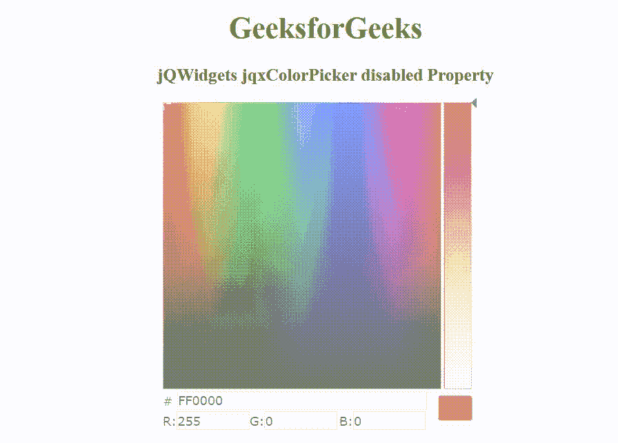

# jQWidgets jqxcolorppicker 禁用属性

> 原文:[https://www . geesforgeks . org/jqwidgets-jqxcolorppicker-disabled-property/](https://www.geeksforgeeks.org/jqwidgets-jqxcolorpicker-disabled-property/)

jQWidgets 是一个 JavaScript 框架，用于为 PC 和移动设备制作基于 web 的应用程序。它是一个非常强大、优化、独立于平台并且得到广泛支持的框架。jqxColorPicker 小部件是一个 jQuery UI 小部件，用于创建颜色选择器。

*禁用的*属性用于启用或禁用颜色选择器。它接受布尔类型值，默认值为*假*。

**语法:**

设置*禁用*属性。

```
$("selector").jqxColorPicker({disabled: true });
```

返回*禁用的*属性。

```
var disabled= $("selector").jqxColorPicker('disabled');
```

**链接文件:**从链接下载 [jQWidgets](https://www.jqwidgets.com/download/) 。在 HTML 文件中，找到下载文件夹中的脚本文件。

> <link rel="”stylesheet”" href="”jqwidgets/styles/jqx.base.css”" type="”text/css”">

**示例:**以下示例说明了 jqxcolorppicker*在 jQWidgets 中禁用了*属性。

## 超文本标记语言

```
<!DOCTYPE html>
<html lang="en">

<head>
    <link rel="stylesheet" href=
        "jqwidgets/styles/jqx.base.css" type="text/css" />
    <script type="text/javascript" 
        src="scripts/jquery-1.11.1.min.js"></script>
    <script type="text/javascript" 
        src="jqwidgets/jqxcore.js"></script>
    <script type="text/javascript" 
        src="jqwidgets/jqxcolorpicker.js"></script>
</head>

<body>
    <center>
        <h1 style="color: green;">
            GeeksforGeeks
        </h1>

        <h3>
            jQWidgets jqxColorPicker disabled Property
        </h3>

        <div id='jqxCP'></div>
    </center>

    <script type="text/javascript">
        $(document).ready(function () {
            $("#jqxCP").jqxColorPicker({ 
                width: 350, 
                height: 350,
                disabled: true
            });
        });
    </script>
</body>

</html>
```

**输出:**



**参考:**[https://www . jqwidgets . com/jquery-widgets-documentation/documentation/jqxcolorppicker/jquery-color picker-API . htm](https://www.jqwidgets.com/jquery-widgets-documentation/documentation/jqxcolorpicker/jquery-colorpicker-api.htm)