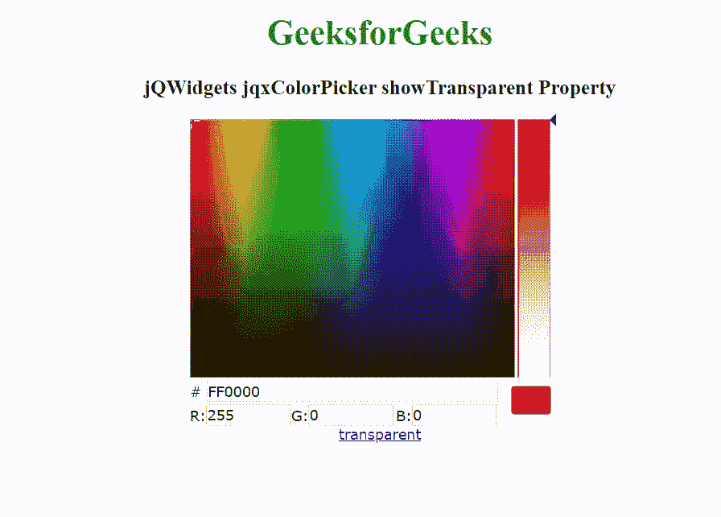

# jQWidgets jqxcolorppicker 显示透明属性

> 原文:[https://www . geesforgeks . org/jqwidgets-jqxcolorppicker-show transparent-property/](https://www.geeksforgeeks.org/jqwidgets-jqxcolorpicker-showtransparent-property/)

jQWidgets 是一个 JavaScript 框架，用于为 PC 和移动设备制作基于 web 的应用程序。它是一个非常强大和优化的框架，独立于平台，并得到广泛支持。jqxColorPicker 小部件是一个 jQuery UI 小部件，用于创建颜色选择器。

show 通透属性用于设置或返回 show 通透属性。它接受布尔类型值，默认值为假。

**语法:**

设置 showTransparent 属性。

```html
$("selector").jqxColorPicker({ showTransparent: true });
```

返回 showTransparent 属性。

```html
var showTrans = $("selector").jqxColorPicker('showTransparent');
```

**链接文件:**从 https://www.jqwidgets.com/download/链接下载 jQWidgets。在 HTML 文件中，找到下载文件夹中的脚本文件:

> <link rel="”stylesheet”" href="”jqwidgets/styles/jqx.base.css”" type="”text/css”">

以下示例说明了 jQWidgets 中的 jqxColorPicker showTransparent 属性:

**示例:**

## 超文本标记语言

```html
<!DOCTYPE html>
<html lang="en">

<head>
    <link rel="stylesheet" href=
        "jqwidgets/styles/jqx.base.css" type="text/css" />
    <script type="text/javascript" 
        src="scripts/jquery-1.11.1.min.js"></script>
    <script type="text/javascript" 
        src="jqwidgets/jqxcore.js"></script>
    <script type="text/javascript" 
        src="jqwidgets/jqxcolorpicker.js"></script>
</head>

<body>
    <center>
        <h1 style="color: green;">
            GeeksforGeeks
        </h1>

        <h3>
            jQWidgets jqxColorPicker showTransparent Property
        </h3>

        <div id='jqxCP'></div>
    </center>

    <script type="text/javascript">
        $(document).ready(function () {
            $("#jqxCP").jqxColorPicker({ 
                width: 350, 
                height: 300,
                showTransparent: true
            });
        });
    </script>
</body>

</html>
```

**输出:**



**参考:**[https://www . jqwidgets . com/jquery-widgets-documentation/documentation/jqxcolorppicker/jquery-color picker-API . htm](https://www.jqwidgets.com/jquery-widgets-documentation/documentation/jqxcolorpicker/jquery-colorpicker-api.htm)