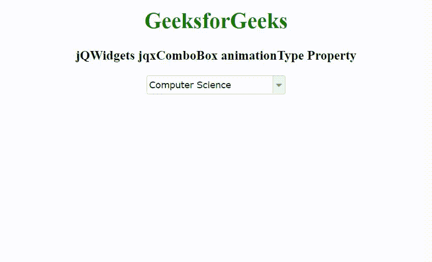

# jqwidgets jqxcombo 动画类型属性

> 原文:[https://www . geesforgeks . org/jqwidgets-jqxcombobox-animation type-property/](https://www.geeksforgeeks.org/jqwidgets-jqxcombobox-animationtype-property/)

jQWidgets 是一个 JavaScript 框架，用于为 PC 和移动设备制作基于 web 的应用程序。它是一个非常强大和优化的框架，独立于平台，并得到广泛支持。jqxComboBox 表示一个 jQuery combobox 小部件，它包含一个具有自动完成功能的输入字段和一个显示在下拉列表中的可选项目列表。

**动画类型属性**用于设置或返回动画的类型。它接受字符串类型的值，默认值是“幻灯片”。

它的可能值是–

*   “褪色”
*   幻灯片
*   没有

**语法:**

设置 enableContainerClick 属性。

```html
$('selector').jqxComboBox({ animationType: 'none' });
```

返回 enableContainerClick 属性。

```html
var animationType = $('selector').jqxComboBox('animationType');
```

**链接文件:**从 https://www.jqwidgets.com/download/链接下载 jQWidgets。在 HTML 文件中，找到下载文件夹中的脚本文件:

> <link rel="”stylesheet”" href="”jqwidgets/styles/jqx.base.css”" type="”text/css”">
> <脚本类型=【text/JavaScript】src =【scripts/jquery-1 . 11 . 1 . min . js】></脚本>
> <脚本类型=【text/JavaScript】src =【jqwidgets/jqx-all . js】></脚本>
> <脚本类型=【text/JavaScript】src =【jqwidgets/jqxcjqwidgets/jqxbuttons . js "></script>
> <script type = " text/JavaScript " src = " jqwidgets/jqxscrollbar . js "></script>
> <script type = " text/JavaScript " src = " jqwidgets/jqxlistbox . js "></script>
> <script type

以下示例说明了 jQWidgets 中的 jqxComboBox animationType 属性:

**示例:**

## 超文本标记语言

```html
<!DOCTYPE html>
<html lang="en">

<head>
    <link rel="stylesheet" href=
        "jqwidgets/styles/jqx.base.css" type="text/css" />
    <script type="text/javascript" 
        src="scripts/jquery-1.11.1.min.js"></script>
    <script type="text/javascript" 
        src="jqwidgets/jqx-all.js"></script>
    <script type="text/javascript" 
        src="jqwidgets/jqxcore.js"></script>
    <script type="text/javascript" 
        src="jqwidgets/jqxcolorpicker.js"></script>
    <script type="text/javascript" 
        src=".jqwidgets/jqxbuttons.js"></script>
    <script type="text/javascript" 
        src="jqwidgets/jqxscrollbar.js"></script>
    <script type="text/javascript" 
        src="jqwidgets/jqxlistbox.js"></script>
    <script type="text/javascript" 
        src="jqwidgets/jqxcombobox.js"></script>
</head>

<body>
    <center>
        <h1 style="color: green;">
            GeeksforGeeks
        </h1>

        <h3>
            jQWidgets jqxComboBox animationType Property
        </h3>

        <div id='jqxCB'></div>
    </center>

    <script type="text/javascript">
        $(document).ready(function () {
            var data = [
                "Computer Science",
                "C Programming",
                "C++ Programming",
                "Java Programming",
                "Python Programming",
                "HTML",
                "CSS",
                "JavaScript",
                "jQuery",
                "PHP",
                "Bootstrap"
            ];

            $("#jqxCB").jqxComboBox({
                source: data,
                selectedIndex: 0,
                width: '200px',
                height: '25px',
                animationType: 'slide'
            });
        });
    </script>
</body>

</html>
```

**输出:**



**参考:**[https://www . jqwidgets . com/jquery-widgets-documentation/documentation/jqxcombobox/jquery-combobox-API . htm](https://www.jqwidgets.com/jquery-widgets-documentation/documentation/jqxcombobox/jquery-combobox-api.htm)