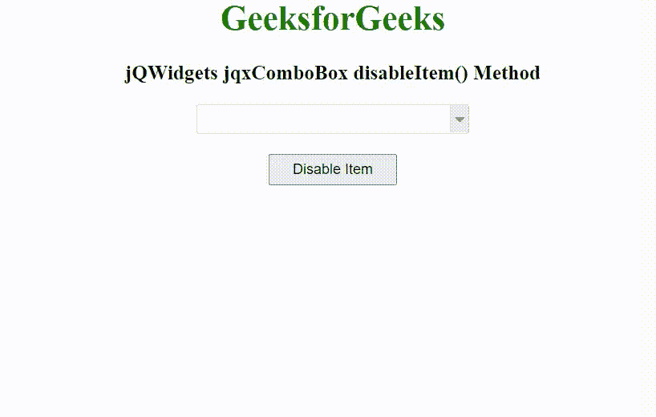

# jqwidgets jqxcombo 禁用()方法

> 原文:[https://www . geesforgeks . org/jqwidgets-jqxcombobox-disableitem-method/](https://www.geeksforgeeks.org/jqwidgets-jqxcombobox-disableitem-method/)

jQWidgets 是一个 JavaScript 框架，用于为 PC 和移动设备制作基于 web 的应用程序。它是一个非常强大和优化的框架，独立于平台，并得到广泛支持。jqxComboBox 用于表示一个 jQuery combobox 小部件，它包含一个具有自动完成功能的输入字段和一个显示在下拉列表中的可选项目列表。

disableItem()方法用于禁用 jqxComboBox 小部件中的一个项目。它接受对象/字符串类型的单个参数*项*，并且不返回值。

该项目可以使用以下字段–

*   标签
*   价值
*   有缺陷的
*   检查
*   hasThreeStates
*   超文本标记语言
*   组

**语法:**

```html
$('selector').jqxComboBox('disableItem', 'Item' );
```

**链接文件:**从 https://www.jqwidgets.com/download/链接下载 jQWidgets。在 HTML 文件中，找到下载文件夹中的脚本文件:

> <link rel="”stylesheet”" href="”jqwidgets/styles/jqx.base.css”" type="”text/css”">
> <脚本类型=【text/JavaScript】src =【scripts/jquery-1 . 11 . 1 . min . js】></脚本>
> <脚本类型=【text/JavaScript】src =【jqwidgets/jqx-all . js】></脚本>
> <脚本类型=【text/JavaScript】src =【jqwidgets/jqxcjqwidgets/jqxbuttons . js "></script>
> <script type = " text/JavaScript " src = " jqwidgets/jqxscrollbar . js "></script>
> <script type = " text/JavaScript " src = " jqwidgets/jqxlistbox . js "></script>
> <script type

以下示例说明了 jQWidgets 中的 jqxComboBox disableItem()方法:

**示例:**

## 超文本标记语言

```html
<!DOCTYPE html>
<html lang="en">

<head>
    <link rel="stylesheet" href=
"jqwidgets/styles/jqx.base.css" type="text/css" />
    <script type="text/javascript" 
            src="scripts/jquery-1.11.1.min.js">
    </script>
    <script type="text/javascript" 
            src="jqwidgets/jqx-all.js">
    </script>
    <script type="text/javascript" 
            src="jqwidgets/jqxcore.js">
    </script>
    <script type="text/javascript" 
            src="jqwidgets/jqxcolorpicker.js">
    </script>
    <script type="text/javascript" 
            src=".jqwidgets/jqxbuttons.js">
    </script>
    <script type="text/javascript" 
            src="jqwidgets/jqxscrollbar.js">
    </script>
    <script type="text/javascript" 
            src="jqwidgets/jqxlistbox.js">
    </script>
    <script type="text/javascript" 
            src="jqwidgets/jqxcombobox.js">
    </script>
</head>

<body>
    <center>
        <h1 style="color: green;">
            GeeksforGeeks
        </h1>

        <h3>
            jQWidgets jqxComboBox disableItem() Method
        </h3>

        <div id='jqxCB'></div>
        <br>
        <input type="button" id='jqxBtn' 
            style="padding: 5px 20px;"
            value="Disable Item" />
    </center>

    <script type="text/javascript">
        $(document).ready(function () {
            var data = [
                "Computer Science",
                "C Programming",
                "C++ Programming",
                "Java Programming",
                "Python Programming",
                "HTML",
                "CSS",
                "JavaScript",
                "jQuery",
                "PHP",
                "Bootstrap"
            ];

            $("#jqxCB").jqxComboBox({
                source: data,
                width: '250px',
                animationType: 'slide'
            });

            $('#jqxBtn').on('click', function () {
                $("#jqxCB").jqxComboBox('disableItem', "HTML");
            });
        });
    </script>
</body>

</html>
```

**输出:**



**参考:**[https://www . jqwidgets . com/jquery-widgets-documentation/documentation/jqxcombobox/jquery-combobox-API . htm](https://www.jqwidgets.com/jquery-widgets-documentation/documentation/jqxcombobox/jquery-combobox-api.htm)