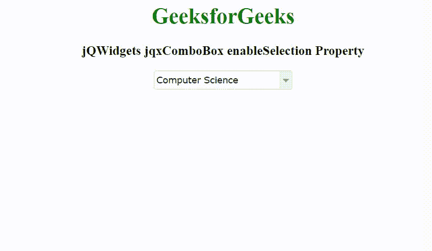

# jQWidgets jqxComboBox enable selection 属性

> 原文:[https://www . geesforgeks . org/jqwidgets-jqxcombobox-enable selection-property/](https://www.geeksforgeeks.org/jqwidgets-jqxcombobox-enableselection-property/)

jQWidgets 是一个 JavaScript 框架，用于为 PC 和移动设备制作基于 web 的应用程序。它是一个非常强大、优化、独立于平台并且得到广泛支持的框架。jqxComboBox 用于表示一个 jQuery combobox 小部件，它包含一个具有自动完成功能的输入字段和一个显示在下拉列表中的可选项目列表。

*启用选择*属性用于设置或返回启用/禁用选择。它接受布尔类型值，默认值为*真*。

**语法:**

设置*启用选择*属性。

```
$('selector').jqxComboBox({ enableSelection: Boolean });
```

返回*启用选择*属性。

```
var enableSelection = $('selector').jqxComboBox('enableSelection');
```

**链接文件:**从链接下载 [jQWidgets](https://www.jqwidgets.com/download/) 。在 HTML 文件中，找到下载文件夹中的脚本文件。

> <link rel="”stylesheet”" href="”jqwidgets/styles/jqx.base.css”" type="”text/css”">
> <脚本类型=【text/JavaScript】src =【scripts/jquery-1 . 11 . 1 . min . js】></脚本>
> <脚本类型=【text/JavaScript】src =【jqwidgets/jqx-all . js】></脚本>
> <脚本类型=【text/JavaScript】src =【jqwidgets/jqxcjqwidgets/jqxbuttons . js "></script>
> <script type = " text/JavaScript " src = " jqwidgets/jqxscrollbar . js "></script>
> <script type = " text/JavaScript " src = " jqwidgets/jqxlistbox . js "></script>
> <script type

**示例:**以下示例说明了 jQWidgets 中的 jqxComboBox*enableSelection*属性。

## 超文本标记语言

```
<!DOCTYPE html>
<html lang="en">

<head>
    <link rel="stylesheet" href=
        "jqwidgets/styles/jqx.base.css" type="text/css" />
    <script type="text/javascript" 
        src="scripts/jquery-1.11.1.min.js"></script>
    <script type="text/javascript" 
        src="jqwidgets/jqx-all.js"></script>
    <script type="text/javascript" 
        src="jqwidgets/jqxcore.js"></script>
    <script type="text/javascript" 
        src="jqwidgets/jqxcolorpicker.js"></script>
    <script type="text/javascript" 
        src=".jqwidgets/jqxbuttons.js"></script>
    <script type="text/javascript" 
        src="jqwidgets/jqxscrollbar.js"></script>
    <script type="text/javascript" 
        src="jqwidgets/jqxlistbox.js"></script>
    <script type="text/javascript" 
        src="jqwidgets/jqxcombobox.js"></script>
</head>

<body>
    <center>
        <h1 style="color: green;">
            GeeksforGeeks
        </h1>

        <h3>
            jQWidgets jqxComboBox enableSelection Property
        </h3>

        <div id='jqxCB'></div>
    </center>

    <script type="text/javascript">
        $(document).ready(function () {
            var data = [
                "Computer Science",
                "C Programming",
                "C++ Programming",
                "Java Programming",
                "Python Programming",
                "HTML",
                "CSS",
                "JavaScript",
                "jQuery",
                "PHP",
                "Bootstrap"
            ];

            $("#jqxCB").jqxComboBox({
                source: data,
                width: '200px',
                selectedIndex: 0,
                animationType: 'slide',
                enableSelection: false
            });
        });
    </script>
</body>

</html>
```

**输出:**



**参考:**[https://www . jqwidgets . com/jquery-widgets-documentation/documentation/jqxcombobox/jquery-combobox-API . htm](https://www.jqwidgets.com/jquery-widgets-documentation/documentation/jqxcombobox/jquery-combobox-api.htm)