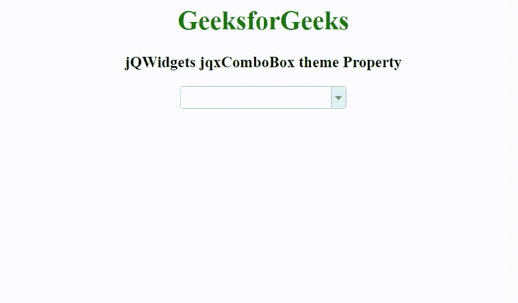

# jQWidgets jqxComboBox 主题属性

> 原文:[https://www . geesforgeks . org/jqwidgets-jqxcombobox-theme-property/](https://www.geeksforgeeks.org/jqwidgets-jqxcombobox-theme-property/)

jQWidgets 是一个 JavaScript 框架，用于为 PC 和移动设备制作基于 web 的应用程序。它是一个非常强大和优化的框架，独立于平台，并得到广泛支持。jqxComboBox 用于表示一个 jQuery combobox 小部件，它包含一个具有自动完成功能的输入字段和一个显示在下拉列表中的可选项目列表。

**主题属性**用于设置或返回 jqxComboBox 小部件的主题。它接受字符串类型值，默认值为空(" ")。要使用这个属性，首先，我们需要在标题部分包含主题样式表(jqx.energyblue.css)。主题文件包含在 jqx.base.css 文件之后。

**语法:**

设置主题属性。

```html
$('selector').jqxComboBox({ theme: String });
```

返回主题属性。

```html
var theme = $('selector').jqxComboBox('theme');
```

**链接文件:**从 https://www.jqwidgets.com/download/链接下载 jQWidgets。在 HTML 文件中，找到下载文件夹中的脚本文件:

> <link rel="”stylesheet”" href="”jqwidgets/styles/jqx.base.css”" type="”text/css”">
> < link rel= "样式表" href = " jqwidgets/style/jqx . energy blue . CSS ">
> <脚本类型= " text/JavaScript " src = " scripts/jquery-1 . 11 . 1 . min . js "></脚本>
> 脚本类型= " text/JavaScript " src = " jqwidgets/jqx-all . js "【T17jqwidgets/jqxbuttons . js "></script>
> <script type = " text/JavaScript " src = " jqwidgets/jqxscrollbar . js "></script>
> <script type = " text/JavaScript " src = " jqwidgets/jqxlistbox . js ">/script><script

以下示例说明了 jQWidgets 中的 jqxComboBox 主题属性:

**示例:**

## 超文本标记语言

```html
<!DOCTYPE html>
<html lang="en">

<head>
    <link rel="stylesheet" href=
        "jqwidgets/styles/jqx.base.css" type="text/css" />
    <link rel="stylesheet" href=
        "jqwidgets/styles/jqx.energyblue.css">
    <script type="text/javascript" 
        src="scripts/jquery-1.11.1.min.js"></script>
    <script type="text/javascript" 
        src="jqwidgets/jqx-all.js"></script>
    <script type="text/javascript" 
        src="jqwidgets/jqxcore.js"></script>
    <script type="text/javascript" 
        src="jqwidgets/jqxcolorpicker.js"></script>
    <script type="text/javascript" 
        src=".jqwidgets/jqxbuttons.js"></script>
    <script type="text/javascript" 
        src="jqwidgets/jqxscrollbar.js"></script>
    <script type="text/javascript" 
        src="jqwidgets/jqxlistbox.js"></script>
    <script type="text/javascript" 
        src="jqwidgets/jqxcombobox.js"></script>
</head>

<body>
    <center>
        <h1 style="color: green;">
            GeeksforGeeks
        </h1>

        <h3>
            jQWidgets jqxComboBox theme Property
        </h3>

        <div id='jqxCB'></div>
    </center>

    <script type="text/javascript">
        $(document).ready(function () {
            var data = [
                "Computer Science",
                "C Programming",
                "C++ Programming",
                "Java Programming",
                "Python Programming",
                "HTML",
                "CSS",
                "JavaScript",
                "jQuery",
                "PHP",
                "Bootstrap"
            ];

            $("#jqxCB").jqxComboBox({
                source: data,
                theme: 'energyblue',
                width: '200px',
                animationType: 'slide'
            });
        });
    </script>
</body>

</html>
```

**输出:**



**参考:**[https://www . jqwidgets . com/jquery-widgets-documentation/documentation/jqxcombobox/jquery-combobox-API . htm](https://www.jqwidgets.com/jquery-widgets-documentation/documentation/jqxcombobox/jquery-combobox-api.htm)