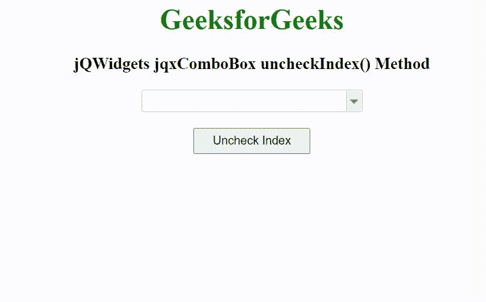

# jQWidgets jqxComboBox uncheckIndex()方法

> 原文:[https://www . geeksforgeeks . org/jqwidgets-jqxcombobox-uncheckindex-method/](https://www.geeksforgeeks.org/jqwidgets-jqxcombobox-uncheckindex-method/)

jQWidgets 是一个 JavaScript 框架，用于为 PC 和移动设备制作基于 web 的应用程序。它是一个非常强大和优化的框架，独立于平台，并得到广泛支持。jqxComboBox 用于表示一个 jQuery combobox 小部件，它包含一个具有自动完成功能的输入字段和一个显示在下拉列表中的可选项目列表。

当“复选框”属性值设置为 true 时，uncheckIndex()方法用于取消选中列表项。jqxComboBox 使用从零开始的索引。它接受数字类型的单个参数索引，并且不返回任何值。

**语法:**

```
$('selector').jqxComboBox('uncheckIndex', index);
```

**链接文件:**从 https://www.jqwidgets.com/download/链接下载 jQWidgets。在 HTML 文件中，找到下载文件夹中的脚本文件:

> <link rel="”stylesheet”" href="”jqwidgets/styles/jqx.base.css”" type="”text/css”">
> <脚本类型=【text/JavaScript】src =【scripts/jquery-1 . 11 . 1 . min . js】></脚本>
> <脚本类型=【text/JavaScript】src =【jqwidgets/jqx-all . js】></脚本>
> <脚本类型=【text/JavaScript】src =【jqwidgets/jqxcjqwidgets/jqxbuttons . js "></script>
> <script type = " text/JavaScript " src = " jqwidgets/jqxscrollbar . js "></script>
> <script type = " text/JavaScript " src = " jqwidgets/jqxlistbox . js "></script>
> <script type

以下示例说明了 jQWidgets 中的 jqxComboBox uncheckIndex()方法:

**示例:**

## 超文本标记语言

```
<!DOCTYPE html>
<html lang="en">

<head>
    <link rel="stylesheet" href=
        "jqwidgets/styles/jqx.base.css" type="text/css" />
    <script type="text/javascript" 
        src="scripts/jquery-1.11.1.min.js"></script>
    <script type="text/javascript" 
        src="jqwidgets/jqx-all.js"></script>
    <script type="text/javascript" 
        src="jqwidgets/jqxcore.js"></script>
    <script type="text/javascript" 
        src="jqwidgets/jqxcolorpicker.js"></script>
    <script type="text/javascript" 
        src=".jqwidgets/jqxbuttons.js"></script>
    <script type="text/javascript" 
        src="jqwidgets/jqxscrollbar.js"></script>
    <script type="text/javascript" 
        src="jqwidgets/jqxlistbox.js"></script>
    <script type="text/javascript" 
        src="jqwidgets/jqxcombobox.js"></script>
</head>

<body>
    <center>
        <h1 style="color: green;">
            GeeksforGeeks
        </h1>

        <h3>
            jQWidgets jqxComboBox uncheckIndex() Method
        </h3>

        <div id='jqxCB'></div>
        <br>
        <input type="button" id='jqxBtn' 
            style="padding: 5px 20px;" 
            value="Uncheck Index" />
    </center>

    <script type="text/javascript">
        $(document).ready(function() {
            var data = [
                "Computer Science",
                "C Programming",
                "C++ Programming",
                "Java Programming",
                "Python Programming",
                "HTML",
                "CSS",
                "JavaScript",
                "jQuery",
                "PHP",
                "Bootstrap"
            ];

            $("#jqxCB").jqxComboBox({
                source: data,
                width: '250px',
                animationType: 'slide',
                checkboxes: true
            });

            $('#jqxBtn').on('click', function() {
                var index = $("#jqxCB").jqxComboBox(
                    'uncheckIndex', 3);
            });
        });
    </script>
</body>

</html>
```

**输出:**



**参考:**[https://www . jqwidgets . com/jquery-widgets-documentation/documentation/jqxcombobox/jquery-combobox-API . htm](https://www.jqwidgets.com/jquery-widgets-documentation/documentation/jqxcombobox/jquery-combobox-api.htm)