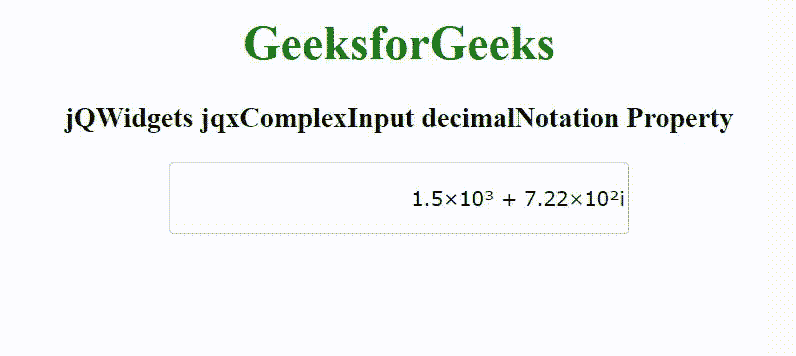

# jQWidgets jqxComplexInput 抽取旋转属性

> 原文:[https://www . geeksforgeeks . org/jqwidgets-jqxcomplexinput-decimalntation-property/](https://www.geeksforgeeks.org/jqwidgets-jqxcomplexinput-decimalnotation-property/)

jQWidgets 是一个 JavaScript 框架，用于为 PC 和移动设备制作基于 web 的应用程序。它是一个非常强大和优化的框架，独立于平台，并得到广泛支持。jqxComplexInput 是一个 jQuery 输入小部件，用于输入包含实部和虚部的复数。

**十进制旋转属性**用于设置或返回显示复数的实部和虚部的符号。它接受字符串类型值，其默认值为“默认值”。

它的可能值是–

*   **“默认值”–**默认值包含十进制表示法。例如–“330000–200i”
*   **“指数”–**它以指数形式表示日期。例如–“3.3e+5–2e+2i”
*   **“科学的”–**它代表 10 的幂次数。例如–'3.3×10⁵–2×10 英寸
*   **“工程”–**例如–“330×10–200×10⁰i'”

**语法:**

设置抽取旋转属性。

```html
$('selector').jqxComplexInput({ decimalNotation: String });
```

返回十进制旋转属性。

```html
var decN = $('selector').jqxComplexInput('decimalNotation');
```

**链接文件:**从给定的链接 https://www.jqwidgets.com/download/.下载 jQWidgets 在 HTML 文件中，找到下载文件夹中的脚本文件。

> <link rel="”stylesheet”" href="”jqwidgets/styles/jqx.base.css”" type="”text/css”">
> <脚本类型= " text/JavaScript " src = " scripts/jquery-1 . 11 . 1 . min . js "></脚本类型>
> <脚本类型= " text/JavaScript " src = " jqwidgets/jqxcore . js "></脚本类型>
> <脚本类型= " text/JavaScript " src = " jqwidgets/jqx-all . js

下面的例子说明了 jQWidgets jqxComplexInput 抽取旋转属性。

**示例:**

## 超文本标记语言

```html
<!DOCTYPE html>
<html lang="en">

<head>
    <link rel="stylesheet" href=
        "jqwidgets/styles/jqx.base.css" type="text/css" />
    <script type="text/javascript" 
        src="scripts/jquery-1.11.1.min.js"></script>
    <script type="text/javascript" 
        src="jqwidgets/jqxcore.js"></script>
      <script type="text/javascript" 
        src="jqwidgets/jqx-all.js"></script>
    <script type="text/javascript" 
        src="jqwidgets/jqxcomplexinput.js"></script>
</head>

<body>
    <center>
        <h1 style="color: green;">
            GeeksforGeeks
        </h1>

        <h3>
            jQWidgets jqxComplexInput decimalNotation Property
        </h3>

        <input id="jqxCI" type="text" />
    </center>

    <script type="text/javascript">
        $(document).ready(function() {
            $("#jqxCI").jqxComplexInput({
                width: 300,
                height: 40,
                value: "1500 + 722i",
                decimalNotation: 'scientific'
            });
        });
    </script>
</body>

</html>
```

**输出:**



**参考:**[https://www . jqwidgets . com/jquery-widgets-documentation/documentation/jqxcomplexinput/jquery-complex-input-API . htm](https://www.jqwidgets.com/jquery-widgets-documentation/documentation/jqxcomplexinput/jquery-complex-input-api.htm)