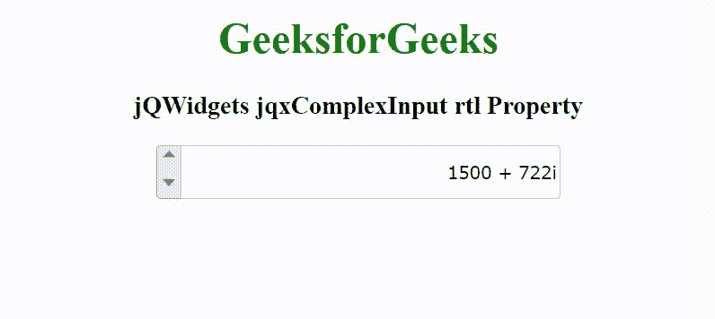

# jQWidgets jqxComplexInput rtl 物业

> 原文:[https://www . geesforgeks . org/jqwidgets-jqxcomplexinput-RTL-property/](https://www.geeksforgeeks.org/jqwidgets-jqxcomplexinput-rtl-property/)

jQWidgets 是一个 JavaScript 框架，用于为 PC 和移动设备制作基于 web 的应用程序。它是一个非常强大和优化的框架，独立于平台，并得到广泛支持。jqxComplexInput 是一个 jQuery 输入小部件，用于输入包含实部和虚部的复数。

**rtl 属性**用于设置或返回一个值，该值指示小部件的元素是否对齐以支持使用从右向左字体的区域设置。它接受布尔类型值，默认值为 false。

**语法:**

设置 rtl 属性。

```html
$('selector').jqxComplexInput({ rtl: Boolean });
```

归还 rtl 的财产。

```html
var rtl = $('selector').jqxComplexInput('rtl');
```

**链接文件:**从给定的链接 https://www.jqwidgets.com/download/.下载 jQWidgets 在 HTML 文件中，找到下载文件夹中的脚本文件。

> <link rel="”stylesheet”" href="”jqwidgets/styles/jqx.base.css”" type="”text/css”">
> <脚本类型= " text/JavaScript " src = " scripts/jquery-1 . 11 . 1 . min . js "></脚本类型>
> <脚本类型= " text/JavaScript " src = " jqwidgets/jqxcore . js "></脚本类型>
> <脚本类型= " text/JavaScript " src = " jqwidgets/jqx-all . js

以下示例说明了 jQWidgets jqxComplexInput rtl 属性。

**示例:**

## 超文本标记语言

```html
<!DOCTYPE html>
<html lang="en">

<head>
    <link rel="stylesheet" href=
        "jqwidgets/styles/jqx.base.css" type="text/css" />
    <script type="text/javascript" 
        src="scripts/jquery-1.11.1.min.js"></script>
    <script type="text/javascript" 
        src="jqwidgets/jqxcore.js"></script>
    <script type="text/javascript" 
        src="jqwidgets/jqx-all.js"></script>
    <script type="text/javascript" 
        src="jqwidgets/jqxcomplexinput.js"></script>
</head>

<body>
    <center>
        <h1 style="color: green;">
            GeeksforGeeks
        </h1>

        <h3>
            jQWidgets jqxComplexInput rtl Property
        </h3>

        <div id="jqxCI">
            <input type="text" />
            <div></div>
        </div>
    </center>

    <script type="text/javascript">
        $(document).ready(function() {
            $("#jqxCI").jqxComplexInput({
                width: 300,
                height: 40,
                value: "1500 + 722i",
                spinButtons: true,
                rtl: true
            });
        });
    </script>
</body>

</html>
```

**输出:**



**参考:**[https://www . jqwidgets . com/jquery-widgets-documentation/documentation/jqxcomplexinput/jquery-complex-input-API . htm](https://www.jqwidgets.com/jquery-widgets-documentation/documentation/jqxcomplexinput/jquery-complex-input-api.htm)