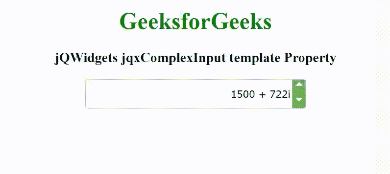

# jQWidgets jqxComplexInput 模板属性

> 原文:[https://www . geesforgeks . org/jqwidgets-jqxcomplexinput-template-property/](https://www.geeksforgeeks.org/jqwidgets-jqxcomplexinput-template-property/)

jQWidgets 是一个 JavaScript 框架，用于为 PC 和移动设备制作基于 web 的应用程序。它是一个非常强大和优化的框架，独立于平台，并得到广泛支持。jqxComplexInput 是一个 jQuery 输入小部件，用于输入包含实部和虚部的复数。

**模板属性**用于设置或返回模板，作为默认样式的替代。它接受字符串类型值，其默认值为“默认值”。

其可能值如下–

*   **‘默认’:**是默认模板，其样式取决于“主题”属性值。
*   **【初级】:**设置深蓝色风格，增加视觉重量。
*   **“成功”:**它为成功或积极的行动设置绿色风格。
*   **“警告”:**设置代表警告的橙色样式。
*   **“危险”:**设置代表危险或消极动作的红色样式。
*   **【信息】:**设置蓝色按钮，不绑定语义动作或使用。

**语法:**

设置模板属性。

```html
$('selector').jqxComplexInput({ template: String });
```

返回模板属性。

```html
var template = $('selector').jqxComplexInput('template');
```

**链接文件:**从给定的链接 https://www.jqwidgets.com/download/.下载 jQWidgets 在 HTML 文件中，找到下载文件夹中的脚本文件。

> <link rel="”stylesheet”" href="”jqwidgets/styles/jqx.base.css”" type="”text/css”">
> <脚本类型= " text/JavaScript " src = " scripts/jquery-1 . 11 . 1 . min . js "></脚本类型>
> <脚本类型= " text/JavaScript " src = " jqwidgets/jqxcore . js "></脚本类型>
> <脚本类型= " text/JavaScript " src = " jqwidgets/jqx-all . js

下面的例子说明了 jQWidgets jqxComplexInput 模板属性。

**示例:**

## 超文本标记语言

```html
<!DOCTYPE html>
<html lang="en">

<head>
    <link rel="stylesheet" href=
        "jqwidgets/styles/jqx.base.css" type="text/css" />
    <script type="text/javascript" 
        src="scripts/jquery-1.11.1.min.js"></script>
    <script type="text/javascript" 
        src="jqwidgets/jqxcore.js"></script>
    <script type="text/javascript" 
        src="jqwidgets/jqx-all.js"></script>
    <script type="text/javascript" 
        src="jqwidgets/jqxcomplexinput.js"></script>
</head>

<body>
    <center>
        <h1 style="color: green;">
            GeeksforGeeks
        </h1>

        <h3>
            jQWidgets jqxComplexInput template Property
        </h3>

        <div id="jqxCI">
            <input type="text" />
            <div></div>
        </div>
    </center>

    <script type="text/javascript">
        $(document).ready(function() {
            $("#jqxCI").jqxComplexInput({
                width: 300,
                height: 40,
                value: "1500 + 722i",
                spinButtons: true,
                template: 'success'
            });
        });
    </script>
</body>

</html>
```

**输出:**



**参考:**[https://www . jqwidgets . com/jquery-widgets-documentation/documentation/jqxcomplexinput/jquery-complex-input-API . htm](https://www.jqwidgets.com/jquery-widgets-documentation/documentation/jqxcomplexinput/jquery-complex-input-api.htm)