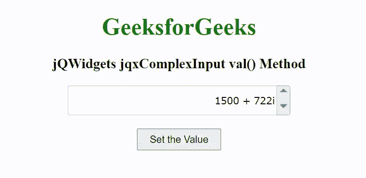

# jQWidgets jqxComplexInput val()方法

> 原文:[https://www . geesforgeks . org/jqwidgets-jqxcomplexinput-val-method/](https://www.geeksforgeeks.org/jqwidgets-jqxcomplexinput-val-method/)

jQWidgets 是一个 JavaScript 框架，用于为 PC 和移动设备制作基于 web 的应用程序。它是一个非常强大和优化的框架，独立于平台，并得到广泛支持。jqxComplexInput 是一个 jQuery 输入小部件，用于输入包含实部和虚部的复数。

**val()方法**用于设置或返回小部件的值。它接受字符串/对象类型值的单个参数值，并返回字符串类型值。

**语法:**

设置小部件的值。

```html
$('Selector').jqxComplexInput('val', complex_value);  // or
$('Selector').val(complex_value);
```

返回小部件的值。

```html
var value = $('Selector').jqxComplexInput('val'); // or
var value = $('Selector').val();
```

**链接文件:**从给定的链接 https://www.jqwidgets.com/download/.下载 jQWidgets 在 HTML 文件中，找到下载文件夹中的脚本文件。

> <link rel="”stylesheet”" href="”jqwidgets/styles/jqx.base.css”" type="”text/css”">
> <脚本类型= " text/JavaScript " src = " scripts/jquery-1 . 11 . 1 . min . js "></脚本类型>
> <脚本类型= " text/JavaScript " src = " jqwidgets/jqxcore . js "></脚本类型>
> <脚本类型= " text/JavaScript " src = " jqwidgets/jqx-all . js

下面的例子说明了 jQWidgets jqxComplexInput val()方法。

**示例:**

## 超文本标记语言

```html
<!DOCTYPE html>
<html lang="en">

<head>
    <link rel="stylesheet" href=
        "jqwidgets/styles/jqx.base.css" type="text/css" />
    <script type="text/javascript" 
        src="scripts/jquery-1.11.1.min.js"></script>
    <script type="text/javascript" 
        src="jqwidgets/jqx-all.js"></script>
    <script type="text/javascript" 
        src="jqwidgets/jqxcore.js"></script>
    <script type="text/javascript" 
        src="jqwidgets/jqxcomplexinput.js"></script>
</head>

<body>
    <center>
        <h1 style="color: green;">
            GeeksforGeeks
        </h1>

        <h3>
            jQWidgets jqxComplexInput val() Method
        </h3>

        <div id="jqxCI">
            <input type="text" />
            <div></div>
        </div>
        <br>

        <input type="button" id="jqxBtn" 
            value="Set the Value" 
            style="padding: 5px 15px;">
    </center>

    <script type="text/javascript">
        $(document).ready(function() {
            $("#jqxCI").jqxComplexInput({
                width: 300,
                height: 40,
                value: "1500 + 722i",
                spinButtons: true
            });

            $("#jqxBtn").on("click", function () {
                $("#jqxCI").jqxComplexInput('val', '100 - 60i');
            });
        });
    </script>
</body>

</html>
```

**输出:**



**参考:**[https://www . jqwidgets . com/jquery-widgets-documentation/documentation/jqxcomplexinput/jquery-complex-input-API . htm](https://www.jqwidgets.com/jquery-widgets-documentation/documentation/jqxcomplexinput/jquery-complex-input-api.htm)