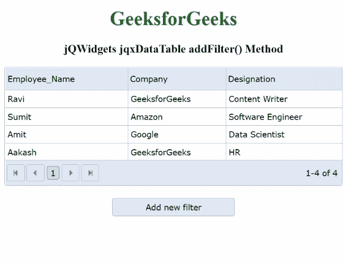

# jQWidgets jqxDataTable addFilter()方法

> 原文:[https://www . geesforgeks . org/jqwidgets-jqxdatatable-addfilter-method/](https://www.geeksforgeeks.org/jqwidgets-jqxdatatable-addfilter-method/)

**jQWidgets** 是一个 JavaScript 框架，用于为 PC 和移动设备制作基于 web 的应用程序。它是一个非常强大、优化、独立于平台并且得到广泛支持的框架。jqxDataTable 用于从 HTML 表中读取和显示数据。这也用于显示来自各种数据源的数据，如 XML、JSON、Array、CSV 或 TSV。

**添加过滤器()** **方法**用于在现有数据表中添加新过滤器。

**语法:**

```
$("#dataTable").jqxDataTable('addFilter', dataField, filtergroup);
```

**参数:**该函数接受两个参数，如下图所示:

*   **数据字段:**这是要应用过滤器的指定列。此参数为字符串类型。
*   **文件组:**这是创建的滤镜组对象。

**链接文件:**从给定链接下载 [jQWidgets](https://www.jqwidgets.com/download/) 。在 HTML 文件中，找到下载文件夹中的脚本文件。

> <link rel="”stylesheet”" href="”jqwidgets/styles/jqx.base.css”" type="”text/css”">
> <脚本类型=“text/JavaScript”src =“scripts/jquery . js”></script>
> <脚本类型=“text/JavaScript”src =“jqwidgets/jqxcore . js”></script>
> <脚本类型=“text/JavaScript”src =“jqwidgets/jqxdata . js”>

**示例:**下面的示例说明了 jQWidgets **addFilter()** 方法。在本例中，数据表内容是根据公司名称“GeeksforGeeks”进行过滤的。

## 超文本标记语言

```
<!DOCTYPE html>
<html lang="en">
   <head>
      <link rel="stylesheet" 
         href="jqwidgets/styles/jqx.base.css"
         type="text/css" />
      <script type="text/javascript" 
         src="scripts/jquery.js"></script>
      <script type="text/javascript" 
         src="jqwidgets/jqxcore.js"></script>
      <script type="text/javascript" 
         src="jqwidgets/jqxdata.js"></script>
      <script type="text/javascript"
         src="jqwidgets/jqxbuttons.js"></script>
      <script type="text/javascript" 
         src="jqwidgets/jqxscrollbar.js"></script>
      <script type="text/javascript" 
         src="jqwidgets/jqxlistbox.js"></script>
      <script type="text/javascript" 
         src="jqwidgets/jqxdropdownlist.js"></script>
      <script type="text/javascript"
         src="jqwidgets/jqxdatatable.js"></script>
      <script>
         $(document).ready(function () {
             var data = new Array();
             var Employee_Name = [
                 "Ravi", "Sumit",
                 "Amit", "Aakash"];
             var Company = [
                 "GeeksforGeeks",
                 "Amazon", "Google",
                 "GeeksforGeeks"];
             var Designation = [
                 "Content Writer",
                 "Software Engineer",
                 "Data Scientist", "HR"];

             for (var i = 0; i < 4; i++) {
                 var row = {};
                 row["Employee_Name"] = Employee_Name[i];
                 row["Company"] = Company[i];
                 row["Designation"] = Designation[i]
                 data[i] = row;
             }

             var source = {
                 localData: data,
                 dataType: "array",
                 dataFields: [{
                     name: 'Employee_Name',
                     type: 'string'
                 }, {
                     name: 'Company',
                     type: 'string'
                 }, {
                     name: 'Designation',
                     type: 'string'
                 }]
             };

             var dataAdapter =
                 new $.jqx.dataAdapter(source);
             $("#table").jqxDataTable({
                 width: 550,
                 theme: 'energyblue',
                 pageable: true,
                 editable: true,
                 source: dataAdapter,
                 columns: [{
                     text: 'Employee_Name',
                     dataField: 'Employee_Name',
                     width: 200
                 }, {
                     text: 'Company',
                     dataField: 'Company',
                     width: 160
                 }, {
                     text: 'Designation',
                     dataField: 'Designation',
                     width: 190
                 }]
             });
             $("#jqxbutton").jqxButton({
                 theme: 'energyblue',
                 width: 200,
                 height: 30
             });
             $('#jqxbutton').click(function () {
                 var filtertype = 'stringfilter';
                 var filtergroup = new $.jqx.filter();
                 var filter_or_operator = 1;
                 var filtervalue = "GeeksforGeeks";
                 var filtercondition = 'equal';
                 var filter = filtergroup.createfilter(
                     filtertype, filtervalue, filtercondition);
                 filtergroup.addfilter(filter_or_operator, filter);
                 $("#table").jqxDataTable(
                     'addFilter', 'Company', filtergroup
                 );
                 $("#table").jqxDataTable('applyFilters');
             });
         });
      </script>
   </head>
   <body>
      <center>
         <h1 style="color: green;"> GeeksforGeeks </h1>
         <h3> jQWidgets jqxDataTable addFilter() Method </h3>
         <div id="table"></div>
         <input type="button" style="margin: 20px;"
            id="jqxbutton" value="Add new filter" />
      </center>
   </body>
</html>
```

**输出:**



**参考:**[https://www . jqwidgets . com/jquery-widgets-documentation/documentation/jqxdatatable/jquery-datatable-API . htm](https://www.jqwidgets.com/jquery-widgets-documentation/documentation/jqxdatatable/jquery-datatable-api.htm)