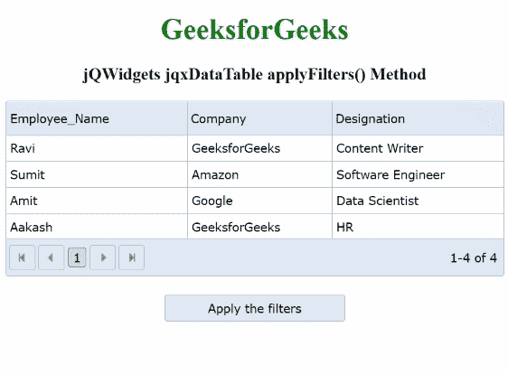

# jQWidgets jqxDataTable apply filters()方法

> 原文:[https://www . geesforgeks . org/jqwidgets-jqxdatatable-apply filters-method/](https://www.geeksforgeeks.org/jqwidgets-jqxdatatable-applyfilters-method/)

**jQWidgets** 是一个 JavaScript 框架，用于为 PC 和移动设备制作基于 web 的应用程序。它是一个非常强大、优化、独立于平台并且得到广泛支持的框架。jqxDataTable 用于从 HTML 表中读取和显示数据。这也用于显示来自各种数据源的数据，如 XML、JSON、Array、CSV 或 TSV。

**应用过滤器()**方法用于应用添加或移除的过滤器。此函数不接受任何参数。

**语法:**

```
$("#dataTable").jqxDataTable('applyFilters');
```

**链接文件:**从给定链接下载 [jQWidgets](https://www.jqwidgets.com/download/) 。在 HTML 文件中，找到下载文件夹中的脚本文件。

> <link rel="”stylesheet”" href="”jqwidgets/styles/jqx.base.css”" type="”text/css”">
> <脚本类型=“text/JavaScript”src =“scripts/jquery . js”></script>
> <脚本类型=“text/JavaScript”src =“jqwidgets/jqxcore . js”></script>
> <脚本类型=“text/JavaScript”src =“jqwidgets/jqxdata . js”>

**示例:**下面的示例说明了 jQWidgets **applyFilters()** 方法。在本例中，数据表内容是根据公司名称“GeeksforGeeks”进行过滤的。

## 超文本标记语言

```
<!DOCTYPE html>
<html lang="en">
   <head>
      <link rel="stylesheet" 
         href="jqwidgets/styles/jqx.base.css"
         type="text/css" />
      <script type="text/javascript"
         src="scripts/jquery.js"></script>
      <script type="text/javascript"
         src="jqwidgets/jqxcore.js"></script>
      <script type="text/javascript" 
         src="jqwidgets/jqxdata.js"></script>
      <script type="text/javascript"
         src="jqwidgets/jqxbuttons.js"></script>
      <script type="text/javascript" 
         src="jqwidgets/jqxscrollbar.js"></script>
      <script type="text/javascript"
         src="jqwidgets/jqxlistbox.js"></script>
      <script type="text/javascript" 
         src="jqwidgets/jqxdropdownlist.js"></script>
      <script type="text/javascript"
         src="jqwidgets/jqxdatatable.js"></script>
      <script>
         $(document).ready(function () {
             var data = new Array();
             var Employee_Name = [
                  "Ravi", "Sumit", "Amit", "Aakash"];
             var Company = [
               "GeeksforGeeks",
               "Amazon", "Google",
               "GeeksforGeeks"];
             var Designation = [
               "Content Writer", "Software Engineer", 
               "Data Scientist", "HR"];

         for (var i = 0; i < 4; i++) {
             var row = {};
             row["Employee_Name"] = Employee_Name[i];
             row["Company"] = Company[i];
             row["Designation"] = Designation[i]
             data[i] = row;
         }

         var source = {
             localData: data,
             dataType: "array",
             dataFields: [{
                 name: 'Employee_Name',
                 type: 'string'
             }, {
                 name: 'Company',
                 type: 'string'
             }, {
                 name: 'Designation',
                 type: 'string'
             }]
         };

         var dataAdapter = 
             new $.jqx.dataAdapter(source);
         $("#table").jqxDataTable({
             width: 550,
             theme: 'energyblue',
             pageable: true,
             editable: true,
             source: dataAdapter,
             columns: [{
                 text: 'Employee_Name',
                 dataField: 'Employee_Name',
                 width: 200
             }, {
                 text: 'Company',
                 dataField: 'Company',
                 width: 160
             }, {
                 text: 'Designation',
                 dataField: 'Designation',
                 width: 190
             }]
         });
         $("#jqxbutton").jqxButton({
             theme: 'energyblue',
             width: 200,
             height: 30
         });
         $('#jqxbutton').click(function () {
             var filtertype = 'stringfilter';
             var filtergroup = new $.jqx.filter();
             var filter_or_operator = 1;
             var filtervalue = "GeeksforGeeks";
             var filtercondition = 'equal';
             var filter = filtergroup.createfilter(
               filtertype, filtervalue, filtercondition);
             filtergroup.addfilter(filter_or_operator, filter);
             $("#table").jqxDataTable(
               'addFilter', 'Company', filtergroup
             );
             $("#table").jqxDataTable('applyFilters');
         });
         });
      </script>
   </head>
   <body>
      <center>
         <h1 style="color: green;"> GeeksforGeeks </h1>
         <h3> jQWidgets jqxDataTable 
            applyFilters() Method 
         </h3>
         <div id="table"></div>
         <input type="button" style="margin: 20px;"
            id="jqxbutton" 
            value="Apply the filters" />
      </center>
   </body>
</html>
```

**输出:**



**参考:**[https://www . jqwidgets . com/jquery-widgets-documentation/documentation/jqxdatatable/jquery-datatable-API . htm](https://www.jqwidgets.com/jquery-widgets-documentation/documentation/jqxdatatable/jquery-datatable-api.htm)