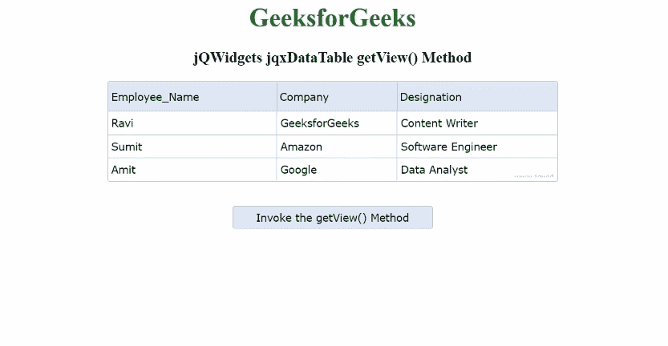

# jQWidgets jqxDataTable getView()方法

> 原文:[https://www . geesforgeks . org/jqwidgets-jqxdatatable-getview-method/](https://www.geeksforgeeks.org/jqwidgets-jqxdatatable-getview-method/)

**jQWidgets** 是一个 JavaScript 框架，用于为 PC 和移动设备制作基于 web 的应用程序。它是一个非常强大、优化、独立于平台并且得到广泛支持的框架。 **jqxDataTable** 用于读取和显示 HTML 表格中的数据。这也用于显示来自各种数据源的数据，如 XML、JSON、Array、CSV 或 TSV。

**getView()** 方法用于返回数据表中可见的所有指定行的列表。此方法不接受任何参数。

**语法:**

```
$("#dataTable").jqxDataTable('getView');
```

**返回值:**该方法返回数据表中所有行的列表。

**链接文件:**从给定链接下载 [jQWidgets](https://www.jqwidgets.com/download/) 。在 HTML 文件中，找到下载文件夹中的脚本文件。

> <link rel="”stylesheet”" href="”jqwidgets/styles/jqx.base.css”" type="”text/css”">
> <脚本类型=“text/JavaScript”src =“scripts/jquery . js”></script>
> <脚本类型=“text/JavaScript”src =“jqwidgets/jqxcore . js”></script>
> <脚本类型=“text/JavaScript”src =“jqwidgets/jqxdata . js”>

**示例:**下面的示例说明了 jQWidgets **getView()** 方法。

## 超文本标记语言

```
<!DOCTYPE html>
<html lang="en">

<head>
    <link rel="stylesheet" href=
"jqwidgets/styles/jqx.base.css" type="text/css" />
    <script type="text/javascript" 
            src="scripts/jquery.js">
    </script>
    <script type="text/javascript" 
            src="jqwidgets/jqxcore.js">
    </script>
    <script type="text/javascript" 
            src="jqwidgets/jqxdata.js">
    </script>
    <script type="text/javascript" 
            src="jqwidgets/jqxbuttons.js">
    </script>
    <script type="text/javascript" 
            src="jqwidgets/jqxscrollbar.js">
    </script>
    <script type="text/javascript" 
            src="jqwidgets/jqxlistbox.js">
    </script>
    <script type="text/javascript" 
            src="jqwidgets/jqxdropdownlist.js">
    </script>
    <script type="text/javascript" 
            src="jqwidgets/jqxdatatable.js">
    </script>
</head>

<body>
    <center>
        <h1 style="color:green;"> 
          GeeksforGeeks 
        </h1>
        <h3> 
          jQWidgets jqxDataTable getView() Method 
        </h3>
        <div id="Data_Table"></div>
        <input type="button" 
               style="margin: 31px;" 
               id="jqxbutton_for_getView" 
               value="Invoke the getView() Method" />
        <div id="log"></div>
    </center>
    <script>
        $(document).ready(function () {
            var Data = new Array();
            var Employee_Name = [
                "Ravi", "Sumit", "Amit"];
            var Company = [
                "GeeksforGeeks", "Amazon", "Google"];
            var Designation = [
                "Content Writer", "Software Engineer",
                "Data Analyst"];

            a = 0;
            while (a < 3) {
                var row = {};
                row["Employee_Name"] = Employee_Name[a];
                row["Company"] = Company[a];
                row["Designation"] = Designation[a]
                Data[a] = row;
                a++;
            }

            var Data_Source = {
                localData: Data,
                dataType: "array",
                dataFields: [{
                    name: 'Employee_Name',
                    type: 'string'
                }, {
                    name: 'Company',
                    type: 'string'
                }, {
                    name: 'Designation',
                    type: 'string'
                }]
            };
            var data_Adapter = 
                new $.jqx.dataAdapter(Data_Source);
            $("#Data_Table").jqxDataTable({
                width: 560,
                theme: 'energyblue',
                source: data_Adapter,
                columns: [{
                    text: 'Employee_Name',
                    dataField: 'Employee_Name',
                    width: 210
                }, {
                    text: 'Company',
                    dataField: 'Company',
                    width: 150
                }, {
                    text: 'Designation',
                    dataField: 'Designation',
                    width: 200
                }]
            });
            $("#jqxbutton_for_getView").jqxButton({
                theme: 'energyblue',
                width: 250
            });
            $('#jqxbutton_for_getView').click(function () {
                var Selected_Rows = 
                    $("#Data_Table").jqxDataTable('getView');
                var Final_Value = "";
                b = 0;
                while (b < Selected_Rows.length) {
                    var rowData = Selected_Rows[b];
                    Final_Value = Final_Value + 
                      rowData.Employee_Name + "-" +
                        rowData.Company + "-" + 
                      rowData.Designation + ", ";
                    b++;
                }
                $("#log").html(JSON.stringify(Final_Value))
            });
        });
    </script>
</body>
</html>
```

**输出:**



**参考:**[https://www . jqwidgets . com/jquery-widgets-documentation/documentation/jqxdatatable/jquery-datatable-API . htm？搜索=](https://www.jqwidgets.com/jquery-widgets-documentation/documentation/jqxdatatable/jquery-datatable-api.htm?search=)