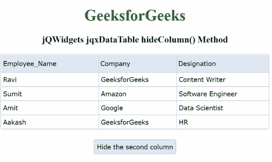

# jQWidgets jqxDataTable hide column()方法

> 原文:[https://www . geesforgeks . org/jqwidgets-jqxdatatable-hide column-method/](https://www.geeksforgeeks.org/jqwidgets-jqxdatatable-hidecolumn-method/)

**jQWidgets** 是一个 JavaScript 框架，用于为 PC 和移动设备制作基于 web 的应用程序。它是一个非常强大、优化、独立于平台并且得到广泛支持的框架。 **jqxDataTable** 用于读取和显示 HTML 表格中的数据。这也用于显示来自各种数据源的数据，如 XML、JSON、Array、CSV 或 TSV。

**hideColumn()** 方法用于隐藏指定的列。

**语法:**

```html
$("#dataTable").jqxDataTable('hideColumn','Column_Name');
```

**参数:**该方法接受如下所示的参数:

*   **列名:**这是将要隐藏的指定列。

**链接文件:**从给定链接下载 [jQWidgets](https://www.jqwidgets.com/download/) 。在 HTML 文件中，找到下载文件夹中的脚本文件。

> <link rel="”stylesheet”" href="”jqwidgets/styles/jqx.base.css”" type="”text/css”">
> <脚本类型=“text/JavaScript”src =“scripts/jquery . js”></script>
> <脚本类型=“text/JavaScript”src =“jqwidgets/jqxcore . js”></script>
> <脚本类型=“text/JavaScript”src =“jqwidgets/jqxdata . js”>

下面的例子说明了 jQWidgets **hideColumn()** 方法。

**示例:**

## 超文本标记语言

```html
<!DOCTYPE html>
<html lang="en">

<head>
    <link rel="stylesheet" href="
         jqwidgets/styles/jqx.base.css" type="text/css"/>
    <script type="text/javascript" 
            src="scripts/jquery.js">
    </script>
    <script type="text/javascript" 
            src="jqwidgets/jqxcore.js">
    </script>
    <script type="text/javascript" 
            src="jqwidgets/jqxdata.js">
    </script>
    <script type="text/javascript" 
            src="jqwidgets/jqxbuttons.js">
    </script>
    <script type="text/javascript" 
            src="jqwidgets/jqxscrollbar.js">
    </script>
    <script type="text/javascript" 
            src="jqwidgets/jqxlistbox.js">
    </script>
    <script type="text/javascript" 
            src="jqwidgets/jqxdropdownlist.js">
    </script>
    <script type="text/javascript" 
            src="jqwidgets/jqxdatatable.js">
    </script>
    <script>
        $(document).ready(function () {
            var data = new Array();
            var Employee_Name = [
                "Ravi", "Sumit", "Amit",
                "Aakash"];
            var Company = [
                "GeeksforGeeks", "Amazon",
                "Google",
                "GeeksforGeeks"];
            var Designation = [
                "Content Writer",
                "Software Engineer",
                "Data Scientist", "HR"];

            a = 0;
            while (a < 4) {
                var row = {};
                row["Employee_Name"] = Employee_Name[a];
                row["Company"] = Company[a];
                row["Designation"] = Designation[a]
                data[a] = row;
                a++;
            }

            var source = {
                localData: data,
                dataType: "array",
                dataFields: [{
                    name: 'Employee_Name',
                    type: 'string'
                }, {
                    name: 'Company',
                    type: 'string'
                }, {
                    name: 'Designation',
                    type: 'string'
                }]
            };
            var dataAdapter = new 
            $.jqx.dataAdapter(source);
            $("#table").jqxDataTable({
                width: 550,
                theme: 'energyblue',
                source: dataAdapter,
                columns: [{
                    text: 'Employee_Name',
                    dataField: 'Employee_Name',
                    width: 200
                }, {
                    text: 'Company',
                    dataField: 'Company',
                    width: 160
                }, {
                    text: 'Designation',
                    dataField: 'Designation',
                    width: 190
                }]
            });
            $("#jqxbutton").jqxButton({
                theme: 'energyblue',
                height: 30
            });
            $('#jqxbutton').click(function () {
                $("#table").jqxDataTable(
                  'hideColumn', 'Company');
            });
        });
    </script>
</head>

<body>
    <center>
        <h1 style="color: green;"> 
          GeeksforGeeks 
        </h1>
        <h3> 
          jQWidgets jqxDataTable hideColumn() Method 
        </h3>
        <div id="table"></div>
        <input type="button" style="margin: 21px;" 
               id="jqxbutton" 
               value="Hide the second column"/>
    </center>
</body>

</html>
```

**输出:**



**参考:**[https://www . jqwidgets . com/jquery-widgets-documentation/documentation/jqxdatatable/jquery-datatable-API . htm？搜索=](https://www.jqwidgets.com/jquery-widgets-documentation/documentation/jqxdatatable/jquery-datatable-api.htm?search=)