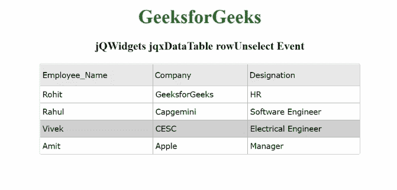

# jQWidgets jqxDataTable 行取消选择事件

> 原文:[https://www . geesforgeks . org/jqwidgets-jqxdatatable-row unselect-event/](https://www.geeksforgeeks.org/jqwidgets-jqxdatatable-rowunselect-event/)

**jQWidgets** 是一个 JavaScript 框架，用于为 PC 和移动设备制作基于 web 的应用程序。它是一个非常强大、优化、独立于平台并且得到广泛支持的框架。 **jqxDataTable** 用于读取和显示 HTML 表格中的数据。这也用于显示来自各种数据源的数据，如 XML、JSON、Array、CSV 或 TSV。

当指定行未被选中时，触发**行取消选择**属性。

**语法:**

```html
$('Selector').on('rowUnselect',  
  function (event) {

    // Event arguments
    var args = event.args;

    // Data of the row
    var row = args.row;

    // Index of the row
    var index = args.index;

    // Data bound index of the row
    var boundIndex = args.boundIndex;

    // Key of the row
    var key = args.key;
});
```

**链接文件:**从给定链接下载 [jQWidgets](https://www.jqwidgets.com/download/) 。在 HTML 文件中，找到下载文件夹中的脚本文件。

> <link rel="”stylesheet”" href="”jqwidgets/styles/jqx.base.css”" type="”text/css”">
> <脚本类型=“text/JavaScript”src =“scripts/jquery . js”></script>
> <脚本类型=“text/JavaScript”src =“jqwidgets/jqxcore . js”></script>
> <脚本类型=“text/JavaScript”src =“jqwidgets/jqxdata . js”>

**示例:**以下示例说明了 jQWidgets **行取消选择**事件。在下面的示例中，已经选择了第三行，然后在单击该行后，该事件被触发并显示该行的详细信息。稍后，再次通过单击该行来选择另一行，然后在单击另一行后取消选择该行，然后该事件被触发并显示前一行的详细信息。

## 超文本标记语言

```html
<!DOCTYPE html>
<html lang="en">

<head>
    <link rel="stylesheet"
          href="jqwidgets/styles/jqx.base.css"
          type="text/css"/>
    <script type="text/javascript" 
            src="scripts/jquery.js">
    </script>
    <script type="text/javascript" 
            src="jqwidgets/jqxcore.js">
    </script>
    <script type="text/javascript" 
            src="jqwidgets/jqxdata.js">
    </script>
    <script type="text/javascript" 
            src="jqwidgets/jqxbuttons.js">
    </script>
    <script type="text/javascript" 
            src="jqwidgets/jqxscrollbar.js">
    </script>
    <script type="text/javascript" 
            src="jqwidgets/jqxlistbox.js">
    </script>
    <script type="text/javascript" 
            src="jqwidgets/jqxdropdownlist.js">
    </script>
    <script type="text/javascript" 
            src="jqwidgets/jqxdatatable.js">
    </script>
</head>

<body>
    <center>
        <h1 style="color: green;">
            GeeksforGeeks
        </h1>
        <h3>
            jQWidgets jqxDataTable rowUnselect Event
        </h3>
        <div id="#Data_Table"></div>
        <div id="log"></div>
        <script type="text/javascript">
            $(document).ready(function () {
                $("#Data_Table").jqxDataTable({
                    columns: [{
                        text: 'Employee_Name',
                        dataField: 'Employee_Name',
                        width: 190
                    }, {
                        text: 'Company',
                        dataField: 'Company',
                        width: 160
                    }, {
                        text: 'Designation',
                        dataField: 'Designation',
                        width: 190
                    }]
                });
                $("#Data_Table").jqxDataTable(
                      'selectRow', 2);
                $("#Data_Table").on(
                    'rowUnselect', function (event) {
                        var args = event.args;
                        var Rows = args.row;
                        $("#log").html(JSON.
                            stringify(Rows))
                    })
            });
        </script>
        <table id="Data_Table" border="1">
            <thead>
                <tr>
                    <th>Employee_Name</th>
                    <th>Company</th>
                    <th>Designation</th>
                </tr>
            </thead>
            <tbody>
                <tr>
                    <td>Rohit</td>
                    <td>GeeksforGeeks</td>
                    <td>HR</td>
                </tr>
                <tr>
                    <td>Rahul</td>
                    <td>Capgemini</td>
                    <td>Software Engineer</td>
                </tr>
                <tr>
                    <td>Vivek</td>
                    <td>CESC</td>
                    <td>Electrical Engineer</td>
                </tr>
                <tr>
                    <td>Amit</td>
                    <td>Apple</td>
                    <td>Manager</td>
                </tr>
            </tbody>
        </table>
    </center>
</body>

</html>
```

**输出:**



**参考:**[https://www . jqwidgets . com/jquery-widgets-documentation/documentation/jqxdatatable/jquery-datatable-API . htm](https://www.jqwidgets.com/jquery-widgets-documentation/documentation/jqxdatatable/jquery-datatable-api.htm)