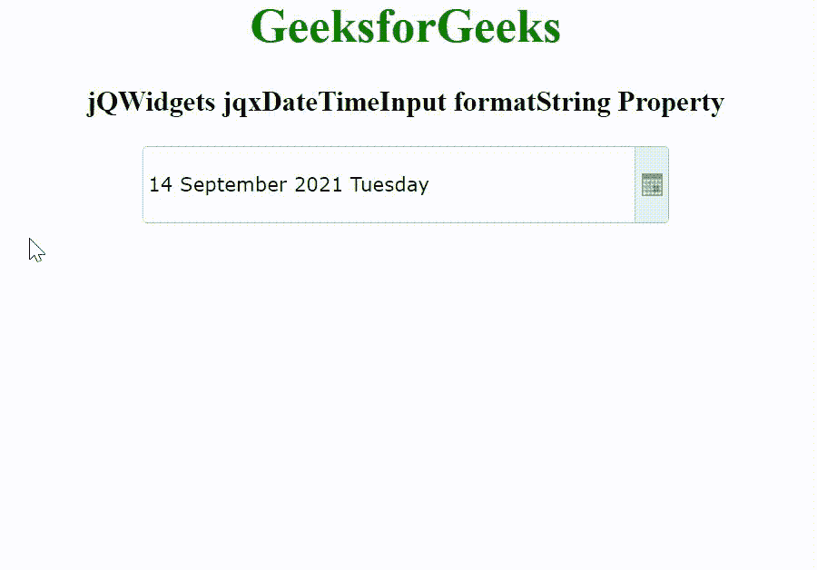

# jqwidget jqxdatetimeinput 格式字符串属性

> 原文:[https://www . geesforgeks . org/jqwidgets-jqxdatetimeinput-format string-property/](https://www.geeksforgeeks.org/jqwidgets-jqxdatetimeinput-formatstring-property/)

jQWidgets 是一个 JavaScript 框架，用于为 PC 和移动设备制作基于 web 的应用程序。它是一个非常强大、优化、独立于平台并且得到广泛支持的框架。jqxDateTimeInput 小部件是一个 jQuery datetimeinput，用于使用显示的日历或键盘选择日期或时间。

formatString 属性用于设置或返回日期的日期时间输入格式。它接受字符串类型值，默认值为日/月/年。

它的可能值是–

*   **‘d’–**代表一个月中的某一天。
*   **‘DD’–**表示一个月中的某一天。
*   **‘DDD’–**表示一周中某一天的缩写名称。
*   **‘dddd’–**表示一周中某一天的全称。
*   **‘h’–**它代表小时，使用从 1 到 12 的 12 小时时钟。
*   **‘hh’–**它代表小时，使用从 01 到 12 的 12 小时时钟。
*   **‘H’–**它代表小时，使用从 0 到 23 的 24 小时时钟。
*   **‘HH’–**它代表小时，使用从 00 到 23 的 24 小时时钟。
*   **‘m’–**表示分钟，从 0 到 59。
*   **‘mm’–**表示分钟，从 00059 开始。
*   **‘M’–**表示月份，从 1 到 12。
*   **‘MM’–**表示月份，从 01 到 12。
*   **‘MMM’–**表示月份的缩写名称。
*   **‘MMMM’–**代表月份的全称。
*   **的–**它代表第二个，从 0 到 59。
*   **‘ss’–**表示第二个，从 00 到 59。
*   **‘t’–**代表 AM/PM 指示符的第一个字符。
*   **“TT”–**代表上午/下午指示符。
*   **‘y’–**代表年份，从 0 到 99。
*   **‘YY’–**代表年份，从 00 到 99。
*   **‘yyy’–**表示年份，最少三位数。
*   **‘yyyy’–**用四位数表示年份。

**语法:**

设置 formatString 属性。

```html
$('selector').jqxDateTimeInput({ formatString: String });
```

返回 formatString 属性。

```html
var formatString = $('selector').jqxDateTimeInput('formatString');
```

**链接文件:**从链接 https://www.jqwidgets.com/download/.下载 jQWidgets 在 HTML 文件中，找到下载文件夹中的脚本文件。

> <link rel="”stylesheet”" href="”jqwidgets/styles/jqx.base.css”" type="”text/css”">
> < link rel= "样式表" href = " jqwidgets/style/jqx . energy blue . CSS " type = " text/CSS "/>
> <脚本类型= " text/JavaScript " src = " scripts/jquery-1 . 11 . 1 . min . js "></脚本>
> <脚本类型= " text/JavaScript " src = " jqwidgets/jqxc

下面的例子说明了 jQWidgets 中的 jqxDateTimeInput formatString 属性。

**示例:**

## 超文本标记语言

```html
<!DOCTYPE html>
<html lang="en">

<head>
    <link rel="stylesheet" href=
        "jqwidgets/styles/jqx.base.css" type="text/css" />
    <link rel="stylesheet" href=
        "jqwidgets/styles/jqx.energyblue.css" type="text/css" />
    <script type="text/javascript" 
        src="scripts/jquery-1.11.1.min.js"></script>
    <script type="text/javascript" 
        src="jqwidgets/jqxcore.js"></script>
    <script type="text/javascript" 
        src="jqwidgets/jqxdatetimeinput.js"></script>
    <script type="text/javascript" 
        src="jqwidgets/jqxcalendar.js"></script>
    <script type="text/javascript" 
        src="jqwidgets/jqxtooltip.js"></script>
    <script type="text/javascript" 
        src="jqwidgets/jqxbuttons.js"></script>
    <script type="text/javascript" 
        src="jqwidgets/globalization/globalize.js"></script>
    <script type="text/javascript" src=
        "jqwidgets/globalization/globalize.culture.de-de.js">
    </script>
</head>

<body>
    <center>
        <h1 style="color: green;">
            GeeksforGeeks
        </h1>

        <h3>
            jQWidgets jqxDateTimeInput formatString Property
        </h3>

        <div style="margin: 10px;" id='jqxDTI'></div>
    </center>

    <script type="text/javascript">
        $(document).ready(function() {
            $("#jqxDTI").jqxDateTimeInput({
                theme: 'energyblue',
                width: '350px',
                height: '50px',
                formatString: "dd MMMM yyyy dddd"
            });
        });
    </script>
</body>

</html>
```

**输出:**



**参考:**[https://www . jqwidgets . com/jquery widgets-documentation/documentation/jqxdatetimeinput/jquery-datetimeinput-API . htm](https://www.jqwidgets.com/jquery-widgets-documentation/documentation/jqxdatetimeinput/jquery-datetimeinput-api.htm)