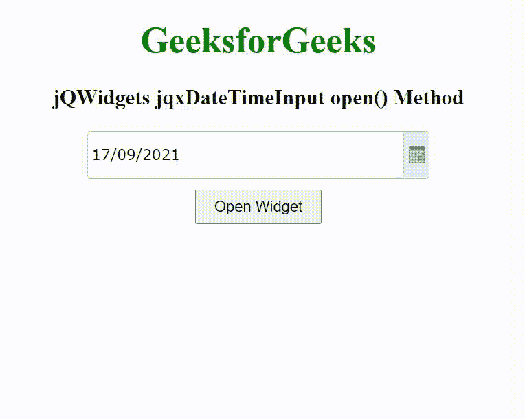

# jqwidget jqxdatetimeinput open()方法

> 原文:[https://www . geesforgeks . org/jqwidgets-jqxdatetimeinput-open-method/](https://www.geeksforgeeks.org/jqwidgets-jqxdatetimeinput-open-method/)

**jQWidgets** 是一个 JavaScript 框架，用于为 PC 和移动设备制作基于 web 的应用程序。它是一个非常强大、优化、独立于平台并且得到广泛支持的框架。jqxDateTimeInput 小部件是一个 jQuery datetimeinput，用于使用显示的日历或键盘选择日期或时间。

**打开()方法**用于打开弹出日历。它不接受任何参数，也不返回值。

**语法:**

```html
$('Selector').jqxDateTimeInput('open');
```

**链接文件:**从链接下载 [jQWidgets](https://www.jqwidgets.com/download/) 。在 HTML 文件中，找到下载文件夹中的脚本文件。

> <link rel="”stylesheet”" href="”jqwidgets/styles/jqx.base.css”" type="”text/css”">
> < link rel= "样式表" href = " jqwidgets/style/jqx . energy blue . CSS " type = " text/CSS "/>
> <脚本类型= " text/JavaScript " src = " scripts/jquery-1 . 11 . 1 . min . js "></脚本>
> <脚本类型= " text/JavaScript " src = " jqwidgets/jqxc

下面的例子说明了 jQWidgets 中的 jqxDateTimeInput **open()方法**。

**示例:**

## 超文本标记语言

```html
<!DOCTYPE html>
<html lang="en">

<head>
    <link rel="stylesheet" 
          href=
"jqwidgets/styles/jqx.base.css" 
          type="text/css" />
    <link rel="stylesheet" 
          href=
"jqwidgets/styles/jqx.energyblue.css" 
          type="text/css" />
    <script type="text/javascript" 
        src="scripts/jquery-1.11.1.min.js">
      </script>
    <script type="text/javascript" 
        src="jqwidgets/jqxcore.js">
      </script>
    <script type="text/javascript" 
        src="jqwidgets/jqxdatetimeinput.js">
      </script>
    <script type="text/javascript" 
        src="jqwidgets/jqxcalendar.js">
      </script>
    <script type="text/javascript" 
        src="jqwidgets/jqxtooltip.js">
      </script>
    <script type="text/javascript" 
        src="jqwidgets/jqxbuttons.js">
      </script>
    <script type="text/javascript" 
        src="jqwidgets/globalization/globalize.js">
      </script>
</head>

<body>
    <center>
        <h1 style="color: green;">
            GeeksforGeeks
        </h1>

        <h3>
            jQWidgets jqxDateTimeInput open() Method
        </h3>

        <div style="margin: 10px;" 
             id='jqxDTI'></div>

        <input type="button" id="jqxBtn"
               value="Open Widget" 
               style="padding: 5px 15px;">
    </center>

    <script type="text/javascript">
        $(document).ready(function() {
            $("#jqxDTI").jqxDateTimeInput({
                theme: 'energyblue',
                width: '300px',
                height: '40px'
            });

            $("#jqxBtn").on('click', function() {
                var date = $('#jqxDTI')
                    .jqxDateTimeInput('open');

                alert("Widget Opening");
            })
        });
    </script>
</body>

</html>
```

**输出:**



**参考:**[https://www . jqwidgets . com/jquery widgets-documentation/documentation/jqxdatetimeinput/jquery-datetimeinput-API . htm](https://www.jqwidgets.com/jquery-widgets-documentation/documentation/jqxdatetimeinput/jquery-datetimeinput-api.htm)