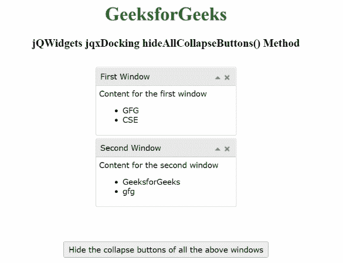

# jQWidgets jqxDocking hideallcollapse buttons()方法

> 原文:[https://www . geesforgeks . org/jqwidgets-jqxdocking-hideallcollapse buttons-method/](https://www.geeksforgeeks.org/jqwidgets-jqxdocking-hideallcollapsebuttons-method/)

***jQWidgets*** 是一个 JavaScript 框架，用于为 PC 和移动设备制作基于 web 的应用程序。它是一个非常强大、优化、独立于平台并且得到广泛支持的框架。 ***jqxDocking*** 用于表示一个小部件来管理多个窗口以及一个网页的布局。在这里，指定的 jqxDocking 中的每个窗口都可以执行多个任务，例如可以在网页上拖动、停靠到停靠区域、从停靠中移除、折叠到最小化状态以隐藏其内容，还可以展开以显示其内容。

***隐藏折叠按钮()*** 方法用于隐藏指定 jqxDocking 的所有窗口的折叠按钮。

**语法:**

```
$('#jqxDocking').jqxDocking('hideAllCollapseButtons');
```

**参数:**此方法不接受任何参数。

**返回值:**此方法不返回值。

**链接文件:**从给定链接下载 [jQWidgets](https://www.jqwidgets.com/download/) 。在 HTML 文件中，找到下载文件夹中的脚本文件。

> <link rel="”stylesheet”" href="”jqwidgets/styles/jqx.base.css”" type="”text/css”">
> <脚本类型=“text/JavaScript”src =“scripts/jquery . js”></脚本>
> <脚本类型=“text/JavaScript”src =“jqwidgets/jqxcore . js”></脚本>
> <脚本类型=“text/JavaScript”src =“jqwidgets/jqxdocking . js”></脚本

**示例:**下面的示例说明了 jQWidgets jqxDocking**hideallcollapsedbuttons()**方法。

## 超文本标记语言

```
<!DOCTYPE html>
<html lang="en">

<head>
    <link rel="stylesheet" href=
    "jqwidgets/styles/jqx.base.css" type="text/css"/>
    <script type="text/javascript" 
            src="scripts/jquery.js">
    </script>
    <script type="text/javascript" 
            src="jqwidgets/jqxcore.js">
    </script>
    <script type="text/javascript" 
            src="jqwidgets/jqxdocking.js">
    </script>
    <script type="text/javascript" 
            src="jqwidgets/jqxwindow.js">
    </script>
</head>

<body>
    <center>
        <h1 style="color: green;">
            GeeksforGeeks
        </h1>
        <h3>
            jQWidgets jqxDocking hideAllCollapseButtons() Method
        </h3>
        <div id="jqx_Docking" style="margin: 25px;" align="left">
            <div>
                <div id="First Window">
                    <div>First Window</div>
                    <div>
                        <h8>Content for the first window</h8>
                        <ul>
                            <li>GFG</li>
                            <li>CSE</li>
                        </ul>
                    </div>
                </div>
                <div id="Second Window">
                    <div>Second Window</div>
                    <div>
                        <h8>Content for the second window</h8>
                        <ul>
                            <li>GeeksforGeeks</li>
                            <li>gfg</li>
                        </ul>
                    </div>
                </div>
            </div>
        </div>
        <input type="button" style="margin: 29px;" 
               id="jqxbutton_for_hideAllCollapseButtons"
         value="Hide the collapse buttons"
             + " of all the above windows"/>
        <div id="log"></div>
        <script type="text/javascript">
            $(document).ready(function () {
                $("#jqx_Docking").jqxDocking({
                    width: 250
                });
                $("#jqxbutton_for_hideAllCollapseButtons").
                    jqxButton({
                        width: 350
                    });
                $('#jqx_Docking').jqxDocking(
                    'showAllCollapseButtons');
                $('#jqxbutton_for_hideAllCollapseButtons').on(
                    'click', function () {
                        $('#jqx_Docking').jqxDocking(
                            'hideAllCollapseButtons');
                    });
            });
        </script>
    </center>
</body>

</html>
```

**输出:**



**参考:**[https://www . jqwidgets . com/jquery-widgets-documentation/documentation/jqxnavigationbar/jquery-navigationbar-API . htm？搜索=](https://www.jqwidgets.com/jquery-widgets-documentation/documentation/jqxdocking/jquery-docking-api.htm?search=)