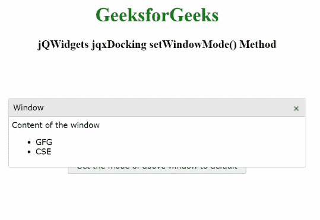

# jQWidgets jqxDocking setWindowMode()方法

> 原文:[https://www . geesforgeks . org/jqwidgets-jqxdocking-setwindowmode-method/](https://www.geeksforgeeks.org/jqwidgets-jqxdocking-setwindowmode-method/)

**jQWidgets** 是一个 JavaScript 框架，用于为 PC 和移动设备制作基于 web 的应用程序。它是一个非常强大、优化、独立于平台并且得到广泛支持的框架。 **jqxDocking** 用于表示一个小部件来管理多个窗口以及一个网页的布局。

指定的 **jqxDocking** 中的每个窗口都可以执行多个任务，例如可以在网页上拖动、停靠到停靠区域、从停靠中移除、折叠到最小化状态以隐藏其内容，还可以展开以显示其内容。

**设置窗口模式()**方法用于将模式设置到指定的 **jqxDocking** 窗口。

**语法:**

```
$('#jqxDocking').jqxDocking('setWindowMode', windowId, mode);
```

**参数:**该方法接受两个参数，如下图所示。

*   **窗口标识:**这是正在设置模式的窗口的标识。
*   **模式:**这是指定模式。它的可能值是“*默认*或“*浮动*”。

**返回值:**此方法不返回值。

**链接文件:**从给定链接下载 [jQWidgets](https://www.jqwidgets.com/download/) 。在 HTML 文件中，找到下载文件夹中的脚本文件。

> <link rel="”stylesheet”" href="”jqwidgets/styles/jqx.base.css”" type="”text/css”">
> <脚本类型=“text/JavaScript”src =“scripts/jquery . js”></脚本>
> <脚本类型=“text/JavaScript”src =“jqwidgets/jqxcore . js”></脚本>
> <脚本类型=“text/JavaScript”src =“jqwidgets/jqx-all . js”><

**示例:**下面的示例说明了 jQWidgets jqxDocking**setWindowMode()***T5T7】的方法。在下面的例子中，窗口的模式是“浮动的”，后来在调用 **setWindowMode()** 方法后，窗口的模式被更改为“默认”。*

## 超文本标记语言

```
<!DOCTYPE html>
<html lang="en">

<head>
    <link rel="stylesheet" 
          href="jqwidgets/styles/jqx.base.css" 
          type="text/css"/>
    <script type="text/javascript" 
            src="scripts/jquery.js">
    </script>
    <script type="text/javascript" 
            src="jqwidgets/jqxcore.js">
    </script>
    <script type="text/javascript" 
            src="jqwidgets/jqxdocking.js">
    </script>
    <script type="text/javascript" 
            src="jqwidgets/jqxwindow.js">
    </script>
</head>

<body>
    <center>
        <h1 style="color:green;">
            GeeksforGeeks
        </h1>
        <h3>
            jQWidgets jqxDocking setWindowMode() Method
        </h3>
        <div id="jqx_Docking" style="margin:25px;" align="left">
            <div>
                <div id="Window">
                    <div>Window</div>
                    <div>
                        <h8>Content of the window</h8>
                        <ul>
                            <li>GFG</li>
                            <li>CSE</li>
                        </ul>
                    </div>
                </div>
            </div>
        </div>
        <input type="button" style="margin:29px;" 
               id="jqxbutton_for_setWindowMode"
               value="Set the mode of above window to default"/>

        <script type="text/javascript">
            $(document).ready(function () {
                $("#jqx_Docking").jqxDocking({
                    width: 250,
                    windowsMode: {
                        'Window': 'floating'
                    }
                });
                $("#jqxbutton_for_setWindowMode").
                    jqxButton({
                        width: 300
                    });
                $('#jqxbutton_for_setWindowMode').on(
                    'click', function () {
                        var windowsId = 'Window';
                        var mode = 'default';
                        $('#jqx_Docking').jqxDocking(
                            'setWindowMode', windowsId, mode);
                    });
            });
        </script>
    </center>
</body>
</html>
```

**输出:**



**参考:**[https://www . jqwidgets . com/jquery-widgets-documentation/documentation/jqxnavigationbar/jquery-navigationbar-API . htm？搜索=](https://www.jqwidgets.com/jquery-widgets-documentation/documentation/jqxdocking/jquery-docking-api.htm?search=)