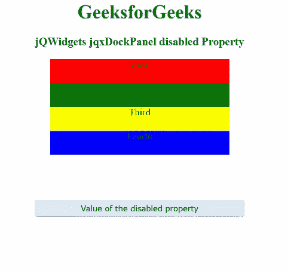

# jQWidgets jqxDockPanel 禁用属性

> 原文:[https://www . geeksforgeeks . org/jqwidgets-jqxdockmpanel-disabled-property/](https://www.geeksforgeeks.org/jqwidgets-jqxdockpanel-disabled-property/)

**jQWidgets** 是一个 JavaScript 框架，用于为 PC 和移动设备制作基于 web 的应用程序。它是一个非常强大、优化、独立于平台并且得到广泛支持的框架。 **jqxDockPanel** 用于表示小部件或元素的容器，这些小部件或元素根据“dock”属性的值排列其内部元素。左侧、右侧、顶部和底部是可能的“停靠”属性值。

**禁用** **属性**用于设置或获取指定的 jqxDockPanel 是否禁用。

**语法:**

*   要设置*禁用的*属性:

    ```
    $('#jqxDockPanel').jqxDockPanel({ disabled: true });  
    ```

*   要禁用*属性:*

    ```
    *var disabled = $('#jqxDockPanel').jqxDockPanel('disabled');*
    ```

***链接文件:**从给定链接下载 [jQWidgets](https://www.jqwidgets.com/download/) 。在 HTML 文件中，找到下载文件夹中的脚本文件。*

> <link rel="”stylesheet”" href="”jqwidgets/styles/jqx.base.css”" type="”text/css”"> *<脚本类型=“text/JavaScript”src =“scripts/jquery . js”></script>
> <脚本类型=“text/JavaScript”src =“jqwidgets/jqxcore . js”></script>
> <脚本类型=“text/JavaScript”src =“jqwidgets/jqxbuttons . js”><*

***示例:**以下示例说明了 jQWidgets jqxdockmpanel**禁用的** **属性**。在以下示例中，*禁用*属性的值已设置为真。*

## *超文本标记语言*

```
*<!DOCTYPE html>
<html lang="en">

<head>
    <link rel="stylesheet"
          href="jqwidgets/styles/jqx.base.css"
          type="text/css"/>
    <script type="text/javascript" 
            src="scripts/jquery.js">
    </script>
    <script type="text/javascript" 
            src="jqwidgets/jqxcore.js">
    </script>
    <script type="text/javascript" 
            src="jqwidgets/jqxbuttons.js">
    </script>
    <script type="text/javascript" 
            src="jqwidgets/jqxdockpanel.js">
    </script>
    <script type="text/javascript" 
            src="jqwidgets/jqx-all.js">
    </script>
</head>

<body>
    <center>
        <h1 style="color:green;">
            GeeksforGeeks
        </h1>
        <h3>
            jQWidgets jqxDockPanel disabled Property
        </h3>
        <div id='jqx_DockPanel'>
            <div style='height: 40px; 
                        background: red;'>
              First</div>
            <div style='height: 40px; 
                        background: green;'>
              Second</div>
            <div style='height: 40px; 
                        background: yellow;'>
              Third</div>
            <div style='height: 40px; 
                        background: blue;'>
              Fourth</div>
        </div>
        <input type="button" style="margin: 25px;" 
               id="button_for_disabled"
               value="Value of the disabled property"/>
        <div id="log"></div>
        <script type="text/javascript">
            $(document).ready(function () {
                $("#jqx_DockPanel").jqxDockPanel({
                    width: 300,
                    height: 210,
                    disabled: true
                });
                $("#button_for_disabled").jqxButton({
                    width: 350,
                    theme: 'energyblue'
                });
                $('#button_for_disabled').jqxButton().
                    click(function () {
                        var value_of_disabled =
              $('#jqx_DockPanel').jqxDockPanel('disabled');
                        $("#log").html(value_of_disabled);
                    })
            });
        </script>
    </center>
</body>

</html>*
```

***输出:***

**

***参考:**[https://www . jqwidgets . com/jquery-widgets-documentation/documentation/jqxdockmpanel/jquery-dockmpanel-API . htm](https://www.jqwidgets.com/jquery-widgets-documentation/documentation/jqxdockpanel/jquery-dockpanel-api.htm)*