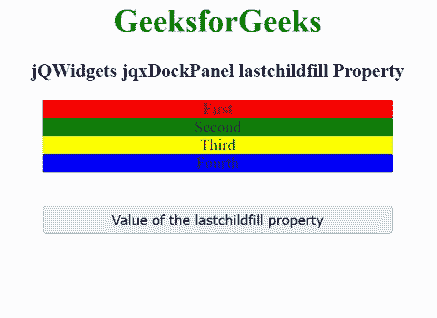

# JqWidgets JqxDockpanel lastdchildfill 属性

> 原文:[https://www . geeksforgeeks . org/jqwidgets-jqxdockmpanel-lastdchildfill-property/](https://www.geeksforgeeks.org/jqwidgets-jqxdockpanel-lastchildfill-property/)

***jQWidgets*** 是一个 JavaScript 框架，用于为 PC 和移动设备制作基于 web 的应用程序。它是一个非常强大、优化、独立于平台并且得到广泛支持的框架。 ***jqxDockPanel*** 用于表示小部件或元素的容器，这些小部件或元素根据“dock”属性的值排列其内部元素。左侧、右侧、顶部和底部是可能的“停靠”属性值。

***【lastschildfill】***属性用于设置或获取指定 jqxDockPanel 的 lastschildfill 属性。当其值为真时，最后一个子级获得可用的宽度和高度。

**语法:**

*   设置 ***lastchildfill*** 属性:

    ```html
    $('#jqxDockPanel').jqxDockPanel({ lastchildfill: true });  
    ```

*   获取 ***lastchildfill*** 属性:

    ```html
    var lastchildfill = 
        $('#jqxDockPanel').jqxDockPanel('lastchildfill');
    ```

**链接文件:**从给定链接下载https://www.jqwidgets.com/download/。在 HTML 文件中，找到下载文件夹中的脚本文件。

> <link rel="”stylesheet”" href="”jqwidgets/styles/jqx.base.css”" type="”text/css”">
> <脚本类型=“text/JavaScript”src =“scripts/jquery . js”></script>
> <脚本类型=“text/JavaScript”src =“jqwidgets/jqxcore . js”></script>
> <脚本类型=“text/JavaScript”src =“jqwidgets/jqxbuttons . js”><

**示例:**以下示例说明了 JQWidgets JQxDockpanel***last child fill***属性。在下面的例子中，***【lastdchildfill】***属性的值被设置为 true。

## 超文本标记语言

```html
<!DOCTYPE html>
<html lang="en">

<head>
    <link rel="stylesheet" 
            href="jqwidgets/styles/jqx.base.css" 
            type="text/css"/>
    <script type="text/javascript" 
            src="scripts/jquery.js">
    </script>
    <script type="text/javascript" 
            src="jqwidgets/jqxcore.js">
    </script>
    <script type="text/javascript" 
            src="jqwidgets/jqxbuttons.js">
    </script>
    <script type="text/javascript" 
            src="jqwidgets/jqxdockpanel.js">
    </script>
    <script type="text/javascript" 
            src="jqwidgets/jqx-all.js">
    </script>
</head>

<body>
    <center>
        <h1 style="color:green;">
            GeeksforGeeks
        </h1>
        <h3>
            jQWidgets jqxDockPanel lastchildfill Property
        </h3>

        <div id='jqx_DockPanel'>
            <div style='background: red;'>
                First</div>
            <div style='background: green;'>
                Second</div>
            <div style='background: yellow;'>
                Third</div>
            <div style='background: blue;'>
                Fourth</div>
        </div>

        <input type="button" style="margin: 5px;" 
               id="button_for_lastchildfill" 
               value="Value of the lastchildfill property"/>

        <div id="log"></div>

        <script type="text/javascript">
            $(document).ready(function () {
                $("#jqx_DockPanel").jqxDockPanel({
                    width: 350,
                    height: 100,
                    disabled: true,
                    lastchildfill: true
                });

                $("#button_for_lastchildfill").jqxButton({
                    width: 350,
                    theme: 'energyblue'
                });

                $('#button_for_lastchildfill')
                .jqxButton().click(function () {
                    var value_of_lastchildfill =
                        $('#jqx_DockPanel')
                        .jqxDockPanel('lastchildfill');
                    $("#log").html(value_of_lastchildfill);
                })
            });
        </script>
    </center>
</body>

</html>
```

**输出:**



**参考:**[https://www . jqwidgets . com/jquery-widgets-documentation/documentation/jqxdockmpanel/jquery-dockmpanel-API . htm？搜索=](https://www.jqwidgets.com/jquery-widgets-documentation/documentation/jqxdockpanel/jquery-dockpanel-api.htm?search=)