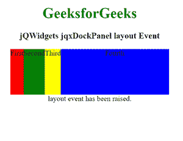

# jqwidgets jqxdlockpanel layout event

> 原文:[https://www . geeksforgeeks . org/jqwidgets-jqxdockmpanel-layout-event/](https://www.geeksforgeeks.org/jqwidgets-jqxdockpanel-layout-event/)

***jQWidgets*** 是一个 JavaScript 框架，用于为 PC 和移动设备制作基于 web 的应用程序。它是一个非常强大、优化、独立于平台并且得到广泛支持的框架。 ***jqxDockPanel*** 用于表示小部件或元素的容器，这些小部件或元素根据“dock”属性的值排列其内部元素。左侧、右侧、顶部和底部是可能的“停靠”属性值。

执行布局时会触发**事件。**

****语法:****

```html
$("#jqx_DockPanel").on('layout', function () {
   $("#log").html('layout event is raised.');
});
```

****链接文件:**从给定链接下载https://www.jqwidgets.com/download/。在 HTML 文件中，找到下载文件夹中的脚本文件。**

> <link rel="”stylesheet”" href="”jqwidgets/styles/jqx.base.css”" type="”text/css”"> **<脚本类型=“text/JavaScript”src =“scripts/jquery . js”></script>
> <脚本类型=“text/JavaScript”src =“jqwidgets/jqxcore . js”></script>
> <脚本类型=“text/JavaScript”src =“jqwidgets/jqxbuttons . js”><**

****示例:**下面的示例说明了 jQWidgets jqxdockmpanel***布局*** 事件。**

## **超文本标记语言**

```html
<!DOCTYPE html>
<html lang="en">

<head>
    <link rel="stylesheet"
          href="jqwidgets/styles/jqx.base.css"
          type="text/css"/>
    <script type="text/javascript" 
            src="scripts/jquery.js">
    </script>
    <script type="text/javascript" 
            src="jqwidgets/jqxcore.js">
    </script>
    <script type="text/javascript" 
            src="jqwidgets/jqxbuttons.js">
    </script>
    <script type="text/javascript" 
            src="jqwidgets/jqxdockpanel.js">
    </script>
    <script type="text/javascript" 
            src="jqwidgets/jqx-all.js">
    </script>
</head>

<body>
    <center>
        <h1 style="color:green;">
            GeeksforGeeks
        </h1>
        <h3>
            jQWidgets jqxDockPanel layout Event
        </h3>
        <div id='jqx_DockPanel'>
            <div style='background: red;'>
                First</div>
            <div style='background: green;'>
                Second</div>
            <div style='background: yellow;'>
                Third</div>
            <div style='background: blue;'>
                Fourth</div>
        </div>
        <div id="log"></div>
        <script type="text/javascript">
            $(document).ready(function () {
                $("#jqx_DockPanel").jqxDockPanel({
                    width: 350,
                    height: 100
                });
                $("#jqx_DockPanel").on(
                    'layout', function () {
                        $("#log").html(
                 'layout event has been raised.');
                    });
            });
        </script>
    </center>
</body>

</html>
```

****输出:****

****

****参考:**[https://www . jqwidgets . com/jquery-widgets-documentation/documentation/jqxdockmpanel/jquery-dockmpanel-API . htm？搜索=](https://www.jqwidgets.com/jquery-widgets-documentation/documentation/jqxdockpanel/jquery-dockpanel-api.htm?search=)**