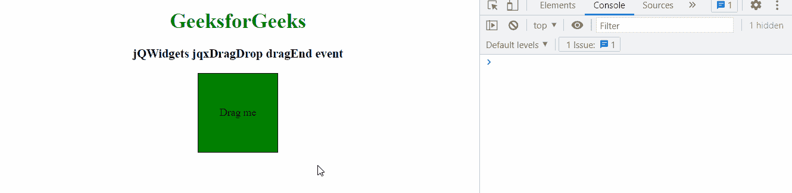

# 【jqxdragdrop 拖动事件部件

> 原文:[https://www . geesforgeks . org/jqwidgets-jqxdragdrop-drag end-event/](https://www.geeksforgeeks.org/jqwidgets-jqxdragdrop-dragend-event/)

**jQWidgets** 是一个 JavaScript 框架，用于为 PC 和移动设备制作基于 web 的应用程序。它是一个非常强大、优化、独立于平台并且得到广泛支持的框架。 **jqxDragDrop** 用于表示 jQuery 拖放小部件，该部件用于使任何 DOM 元素可拖动。它可以与许多小部件结合使用，如 jqxTree、jqxGrid、jqxListBox 等。

当拖动后项目掉落时，触发**拖动结束**事件。

**语法:**

```html
$('#jqxDragDrop').on('dragEnd', function () {
    // Code here.
});  
```

**链接文件:**从链接下载 [jQWidgets](https://www.jqwidgets.com/download/) 。在 HTML 文件中，找到下载文件夹中的脚本文件。

> <link rel="”stylesheet”" href="”jqwidgets/styles/jqx.base.css”" type="”text/css”">
> <脚本类型= " text/JavaScript " src = " scripts/jquery-1 . 11 . 1 . min . js "></脚本>
> <脚本类型= " text/JavaScript " src = " jqwidgets/jqx-all . js "></脚本>
> 脚本类型= " text/JavaScript " src = " jqwidgets/jqxcore . js

**示例:**以下示例说明了 jQWidgets 中的 jqxDragDrop **dragEnd** 事件。

## 超文本标记语言

```html
<!DOCTYPE html>
<html lang="en">

<head>
    <link rel="stylesheet"
          href="jqwidgets/styles/jqx.base.css"
          type="text/css" />
    <script type="text/javascript"
            src="scripts/jquery-1.11.1.min.js">
    </script>
    <script type="text/javascript"
            src="jqwidgets/jqx-all.js">
    </script>
    <script type="text/javascript"
            src="jqwidgets/jqxcore.js">
    </script>
    <script type="text/javascript"
            src="jqwidgets/jqxdragdrop.js">
    </script>
</head>

<body class='default'>
    <center>
        <h1 style="color:green;">
            GeeksforGeeks
        </h1>

        <h3>jQWidgets jqxDragDrop dragEnd event</h3>

        <div id="divID" 
             style="width:120px;
                    height:120px;
                    border:1px solid black;
                    background-color:green;">

            <div style="display:flex;
                         justify-content:center;
                        align-items:center;
                        height:100%;">
                Drag me
            </div>
        </div>
    </center>

    <script type="text/javascript">
        $(document).ready(function() {
            $("#divID").jqxDragDrop({

            });
            $('#divID').on('dragEnd ', function () {
                console.log('the element is dropped')
            });
        });
    </script>
</body>
</html>
```

**输出:**



**参考:**[https://www . jqwidgets . com/jquery-widgets-documentation/documentation/jqxdragdrop/jquery-drag drop-API . htm？搜索=](https://www.jqwidgets.com/jquery-widgets-documentation/documentation/jqxdragdrop/jquery-dragdrop-api.htm?search=)