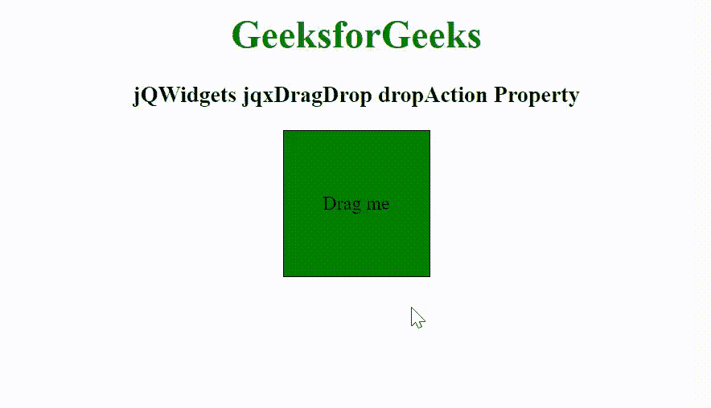

# jQWidgets jqxDragDrop drop action 属性

> 原文:[https://www . geesforgeks . org/jqwidgets-jqxdragdrop-drop action-property/](https://www.geeksforgeeks.org/jqwidgets-jqxdragdrop-dropaction-property/)

**jQWidgets** 是一个 JavaScript 框架，用于为 PC 和移动设备制作基于 web 的应用程序。它是一个非常强大、优化、独立于平台并且得到广泛支持的框架。jqxDragDrop 用于表示一个 jQuery 拖放小部件，该部件用于使任何 DOM 元素可拖动。它可以与许多小部件结合使用，如 jqxTree、jqxGrid、jqxListBox 等。

*dropAction* 属性用于设置或返回可拖动元素，当元素被放下时，该元素将改变其位置。它接受字符串类型值，其默认值为“默认值”。

**语法:**

*   设置 *dropAction* 属性。

    ```
    $('selector').jqxDragDrop({ dropAction: 'none' });
    ```

*   返回 *dropAction* 属性。

    ```
    var dropAction = $('selector').jqxDragDrop('dropAction');
    ```

**链接文件:**从链接下载 [jQWidgets](https://www.jqwidgets.com/download/) 。在 HTML 文件中，找到下载文件夹中的脚本文件。

> <link rel="”stylesheet”" href="”jqwidgets/styles/jqx.base.css”" type="”text/css”">
> <脚本类型= " text/JavaScript " src = " scripts/jquery-1 . 11 . 1 . min . js "></脚本>
> <脚本类型= " text/JavaScript " src = " jqwidgets/jqx-all . js "></脚本>
> 脚本类型= " text/JavaScript " src = " jqwidgets/jqxcore . js

**示例:**下面的示例说明了 jQWidgets 中的 jqxDragDrop *dropAction* 属性。

## 超文本标记语言

```
<!DOCTYPE html>
<html lang="en">

<head>
    <link rel="stylesheet" href=
"jqwidgets/styles/jqx.base.css" type="text/css" />
    <script type="text/javascript" 
            src="scripts/jquery-1.11.1.min.js">
    </script>
    <script type="text/javascript" 
            src="jqwidgets/jqx-all.js">
    </script>
    <script type="text/javascript" 
            src="jqwidgets/jqxcore.js">
    </script>
    <script type="text/javascript" 
            src="jqwidgets/jqxdragdrop.js">
    </script>
</head>

<body class='default'>
    <center>
        <h1 style="color: green;">
            GeeksforGeeks
        </h1>

        <h3>
            jQWidgets jqxDragDrop dropAction Property
        </h3>

        <div style="width: 120px; height: 120px; 
            border: 1px solid black; 
            background-color: green;" id="divID">

            <div style="display: flex;
                justify-content: center;
                align-items: center;
                height: 100%;">
                Drag me
            </div>
        </div>
    </center>

    <script type="text/javascript">
        $(document).ready(function() {
            $("#divID").jqxDragDrop({
                dropAction: 'none'
            });
        });
    </script>
</body>
</html>
```

**输出:**



**参考:**[https://www . jqwidgets . com/jquery-widgets-documentation/documentation/jqxdragdrop/jquery-drag drop-API . htm](https://www.jqwidgets.com/jquery-widgets-documentation/documentation/jqxdragdrop/jquery-dragdrop-api.htm)